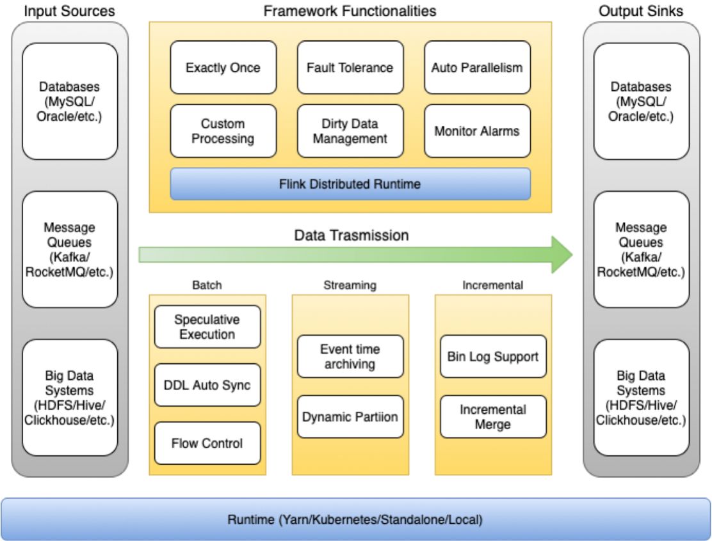

# BitSail
[Chinese Version](README_zh.md)

## Introduction
BitSail is ByteDance's open source data integration engine which is based on distributed architecture and provides high performance. It supports data synchronization between multiple heterogeneous data sources, and provides global data integration solutions in batch, streaming, and incremental scenarios. At present, it serves almost all business lines in ByteDance, such as Douyin, Toutiao, etc., and synchronizes hundreds of trillions data every day.

## Why do we use BitSail
BitSail has been widely used and supports hundreds of trillions of large traffic. At the same time, it has been verified in various scenarios such as the cloud native environment of the volcano engine and the on-premises private cloud environment.

We have accumulated a lot of experience and made a number of optimizations to improve the function of data integration

- Global Data Integration, covering batch, streaming and incremental scenarios

- Distributed and cloud-native architecture, supporting horizontal scaling

- High maturity in terms of accuracy, stability and performance

- Rich basic functions, such as type conversion, dirty data processing, flow control, data lake integration, automatic parallelism calculation
, etc.

- Task running status monitoring, such as traffic, QPS, dirty data, latency, etc.

## BitSail use scenarios
- Mass data synchronization in heterogeneous data sources

- Streaming and batch integration data processing capability

- Data lake and warehouse integration data processing capability

- High performance, high reliability data synchronization

- Distributed, cloud-native architecture data integration engine

## Features of BitSail

- Low start-up cost and high flexibility

- Stream-batch integration and Data lake-warehouse integration architecture, one framework covers almost all data synchronization scenarios

- High-performance, massive data processing capabilities

- DDL automatic synchronization

- Type system, conversion between different data source types

- Engine independent reading and writing interface, low development cost

- Real-time display of task progress, under development

- Real-time monitoring of task status

## Architecture of BitSail
 
 
 ```
 Source[Input Sources] -> Framework[Data Transmission] -> Sink[Output Sinks]
 ```
The data processing pipeline is as follows. First, pull the source data through Input Sources, then process it through the intermediate framework layer, and finally write the data to the target through Output Sinks

At the framework layer, we provide rich functions and take effect for all synchronization scenarios, such as dirty data collection, auto parallelism calculation, task monitoring, etc.

In data synchronization scenarios, it covers batch, streaming, and incremental data synchronization

In the Runtime layer, it supports multiple execution modes, such as yarn, local, and k8s is under development

## Supported Connectors
<table>
  <tr>
    <th>DataSource</th>
    <th>Sub Modules</th>
    <th>Reader</th>
    <th>Writer</th>
  </tr>
  <tr>
    <td>Hive</td>
    <td>-</td>
    <td>✅</td>
    <td>✅</td>
  </tr>
  <tr>
    <td>Hadoop</td>
    <td>-</td>
    <td>✅</td>
    <td>✅</td>
  </tr>
  <tr>
    <td>Hbase</td>
    <td>-</td>
    <td>✅</td>
    <td>✅</td>
  </tr>
  <tr>
    <td>Hudi</td>
    <td>-</td>
    <td>✅</td>
    <td>✅</td>
  </tr>
  <tr>
    <td>Kafka</td>
    <td>-</td>
    <td>✅</td>
    <td>✅</td>
  </tr>
  <tr>
    <td>RocketMQ</td>
    <td>-</td>
    <td> </td>
    <td>✅</td>
  </tr>
  <tr>
    <td>Redis</td>
    <td>-</td>
    <td> </td>
    <td>✅</td>
  </tr>
  <tr>
    <td>Doris</td>
    <td>-</td>
    <td> </td>
    <td>✅</td>
  </tr>
  <tr>
    <td>MongoDB</td>
    <td>-</td>
    <td>✅</td>
    <td>✅</td>
  </tr>
  <tr>
    <td>Doris</td>
    <td>-</td>
    <td>✅</td>
    <td> </td>
  </tr>
  <tr>
    <td rowspan="4">JDBC</td>
    <td>MySQL</td>
    <td rowspan="4">✅</td>
    <td rowspan="4">✅</td>
  </tr>
  <tr>
    <td>Oracle</td>
  </tr>
  <tr>
    <td>PostgreSQL</td>
  </tr>
  <tr>
    <td>SqlServer</td>
  </tr>
  <tr>
    <td>Fake</td>
    <td>-</td>
    <td>✅</td>
    <td> </td>
  </tr>
  <tr>
    <td>Print</td>
    <td>-</td>
    <td> </td>
    <td>✅</td>
  </tr>
</table>

Documentation for [Connectors](./docs/connectors/introduction.md).

## Community Support
### Slack
Join BitSail Slack channel via this [link](https://join.slack.com/t/slack-ted3816/shared_invite/zt-1inff2sip-u7Ej_o73sUgdpJAvqwlEwQ)

### Mailing List
Currently, BitSail community use Google Group as the mailing list provider.
You need to subscribe to the mailing list before starting a conversation

Subscribe: Email to this address `bitsail+subscribe@googlegroups.com`

Start a conversation: Email to this address `bitsail@googlegroups.com`

Unsubscribe: Email to this address `bitsail+unsubscribe@googlegroups.com`

### WeChat Group
If you have WeChat account, please scan this QR code to connect with the BitSail community assistant
and join the WeChat group chat.


## Environment Setup
Link to [Environment Setup](docs/env_setup.md).

## Deployment Guide
Link to [Deployment Guide](docs/deployment.md).

## BitSail Configuration
Link to [configuration guide](docs/config.md).

## Contributing Guide
Link to [Contributing Guide](docs/contributing.md).

## License
[Apache 2.0 License](LICENSE).

