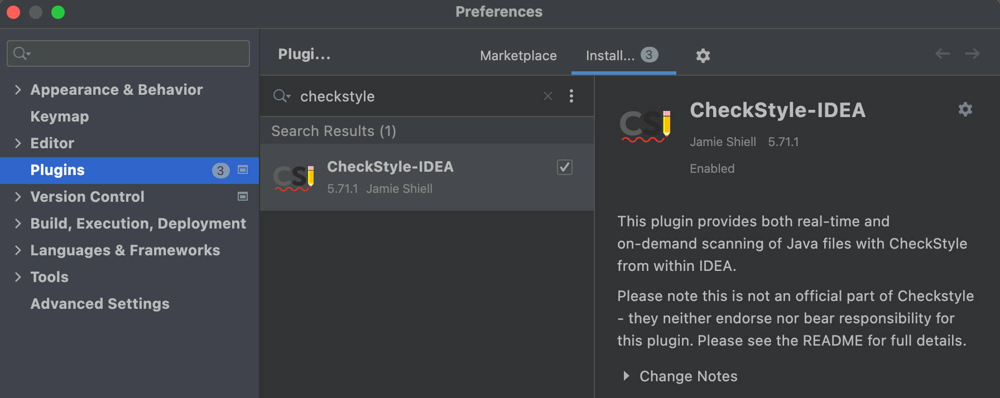
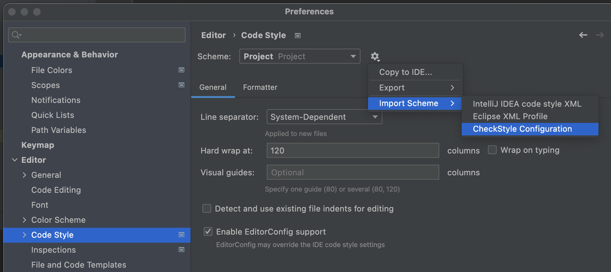
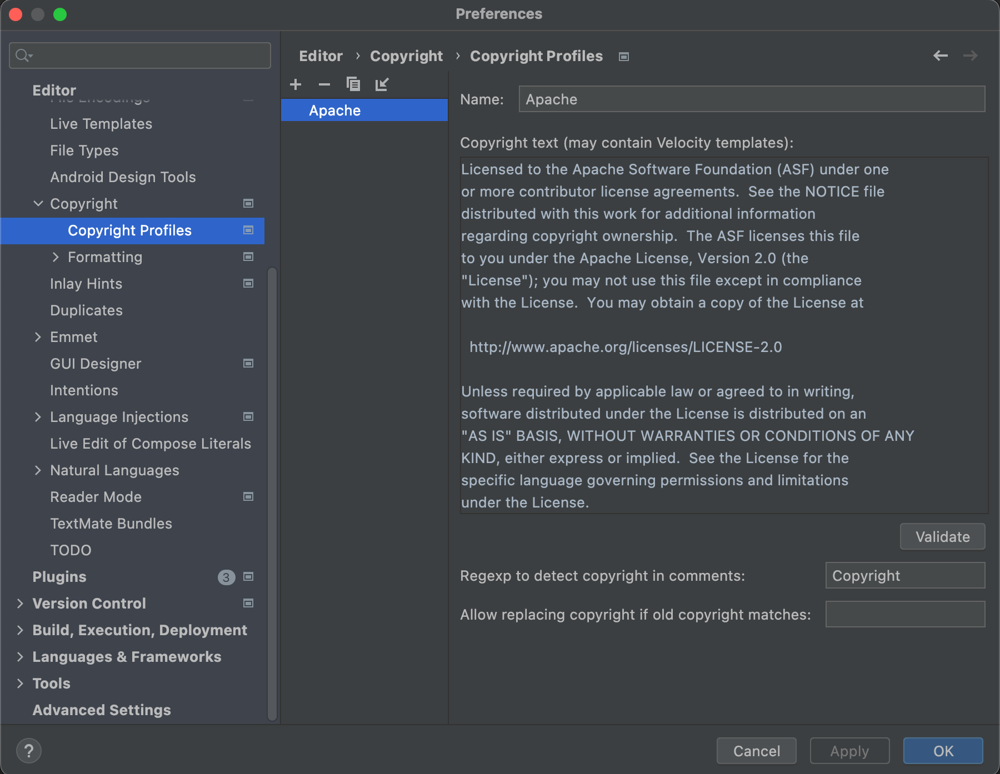

# 贡献者指引

[English](contributing.md) | 简体中文

BitSail社区欢迎大家的贡献！

## 如何参与

- 如果你在使用 BitSail 时遇到任何问题，请提交GitHub Issue进行报告。
- 如果你希望能支持一个新功能，请提交GitHub Issue以请求该功能。
- 在 Slack 频道上可以提出任何问题，或帮助回答其他用户的问题。
- 通过认领GitHub Issue来修复Bug或开发新功能。
- 改进文档、代码注释、拼写错误和测试覆盖率。
- 如果你有一个大的功能要引入，可以在邮件列表中发起一个讨论，收集其他开发者的意见。

## 打开一个GitHub Issue
- 搜索已知问题以检查是否存在现有主题
- 如果是，您可以参与讨论
- 如果不是，根据文档自己创建一个新问题[创建Issue](https://docs.github.com/en/issues/tracking-your-work-with-issues/creating-an-issue)

## 开发环境配置
跳转到[环境配置](env_setup_zh.md)

## 代码风格

BitSail项目使用了[Google Java Style Guide](https://google.github.io/styleguide/javaguide.html)

## IDE配置

我们使用了Intellij作为配置的例子

### CheckStyle

在IDE中安装checkstyle插件

我们为开发者定义了一份checkstyle配置 [tools/maven/checkstyle.xml](https://github.com/bytedance/bitsail/blob/master/tools/maven/checkstyle.xml) 。
在IDE中进行开发时，可将上述checkstyle配置文件导入项目:

导入完成后，运行指令 `mvn checkstyle:check` 即可检查是否满足checkstyle.

### 安装lombok

我们使用了[lombok](https://projectlombok.org/).请在IDE插件安装lombok

### 添加License配置
所有源文件都需要添加许可证头。请添加 [Apache License header](https://www.apache.org/legal/src-headers#headers)
到您的 IDE 版权设置。完成此步骤后，IDE 将自动将许可证添加到新的源文件。

## 开发小技巧
### maven依赖强制检查
我们在构建过程中检查重叠的包。当您在构建过程中看到冲突错误时，请从 pom 文件中排除有冲突的包。

## 提交一个Pull Request
如果是第一次提交 pull request，可以阅读这个文档 [什么是Pull Request](https://docs.github.com/en/pull-requests/collaborating-with-pull-requests/proposing-changes-to-your-work-with-pull-requests/about-pull-requests)

- [Fork ***BitSail*** 代码库](https://docs.github.com/en/get-started/quickstart/fork-a-repo)
- 在你的fork的代码库中生成一个新分支
- 开发你的代码，包括必要的测试用例和编码风格检查
- 提交对分支的更改并推送到你fork的仓库
- 向 ***BitSail*** 存储库创建pull request

## 请求代码审查
准备好pull request后，请确保pull request模板清单中的所有项目都已完成。
在pull request中@任意一个项目的committer进行代码审查。
