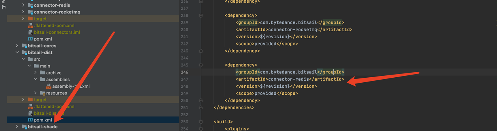

# Connector Quick Start

English | [简体中文](../../zh/community/connector_quick_start.md)

-----

## Introduction

This article is aimed at BitSail's Connector developers. It comprehensively explains the whole process of developing a complete Connector from the developer's perspective, and quickly gets started with Connector development.

## contents

First, the developer needs to fork the BitSail repository. For more details, refer to [Fork BitSail Repo](https://docs.github.com/en/get-started/quickstart/fork-a-repo). And then use git clone the repository to the local, and import it into the IDE. At the same time, create your own working branch and use this branch to develop your own Connector. project address: https://github.com/bytedance/bitsail.git.

The project structure is as follows:


## Development Process

BitSail is a data integration engine based on a distributed architecture, and Connectors will execute concurrently. And the BitSail framework is responsible for task scheduling, concurrent execution, dirty data processing, etc. Developers only need to implement the corresponding interface. The specific development process is as follows:

- Project configuration, developers need to register their own Connector in the `bitsail/bitsail-connectors/pom.xml` module, add their own Connector module in `bitsail/bitsail-dist/pom.xml`, and register configuration files for your connector , so that the framework can dynamically discover it at runtime
  - 

  - 
- Connector development, implement the abstract methods provided by Source and Sink, refer to the follow-up introduction for details
- Data output type, the currently supported data type is the BitSail Row type, whether it is the data type that the Source passes to the downstream in the Reader, or the data type that the Sink consumes from the upstream, it should be the BitSail Row type

# Architecture

The current design of the Source API is also compatible with streaming and batch scenarios, in other words, it supports pull & push scenarios at the same time. Before that, we need to go through the interaction model of each component in the traditional streaming batch scenario.

## Batch Model

In traditional batch scenarios, data reading is generally divided into the following steps: 

- `createSplits`：It is generally executed on the client side or the central node. The purpose is to split the complete data into as many `rangeSplits` as possible according to the specified rules. `createSplits` is executed once in the job life cycle.
- `runWithSplit`: Generally, it is executed on the execution node. After the execution node is started, it will request the existing `rangeSplit` from the central node, and then execute it locally; after the execution is completed, it will request the central node again until all the `splits `are executed.
- `commit`：After the execution of all splits is completed, the `commit` operation is generally performed on the central node to make the data visible to the outside world.

## Stream Model

In traditional streaming scenarios, data reading is generally divided into the following steps:

- `createSplits`: generally executed on the client side or the central node, the purpose is to divide the data stream into `rangeSplits` according to the sliding window or tumbling window strategy, and `createSplits` will always be executed according to the divided windows during the life cycle of the streaming job.
- `runWithSplit`: Generally executed on the execution node, the central node will send `rangeSplit` to the executable node, and then execute locally on the executable node; after the execution is completed, the processed `splits` data will be sent downstream.
- `commit`: After the execution of all splits is completed, the `retract message` is generally sent to the target data source, and the results are dynamically displayed in real time.

## BitSail Model


- `createSplits`: BitSail divides rangeSplits through the `SplitCoordinator` module. `createSplits` will be executed periodically in the life cycle of streaming jobs, but only once in batch jobs.
- `runWithSplit`: Execute on the execution node. The execution node in BitSail includes `Reader` and `Writer` modules. The central node will send `rangeSplit` to the executable node, and then execute locally on the executable node; after the execution is completed, the processed `splits` data will be sent downstream.
- `commit`: After the `writer` completes the data writing, the `committer` completes the submission. When `checkpoint` is not enabled, `commit` will be executed once after all `writers` are finished; when `checkpoint` is enabled, `commit` will be executed once every checkpoint.

# Source Connector

## Introduction


- Source: The life cycle management component of the data reading component is mainly responsible for interacting with the framework, structuring the job, and not participating in the actual execution of the job.
- SourceSplit:  Source data split. The core purpose of the big data processing framework is to split large-scale data into multiple reasonable Splits
- State：Job status snapshot. When the checkpoint is enabled, the current execution status will be saved.
- SplitCoordinator: SplitCoordinator assumes the role of creating and managing Split.
- SourceReader: The component that is actually responsible for data reading will read the data after receiving the Split, and then transmit the data to the next operator.

Developers first need to create the `Source` class, which needs to implement the `Source` and `ParallelismComputable` interfaces. It is mainly responsible for interacting with the framework and structuring the job. It does not participate in the actual execution of the job. BitSail's `Source` adopts the design idea of stream-batch integration, sets the job processing method through the `getSourceBoundedness` method, defines the `readerConfiguration` through the `configure` method, and performs data type conversion through the `createTypeInfoConverter` method, and can obtain user-defined data in the yaml file through `FileMappingTypeInfoConverter` The conversion between source type and BitSail type realizes customized type conversion. Then we define the data fragmentation format `SourceSplit` class of the data source and the `SourceSplitCoordinator` class that will manage the Split role, and finally complete the `SourceReader` to read data from the Split.

| Job Type | Boundedness                 |
| -------- | --------------------------- |
| batch    | Boundedness.*BOUNDEDNESS*   |
| stream   | Boundedness.*UNBOUNDEDNESS* |

Each `SourceReader` is executed in an independent thread. As long as we ensure that the splits assigned by the `SourceSplitCoordinator` to different `SourceReader` do not overlap, the developer doesn't consider any concurrency details during the execution cycle of  `SourceReader`. You only need to pay attention to how to read data from the constructed split, then complete the data type conversion, and convert the external data type into BitSail’s Row type and pass it downstream.

## Reader example

```Java
public class FakeSourceReader extends SimpleSourceReaderBase<Row> {

  private final BitSailConfiguration readerConfiguration;
  private final TypeInfo<?>[] typeInfos;

  private final transient int totalCount;
  private final transient RateLimiter fakeGenerateRate;
  private final transient AtomicLong counter;

  private final FakeRowGenerator fakeRowGenerator;

  public FakeSourceReader(BitSailConfiguration readerConfiguration, Context context) {
    this.readerConfiguration = readerConfiguration;
    this.typeInfos = context.getTypeInfos();
    this.totalCount = readerConfiguration.get(FakeReaderOptions.TOTAL_COUNT);
    this.fakeGenerateRate = RateLimiter.create(readerConfiguration.get(FakeReaderOptions.RATE));
    this.counter = new AtomicLong();
    this.fakeRowGenerator = new FakeRowGenerator(readerConfiguration, context.getIndexOfSubtask());
  }

  @Override
  public void pollNext(SourcePipeline<Row> pipeline) throws Exception {
    fakeGenerateRate.acquire();
    pipeline.output(fakeRowGenerator.fakeOneRecord(typeInfos));
  }

  @Override
  public boolean hasMoreElements() {
    return counter.incrementAndGet() <= totalCount;
  }
}
```

# Sink Connector

## Introduction


- Sink: life cycle management of data writing components, mainly responsible for interaction with the framework, framing jobs, it does not participate in the actual execution of jobs.
- Writer: responsible for writing the received data to external storage.
-  WriterCommitter (optional): Commit the data to complete the two-phase commit operation; realize the semantics of exactly-once.

Developers first need to create a `Sink` class and implement the `Sink` interface, which is mainly responsible for the life cycle management of the data writing component and the construction of the job. Define the configuration of `writerConfiguration` through the `configure` method, perform data type conversion through the `createTypeInfoConverter` method, and write the internal type conversion to the external system, the same as the `Source` part. Then we define the `Writer` class to implement the specific data writing logic. When the `write` method is called, the BitSail Row type writes the data into the cache queue, and when the `flush` method is called, the data in the cache queue is flushed to the target data source.

## Writer example

```Java
public class PrintWriter implements Writer<Row, String, Integer> {
  private static final Logger LOG = LoggerFactory.getLogger(PrintWriter.class);

  private final int batchSize;
  private final List<String> fieldNames;

  private final List<String> writeBuffer;
  private final List<String> commitBuffer;

  private final AtomicInteger printCount;

  public PrintWriter(int batchSize, List<String> fieldNames) {
    this(batchSize, fieldNames, 0);
  }

  public PrintWriter(int batchSize, List<String> fieldNames, int alreadyPrintCount) {
    Preconditions.checkState(batchSize > 0, "batch size must be larger than 0");
    this.batchSize = batchSize;
    this.fieldNames = fieldNames;
    this.writeBuffer = new ArrayList<>(batchSize);
    this.commitBuffer = new ArrayList<>(batchSize);
    printCount = new AtomicInteger(alreadyPrintCount);
  }

  @Override
  public void write(Row element) {
    String[] fields = new String[element.getFields().length];
    for (int i = 0; i < element.getFields().length; ++i) {
      fields[i] = String.format("\"%s\":\"%s\"", fieldNames.get(i), element.getField(i).toString());
    }

    writeBuffer.add("[" + String.join(",", fields) + "]");
    if (writeBuffer.size() == batchSize) {
      this.flush(false);
    }
    printCount.incrementAndGet();
  }

  @Override
  public void flush(boolean endOfInput) {
    commitBuffer.addAll(writeBuffer);
    writeBuffer.clear();
    if (endOfInput) {
      LOG.info("all records are sent to commit buffer.");
    }
  }

  @Override
  public List<String> prepareCommit() {
    return commitBuffer;
  }

  @Override
  public List<Integer> snapshotState(long checkpointId) {
    return Collections.singletonList(printCount.get());
  }
}
```

# Register the connector into the configuration file

Register a configuration file for your connector so that the framework can dynamically discover it at runtime. The configuration file is defined as follows:

Taking hive as an example, developers need to add a json file in the resource directory. The example name is `bitsail-connector-hive.json`, as long as it does not overlap with other connectors.

```Json
{
  "name": "bitsail-connector-hive",
  "classes": [
    "com.bytedance.bitsail.connector.hive.source.HiveSource",
    "com.bytedance.bitsail.connector.hive.sink.HiveSink"
  ],
  "libs": [
    "bitsail-connector-hive-${version}.jar"
  ]
}
```

# Test module

In the module where the Source or Sink connector is located, add an ITCase test case, and then support it according to the following process.

- Start data source through the test container


- Write the corresponding configuration file

```Json
{
  "job": {
    "common": {
      "job_id": 313,
      "instance_id": 3123,
      "job_name": "bitsail_clickhouse_to_print_test",
      "user_name": "test"
    },
    "reader": {
      "class": "com.bytedance.bitsail.connector.clickhouse.source.ClickhouseSource",
      "jdbc_url": "jdbc:clickhouse://localhost:8123",
      "db_name": "default",
      "table_name": "test_ch_table",
      "split_field": "id",
      "split_config": "{\"name\": \"id\", \"lower_bound\": 0, \"upper_bound\": \"10000\", \"split_num\": 3}",
      "sql_filter": "( id % 2 == 0 )",
      "columns": [
        {
          "name": "id",
          "type": "int64"
        },
        {
          "name": "int_type",
          "type": "int32"
        },
        {
          "name": "double_type",
          "type": "float64"
        },
        {
          "name": "string_type",
          "type": "string"
        },
        {
          "name": "p_date",
          "type": "date"
        }
      ]
    },
    "writer": {
      "class": "com.bytedance.bitsail.connector.legacy.print.sink.PrintSink"
    }
  }
}
```

- Submit the job through  EmbeddedFlinkCluster.submit method

```Java
@Test
public void testClickhouseToPrint() throws Exception {
  BitSailConfiguration jobConf = JobConfUtils.fromClasspath("clickhouse_to_print.json");
  EmbeddedFlinkCluster.submitJob(jobConf);
}
```

# Submit your PR

After the developer implements his own Connector, he can associate his own issue and submit a PR to github. Before submitting, the developer remembers to add documents to the Connector. After passing the review, the Connector contributed by everyone becomes a part of BitSail. We follow the level of contribution and select active Contributors to become our Committers and participate in major decisions in the BitSail community. We hope that everyone will actively participate!