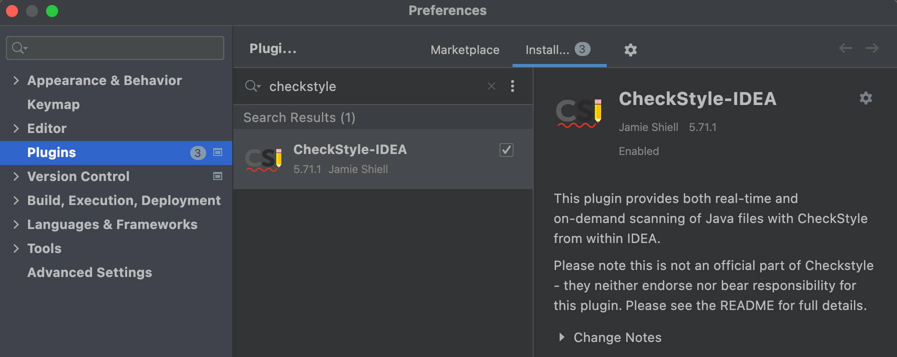
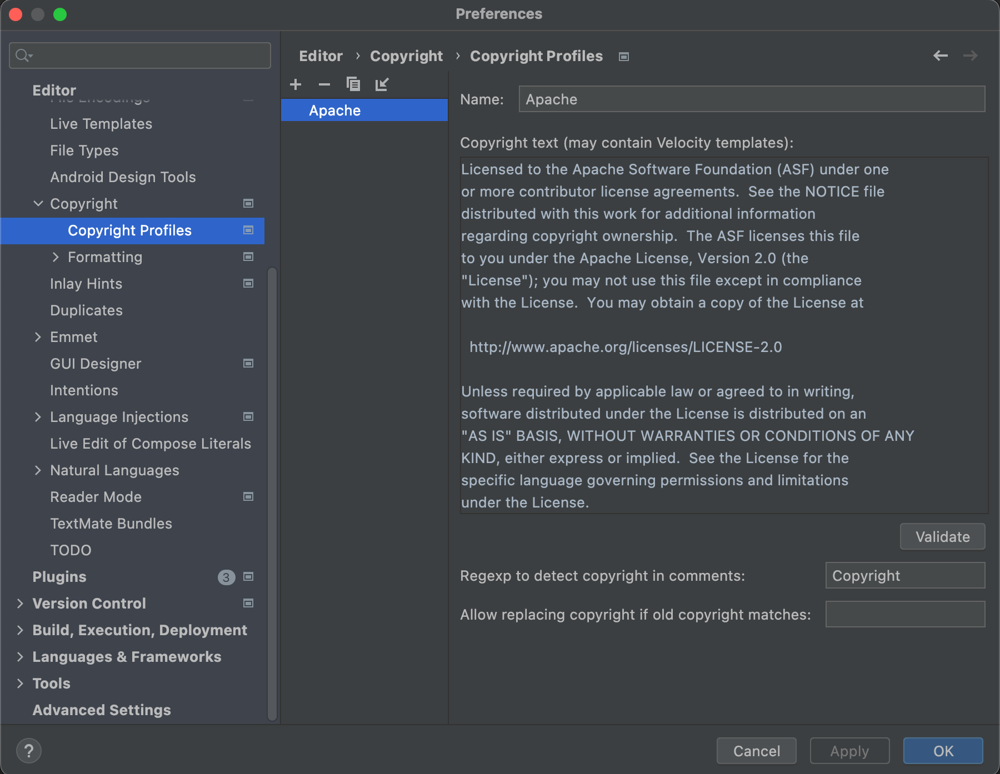

# Contributor Guide

English | [简体中文](../../zh/community/contribute.md)

-----

BitSail community welcomes contributions from anyone!

## How To Get Involved

- If you meet any issue when using BitSail, submit a GitHub issue to report.
- If you want a new feature, submit a GitHub issue to request the feature.
- Ask any question on the Slack channel, or help to answer other user's question.
- Claim an issue to fix bug or develop new features.
- Improve documentation, code comments, typos and test coverages.
- Start a discussion on mailing list if you have a large feature to bring in.

## Open a GitHub Issue
- Search for known issues to check whether there have been an existing topic
- If Yes, you can participate in the discussion
- If Not, create a new issue by yourself according to the doc [Create a New Issue](https://docs.github.com/en/issues/tracking-your-work-with-issues/creating-an-issue)

## Environment Setup
Link to [environment setup](../documents/start/env_setup.md)

## Code Style

We generally follow the [Google Java Style Guide](https://google.github.io/styleguide/javaguide.html)

## IDE Setup

We are using Intellij as an example for this set up.

### CheckStyle

Install the checkstyle plugin on your IDE.



We define check style in [tools/maven/checkstyle.xml](https://github.com/bytedance/bitsail/blob/master/tools/maven/checkstyle.xml).
When developing in IDE, you can import this checkstyle configuration file.


After importing, run command `mvn checkstyle:check` to see if checkstyle satisfied.

### Install lombok

We use project [lombok](https://projectlombok.org/). So please install this plugin as well.

### Add License Header
All the source files are required to add License header. Please copy License header text **below** and add 
to your IDE Copyright settings. After this step, IDE will add license to new source files automatically.

```
Copyright 2022-2023 Bytedance Ltd. and/or its affiliates.

Licensed under the Apache License, Version 2.0 (the "License");
you may not use this file except in compliance with the License.
You may obtain a copy of the License at

    http://www.apache.org/licenses/LICENSE-2.0

Unless required by applicable law or agreed to in writing, software
distributed under the License is distributed on an "AS IS" BASIS,
WITHOUT WARRANTIES OR CONDITIONS OF ANY KIND, either express or implied.
See the License for the specific language governing permissions and
limitations under the License.
```



## Developing Tips
### Maven Dependency Enforcement
We check the overlapping packages during the build process. When you see a conflict error during the build process,
please exclude the conflicting packages from the pom file.

## Submit a Pull Request
If it is the first time to submit a pull request, you can read this doc [About Pull Request](https://docs.github.com/en/pull-requests/collaborating-with-pull-requests/proposing-changes-to-your-work-with-pull-requests/about-pull-requests)

- [Fork ***BitSail*** Repo](https://docs.github.com/en/get-started/quickstart/fork-a-repo)
- Checkout a new branch in your fork repo
- Patch you code, including necessary test cases & coding-style check
- Commit changes to the branch and push to the fork repo
- Create a pull request to the ***BitSail*** repo

If you are a freshman to open source projects, you can read [How to submit a github pull request](pr_guide.md) for a more detailed guide.
## Ask for a code review
After you have your pull request ready, with all the items from the pull request checklist being completed.
Tag a committer to review you pull request.

## How to contribute documents

BitSail's documents are saved in the `website` directory of the project, including Chinese and English versions.

When any document update is merged into master branch, a GitHub action is triggered to generate [BitSail's homepage](https://bytedance.github.io/bitsail/). So one need to test the website in local before creating a PR.

The BitSail homepage is built through the [VuePress](https://vuepress-theme-hope.github.io/v2/) framework. After the markdown document is modified, you can try generating a test homepage through the following steps:

1. Install [yarn](https://yarnpkg.com/) (A JS package manager)

```bash
# install yarn
npm install -g yarn

# search version
yarn --version
```

2. Generate test homepage locally

```bash
# install dependencies
yarn install

# generate homepage
yarn docs:dev

# visit http://localhost:8080/bitsail/
```

> The default port is 8080, if the port conflicts, you can use `--port` to specify the port

```bash
yarn docs:dev --port 9090

# visit http://localhost:9090/bitsail/
```
