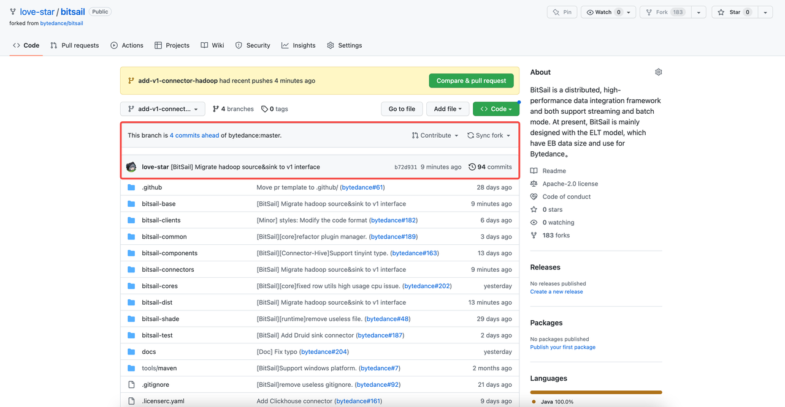

# Pull Request Guide

English | [简体中文](../../zh/community/pr_guide.md)

-----


##  Fork BitSail to your repository


##  Git account configuration

 The role of user name and email address: User name and email address are variables of the local git client. Each commit will be recorded with the user name and email address. Github's contribution statistics are based on email addresses.

 Check your account and email address:

```Bash
$ git config user.name
$ git config user.email
```

 If you are using git for the first time, or need to modify account, execute the following command, replacing the username and email address with your own.

```Bash
$ git config --global user.name "username"
$ git config --global user.email "your_email@example.com"
```

##  Clone the Fork repository to local

 You can choose HTTPS or SSH mode, and the following operations will use SSH mode as an example. If you use HTTPS mode, you only need to replace all the SSH url in the command with HTTPS url.

###  HTTPS

```Bash
$ git clone git@github.com:{your_github_id}/bitsail.git
```

###  SSH

```Bash
$ git clone https://github.com/{your_github_id}/bitsail.git
```


##  Set origin and upstream

```Bash
$ git remote add origin git@github.com:{your_github_id}/bitsail.git
$ git remote add upstream git@github.com:bytedance/bitsail.git
$ git remote -v
origin  git@github.com:{your_github_id}/bitsail.git (fetch)
origin  git@github.com:{your_github_id}/bitsail.git (push)
upstream        git@github.com:bytedance/bitsail.git (fetch)
upstream        git@github.com:bytedance/bitsail.git (push)
```

 If the `origin` setting of `git` is wrong, you can execute `git `*`remote`*` rm `*`origin`* to clear and reset it.

 The `upstream` is the same, setting errors can be cleared by `git `*`remote`*` rm `*`upstream`* and reset.

##  Create your working branch

```Bash
// view all branches
$ git branch -a
// Create a new loacl branch 
$ git branch {your_branch_name}
// switch to new branch
$ git checkout {your_branch_name}
// Push the local branch to the fork repository
$ git push -u origin
```

 Branch name example: add-sink-connector-redis

 After that, you can write and test the code in your own working branch, and synchronize it to your personal branch in time.

```Bash
$ git add .
$ git commit -m "[BitSail] Message"
$ git push -u origin <branch name>
```

##  Synchronize source code

 BitSail will carefully consider the update and iteration of the interface or version. If the developer has a short development cycle, he can do a synchronization with the original warehouse before submitting the code. However, if unfortunately encountering a major version change, the developer can follow up at any time Changes to the original repository.

 Here, in order to ensure the cleanness of the code branch, it is recommended to use the rebase method for merging.

```Bash
$ git fetch upstream
$ git rebase upstream/master
```

 During the rebase process, file conflicts may be reported

 For example, in the following situation, we need to manually merge the conflicting files: `bitsail-connectors/pom.xml`

```Bash
$ git rebase upstream/master
Auto-merging bitsail-dist/pom.xml
Auto-merging bitsail-connectors/pom.xml
CONFLICT (content): Merge conflict in bitsail-connectors/pom.xml
error: could not apply 054a4d3... [BitSail] Migrate hadoop source&sink to v1 interface
Resolve all conflicts manually, mark them as resolved with
"git add/rm <conflicted_files>", then run "git rebase --continue".
You can instead skip this commit: run "git rebase --skip".
To abort and get back to the state before "git rebase", run "git rebase --abort".
Could not apply 054a4d3... [BitSail] Migrate hadoop source&sink to v1 interface
```

 The conflicting parts are shown below, bounded by `=======`, decide whether you want to keep only the changes of the branch, only the changes of the other branch, or make completely new changes (possibly containing changes of both branches). Remove the conflict markers `<<<<<<<`, `=======`, `>>>>>>>` and make the desired changes in the final merge.

```Plain
<modules>
    <module>bitsail-connectors-legacy</module>
    <module>connector-print</module>
    <module>connector-elasticsearch</module>
    <module>connector-fake</module>
    <module>connector-base</module>
    <module>connector-doris</module>
    <module>connector-kudu</module>
    <module>connector-rocketmq</module>
    <module>connector-redis</module>
    <module>connector-clickhouse</module>
<<<<<<< HEAD
    <module>connector-druid</module>
=======
    <module>connector-hadoop</module>
>>>>>>> 054a4d3 ([BitSail] Migrate hadoop source&sink to v1 interface)
</modules>
```

 After combine:

```Plain
<modules>
    <module>bitsail-connectors-legacy</module>
    <module>connector-print</module>
    <module>connector-elasticsearch</module>
    <module>connector-fake</module>
    <module>connector-base</module>
    <module>connector-doris</module>
    <module>connector-kudu</module>
    <module>connector-rocketmq</module>
    <module>connector-redis</module>
    <module>connector-clickhouse</module>
    <module>connector-druid</module>
    <module>connector-hadoop</module>
</modules>
```

 Execute `git add <conflicted_files>` after combine:

```Bash
$ git add bitsail-connectors/pom.xml
$ git rebase --continue
```

 Afterwards, the following window will appear. This is the Vim editing interface. The editing mode can be done according to Vim. Usually we only need to edit the Commit information on the first line, or not. After completion, follow the exit method of Vim, and press`: w q ↵`。


 After that, the following appears to indicate that the rebase is successful.

```Bash
$ git rebase --continue
[detached HEAD 9dcf4ee] [BitSail] Migrate hadoop source&sink to v1 interface
 15 files changed, 766 insertions(+)
 create mode 100644 bitsail-connectors/connector-hadoop/pom.xml
 create mode 100644 bitsail-connectors/connector-hadoop/src/main/java/com/bytedance/bitsail/connector/hadoop/constant/HadoopConstants.java
 create mode 100644 bitsail-connectors/connector-hadoop/src/main/java/com/bytedance/bitsail/connector/hadoop/error/TextInputFormatErrorCode.java
 create mode 100644 bitsail-connectors/connector-hadoop/src/main/java/com/bytedance/bitsail/connector/hadoop/format/HadoopDeserializationSchema.java
 create mode 100644 bitsail-connectors/connector-hadoop/src/main/java/com/bytedance/bitsail/connector/hadoop/option/HadoopReaderOptions.java
 create mode 100644 bitsail-connectors/connector-hadoop/src/main/java/com/bytedance/bitsail/connector/hadoop/sink/HadoopSink.java
 create mode 100644 bitsail-connectors/connector-hadoop/src/main/java/com/bytedance/bitsail/connector/hadoop/sink/HadoopWriter.java
 create mode 100644 bitsail-connectors/connector-hadoop/src/main/java/com/bytedance/bitsail/connector/hadoop/source/HadoopSource.java
 create mode 100644 bitsail-connectors/connector-hadoop/src/main/java/com/bytedance/bitsail/connector/hadoop/source/coordinator/HadoopSourceSplitCoordinator.java
 create mode 100644 bitsail-connectors/connector-hadoop/src/main/java/com/bytedance/bitsail/connector/hadoop/source/reader/HadoopSourceReader.java
 create mode 100644 bitsail-connectors/connector-hadoop/src/main/java/com/bytedance/bitsail/connector/hadoop/source/reader/HadoopSourceReaderCommonBasePlugin.java
 create mode 100644 bitsail-connectors/connector-hadoop/src/main/java/com/bytedance/bitsail/connector/hadoop/source/split/HadoopSourceSplit.java
 create mode 100644 bitsail-connectors/connector-hadoop/src/main/resources/bitsail-connector-unified-hadoop.json
Successfully rebased and updated refs/heads/add-v1-connector-hadoop.
```

 At this point, we can see that our `commit` has been mentioned on the front:


 The code may not be pushed normally after rebase:

```Bash
$ git push
To github.com:love-star/bitsail.git
 ! [rejected]        add-v1-connector-hadoop -> add-v1-connector-hadoop (non-fast-forward)
error: failed to push some refs to 'github.com:love-star/bitsail.git'
hint: Updates were rejected because the tip of your current branch is behind
hint: its remote counterpart. Integrate the remote changes (e.g.
hint: 'git pull ...') before pushing again.
hint: See the 'Note about fast-forwards' in 'git push --help' for details.
```

 At this time, `git push -f` is required to force the push. Forced push is a risky operation. Please check carefully before the operation to avoid the problem that irrelevant code is forcibly overwritten.

```Bash
git push -f
Enumerating objects: 177, done.
Counting objects: 100% (177/177), done.
Delta compression using up to 12 threads
Compressing objects: 100% (110/110), done.
Writing objects: 100% (151/151), 26.55 KiB | 1.40 MiB/s, done.
Total 151 (delta 40), reused 0 (delta 0), pack-reused 0
remote: Resolving deltas: 100% (40/40), completed with 10 local objects.
To github.com:love-star/bitsail.git
 + adb90f4...b72d931 add-v1-connector-hadoop -> add-v1-connector-hadoop (forced update)
```

 At this point, the branch has been synchronized with the upstream repository, and subsequent code writing will be based on the latest.

##  Submit your code

 When the developer completes the development, he first needs to complete a `rebase` of the warehouse. For details, refer to the scenario of `synchronizing source code`. After rebase, git's history looks like this:


 As shown on Github



 We hope to keep only one Commit for each PR to ensure the cleanness of the branch. If there are multiple commits, they can be merged into one commit in the end. The specific operation is as follows:

```Bash
git reset --soft HEAD~N(N is the reset submit number)
git add .
git commit -m "[BitSail] Message"
git push -f
```

 example:

```Bash
$ git reset --soft HEAD~4
$ git add .
$ git commit -m "[BitSail] Migrate hadoop source&sink to v1 interface"
$ git push -f
```

 After the reset:


##  Submit your PR


 When submitting PR, you should pay attention to the specifications of Commit message and PR message:


###  Commit message specification

1. Create a Github issue or claim an existing issue
2. Describe what you would like to do in the issue description. 
3. Include the issue number in the commit message. The format follows below.

```Plain
[BitSail#${IssueNumber}][${Module}] Description
[BitSail#1234][Connector] Improve reader split algorithm to Kudu source connector

//For Minor change
[Minor] Description
```

1. List of module. Chose the most related one if your changes affect multiple modules. e.g. If you are adding a feature to the kafka connector and end up modifying code in common, components and cores, you should still use the [Connector] as module name.

```Plain
[Common] bitsail-common
[Core] base client component cores
[Connector] all connector related changes
[Doc] documentation or java doc changes
[Build] build, dependency changes
```

###  PR message specification

 The PR message should summarize the cause and effect of the problem clearly. If there is a corresponding issue, the issue address should be attached to ensure that the problem is traceable.