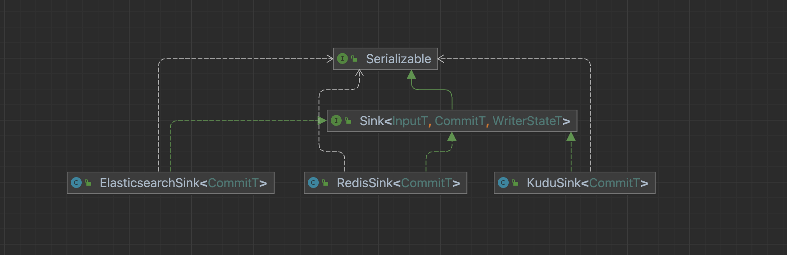
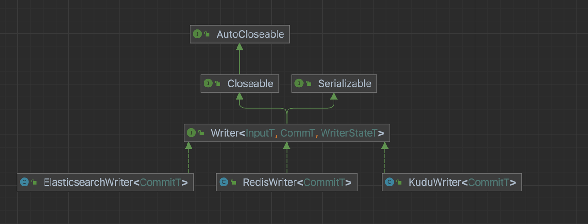

# Sink Connector Details

English | [简体中文](../../zh/community/sink_connector_detail.md)

-----

## Introduction


- Sink: life cycle management of data writing components, mainly responsible for interaction with the framework, framing jobs, it does not participate in the actual execution of jobs.
- Writer: responsible for writing the received data to external storage.
- WriterCommitter (optional): Commit the data to complete the two-phase commit operation; realize the semantics of exactly-once.

Developers first need to create a `Sink` class and implement the `Sink interface`, which is mainly responsible for the life cycle management of the data writing component and the construction of the job. Define the configuration of `writerConfiguration` through the configure method, perform data type conversion through the `createTypeInfoConverter` method, and `write` the internal type conversion to the external system, the same as the `Source` part. Then we define the `Writer` class to implement the specific data writing logic. When the `write` method is called, the `BitSail Row` type writes the data into the cache queue, and when the `flush` method is called, the data in the cache queue is flushed to the target data source.

## Sink

The life cycle management of the data writing component is mainly responsible for the interaction with the framework and the construction of the job. It does not participate in the actual execution of the job.

For each Sink task, we need to implement a class that inherits the Sink interface.



### Sink Interface

```Java
public interface Sink<InputT, CommitT extends Serializable, WriterStateT extends Serializable> extends Serializable {

  /**
   * @return The name of writer operation.
   */
  String getWriterName();

  /**
   * Configure writer with user defined options.
   *
   * @param commonConfiguration Common options.
   * @param writerConfiguration Options for writer.
   */
  void configure(BitSailConfiguration commonConfiguration, BitSailConfiguration writerConfiguration) throws Exception;

  /**
   * Create a writer for processing elements.
   *
   * @return An initialized writer.
   */
  Writer<InputT, CommitT, WriterStateT> createWriter(Writer.Context<WriterStateT> context) throws IOException;

  /**
   * @return A converter which supports conversion from BitSail {@link TypeInfo}
   * and external engine type.
   */
  default TypeInfoConverter createTypeInfoConverter() {
    return new BitSailTypeInfoConverter();
  }

  /**
   * @return A committer for commit committable objects.
   */
  default Optional<WriterCommitter<CommitT>> createCommitter() {
    return Optional.empty();
  }

  /**
   * @return A serializer which convert committable object to byte array.
   */
  default BinarySerializer<CommitT> getCommittableSerializer() {
    return new SimpleBinarySerializer<CommitT>();
  }

  /**
   * @return A serializer which convert state object to byte array.
   */
  default BinarySerializer<WriterStateT> getWriteStateSerializer() {
    return new SimpleBinarySerializer<WriterStateT>();
  }
}
```

### configure method

Responsible for configuration initialization, usually extracting necessary configuration from commonConfiguration and writerConfiguration.

#### example

ElasticsearchSink:

```Java
public void configure(BitSailConfiguration commonConfiguration, BitSailConfiguration writerConfiguration) {
  writerConf = writerConfiguration;
}
```

### createWriter method

Responsible for generating a connector Writer class inherited from the Writer interface. Pass in construction configuration parameters as needed, and note that the passed in parameters must be serializable.

```Java
@Override
public Writer<Row, CommitT, EmptyState> createWriter(Writer.Context<EmptyState> context) {
  return new RedisWriter<>(redisOptions, jedisPoolOptions);
}
```

### createTypeInfoConverter method

Type conversion, convert the internal type and write it to the external system, same as the Source part.

### createCommitter method

The optional method is to write the specific data submission logic, which is generally used in scenarios where the data exactly-once semantics needs to be guaranteed. After the writer completes the data writing, the committer completes the submission, and then realizes the two-phase submission. For details, please refer to the implementation of Doris Connector.

## Writer

specific data write logic



### Writer Interface

```Java
public interface Writer<InputT, CommT, WriterStateT> extends Serializable, Closeable {

  /**
   * Output an element to target source.
   *
   * @param element Input data from upstream.
   */
  void write(InputT element) throws IOException;

  /**
   * Flush buffered input data to target source.
   *
   * @param endOfInput Flag indicates if all input data are delivered.
   */
  void flush(boolean endOfInput) throws IOException;

  /**
   * Prepare commit information before snapshotting when checkpoint is triggerred.
   *
   * @return Information to commit in this checkpoint.
   * @throws IOException Exceptions encountered when preparing committable information.
   */
  List<CommT> prepareCommit() throws IOException;

  /**
   * Do snapshot for at each checkpoint.
   *
   * @param checkpointId The id of checkpoint when snapshot triggered.
   * @return The current state of writer.
   * @throws IOException Exceptions encountered when snapshotting.
   */
  default List<WriterStateT> snapshotState(long checkpointId) throws IOException {
    return Collections.emptyList();
  }

  /**
   * Closing writer when operator is closed.
   *
   * @throws IOException Exception encountered when closing writer.
   */
  default void close() throws IOException {

  }

  interface Context<WriterStateT> extends Serializable {

    TypeInfo<?>[] getTypeInfos();

    int getIndexOfSubTaskId();

    boolean isRestored();

    List<WriterStateT> getRestoreStates();
  }
}
```

### Construction method

Initialize the connection object of the data source according to the configuration, and establish a connection with the target data source.

#### example

```Java
public RedisWriter(BitSailConfiguration writerConfiguration) {
  // initialize ttl
  int ttl = writerConfiguration.getUnNecessaryOption(RedisWriterOptions.TTL, -1);
  TtlType ttlType;
  try {
    ttlType = TtlType.valueOf(StringUtils.upperCase(writerConfiguration.get(RedisWriterOptions.TTL_TYPE)));
  } catch (IllegalArgumentException e) {
    throw BitSailException.asBitSailException(RedisPluginErrorCode.ILLEGAL_VALUE,
        String.format("unknown ttl type: %s", writerConfiguration.get(RedisWriterOptions.TTL_TYPE)));
  }
  int ttlInSeconds = ttl < 0 ? -1 : ttl * ttlType.getContainSeconds();
  log.info("ttl is {}(s)", ttlInSeconds);

  // initialize commandDescription
  String redisDataType = StringUtils.upperCase(writerConfiguration.get(RedisWriterOptions.REDIS_DATA_TYPE));
  String additionalKey = writerConfiguration.getUnNecessaryOption(RedisWriterOptions.ADDITIONAL_KEY, "default_redis_key");
  this.commandDescription = initJedisCommandDescription(redisDataType, ttlInSeconds, additionalKey);
  this.columnSize = writerConfiguration.get(RedisWriterOptions.COLUMNS).size();

  // initialize jedis pool
  JedisPoolConfig jedisPoolConfig = new JedisPoolConfig();
  jedisPoolConfig.setMaxTotal(writerConfiguration.get(RedisWriterOptions.JEDIS_POOL_MAX_TOTAL_CONNECTIONS));
  jedisPoolConfig.setMaxIdle(writerConfiguration.get(RedisWriterOptions.JEDIS_POOL_MAX_IDLE_CONNECTIONS));
  jedisPoolConfig.setMinIdle(writerConfiguration.get(RedisWriterOptions.JEDIS_POOL_MIN_IDLE_CONNECTIONS));
  jedisPoolConfig.setMaxWait(Duration.ofMillis(writerConfiguration.get(RedisWriterOptions.JEDIS_POOL_MAX_WAIT_TIME_IN_MILLIS)));

  String redisHost = writerConfiguration.getNecessaryOption(RedisWriterOptions.HOST, RedisPluginErrorCode.REQUIRED_VALUE);
  int redisPort = writerConfiguration.getNecessaryOption(RedisWriterOptions.PORT, RedisPluginErrorCode.REQUIRED_VALUE);
  String redisPassword = writerConfiguration.get(RedisWriterOptions.PASSWORD);
  int timeout = writerConfiguration.get(RedisWriterOptions.CLIENT_TIMEOUT_MS);

  if (StringUtils.isEmpty(redisPassword)) {
    this.jedisPool = new JedisPool(jedisPoolConfig, redisHost, redisPort, timeout);
  } else {
    this.jedisPool = new JedisPool(jedisPoolConfig, redisHost, redisPort, timeout, redisPassword);
  }

  // initialize record queue
  int batchSize = writerConfiguration.get(RedisWriterOptions.WRITE_BATCH_INTERVAL);
  this.recordQueue = new CircularFifoQueue<>(batchSize);

  this.logSampleInterval = writerConfiguration.get(RedisWriterOptions.LOG_SAMPLE_INTERVAL);
  this.jedisFetcher = RetryerBuilder.<Jedis>newBuilder()
      .retryIfResult(Objects::isNull)
      .retryIfRuntimeException()
      .withStopStrategy(StopStrategies.stopAfterAttempt(3))
      .withWaitStrategy(WaitStrategies.exponentialWait(100, 5, TimeUnit.MINUTES))
      .build()
      .wrap(jedisPool::getResource);

  this.maxAttemptCount = writerConfiguration.get(RedisWriterOptions.MAX_ATTEMPT_COUNT);
  this.retryer = RetryerBuilder.<Boolean>newBuilder()
      .retryIfResult(needRetry -> Objects.equals(needRetry, true))
      .retryIfException(e -> !(e instanceof BitSailException))
      .withWaitStrategy(WaitStrategies.fixedWait(3, TimeUnit.SECONDS))
      .withStopStrategy(StopStrategies.stopAfterAttempt(maxAttemptCount))
      .build();
}
```

### write method

When this method is called, the BitSail Row type data will be written to the cache queue, and various formats of Row type data can also be preprocessed here. If the size of the cache queue is set here, then flush is called after the cache queue is full.

#### example

redis：Store data in `BitSail Row` format directly in a cache queue of a certain size

```Java
public void write(Row record) throws IOException {
  validate(record);
  this.recordQueue.add(record);
  if (recordQueue.isAtFullCapacity()) {
    flush(false);
  }
}
```

Druid：Preprocess the data in `BitSail Row` format and convert it into `StringBuffer` for storage.

```Java
@Override
public void write(final Row element) {
  final StringJoiner joiner = new StringJoiner(DEFAULT_FIELD_DELIMITER, "", "");
  for (int i = 0; i < element.getArity(); i++) {
    final Object v = element.getField(i);
    if (v != null) {
      joiner.add(v.toString());
    }
  }
  // timestamp column is a required field to add in Druid.
  // See https://druid.apache.org/docs/24.0.0/ingestion/data-model.html#primary-timestamp
  joiner.add(String.valueOf(processTime));
  data.append(joiner);
  data.append(DEFAULT_LINE_DELIMITER);
}
```

### flush method

This method mainly implements flushing the data in the cache of the `write` method to the target data source.

#### example

redis: flush the BitSail Row format data in the cache queue to the target data source.

```Java
public void flush(boolean endOfInput) throws IOException {
  processorId++;
  try (PipelineProcessor processor = genPipelineProcessor(recordQueue.size(), this.complexTypeWithTtl)) {
    Row record;
    while ((record = recordQueue.poll()) != null) {

      String key = (String) record.getField(0);
      String value = (String) record.getField(1);
      String scoreOrHashKey = value;
      if (columnSize == SORTED_SET_OR_HASH_COLUMN_SIZE) {
        value = (String) record.getField(2);
        // Replace empty key with additionalKey in sorted set and hash.
        if (key.length() == 0) {
          key = commandDescription.getAdditionalKey();
        }
      }

      if (commandDescription.getJedisCommand() == JedisCommand.ZADD) {
        // sorted set
        processor.addInitialCommand(new Command(commandDescription, key.getBytes(), parseScoreFromString(scoreOrHashKey), value.getBytes()));
      } else if (commandDescription.getJedisCommand() == JedisCommand.HSET) {
        // hash
        processor.addInitialCommand(new Command(commandDescription, key.getBytes(), scoreOrHashKey.getBytes(), value.getBytes()));
      } else if (commandDescription.getJedisCommand() == JedisCommand.HMSET) {
        //mhset
        if ((record.getArity() - 1) % 2 != 0) {
          throw new BitSailException(CONVERT_NOT_SUPPORT, "Inconsistent data entry.");
        }
        List<byte[]> datas = Arrays.stream(record.getFields())
            .collect(Collectors.toList()).stream().map(o -> ((String) o).getBytes())
            .collect(Collectors.toList()).subList(1, record.getFields().length);
        Map<byte[], byte[]> map = new HashMap<>((record.getArity() - 1) / 2);
        for (int index = 0; index < datas.size(); index = index + 2) {
          map.put(datas.get(index), datas.get(index + 1));
        }
        processor.addInitialCommand(new Command(commandDescription, key.getBytes(), map));
      } else {
        // set and string
        processor.addInitialCommand(new Command(commandDescription, key.getBytes(), value.getBytes()));
      }
    }
    retryer.call(processor::run);
  } catch (ExecutionException | RetryException e) {
    if (e.getCause() instanceof BitSailException) {
      throw (BitSailException) e.getCause();
    } else if (e.getCause() instanceof RedisUnexpectedException) {
      throw (RedisUnexpectedException) e.getCause();
    }
    throw e;
  } catch (IOException e) {
    throw new RuntimeException("Error while init jedis client.", e);
  }
}
```

Druid: Submit the sink job to the data source using HTTP post.

```Java
private HttpURLConnection provideHttpURLConnection(final String coordinatorURL) throws IOException {
    final URL url = new URL("http://" + coordinatorURL + DRUID_ENDPOINT);
    final HttpURLConnection con = (HttpURLConnection) url.openConnection();
    con.setRequestMethod("POST");
    con.setRequestProperty("Content-Type", "application/json");
    con.setRequestProperty("Accept", "application/json, text/plain, */*");
    con.setDoOutput(true);
    return con;
  }
  
  public void flush(final boolean endOfInput) throws IOException {
    final ParallelIndexIOConfig ioConfig = provideDruidIOConfig(data);
    final ParallelIndexSupervisorTask indexTask = provideIndexTask(ioConfig);
    final String inputJSON = provideInputJSONString(indexTask);
    final byte[] input = inputJSON.getBytes();
    try (final OutputStream os = httpURLConnection.getOutputStream()) {
      os.write(input, 0, input.length);
    }
    try (final BufferedReader br =
                 new BufferedReader(new InputStreamReader(httpURLConnection.getInputStream(), StandardCharsets.UTF_8))) {
      final StringBuilder response = new StringBuilder();
      String responseLine;
      while ((responseLine = br.readLine()) != null) {
        response.append(responseLine.trim());
      }
      LOG.info("Druid write task has been sent, and the response is {}", response);
    }
  }
```

### close method

Closes any previously created target data source connection objects.

#### example

```Java
public void close() throws IOException {
  bulkProcessor.close();
  restClient.close();
  checkErrorAndRethrow();
}
```