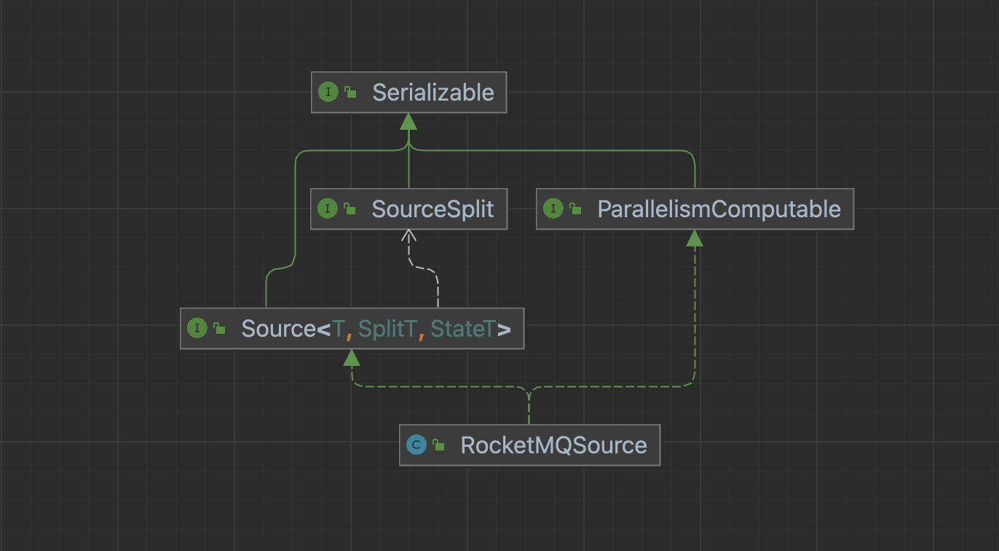
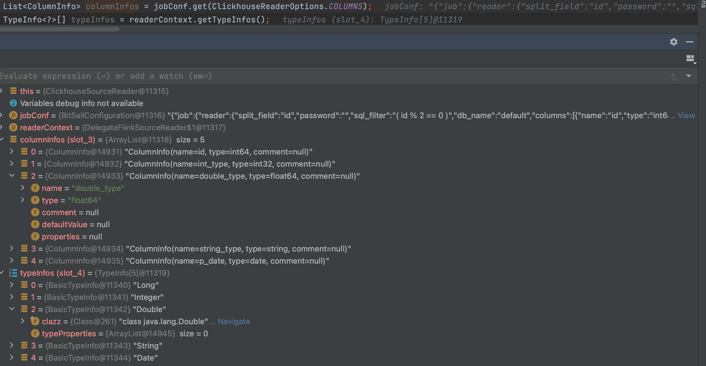
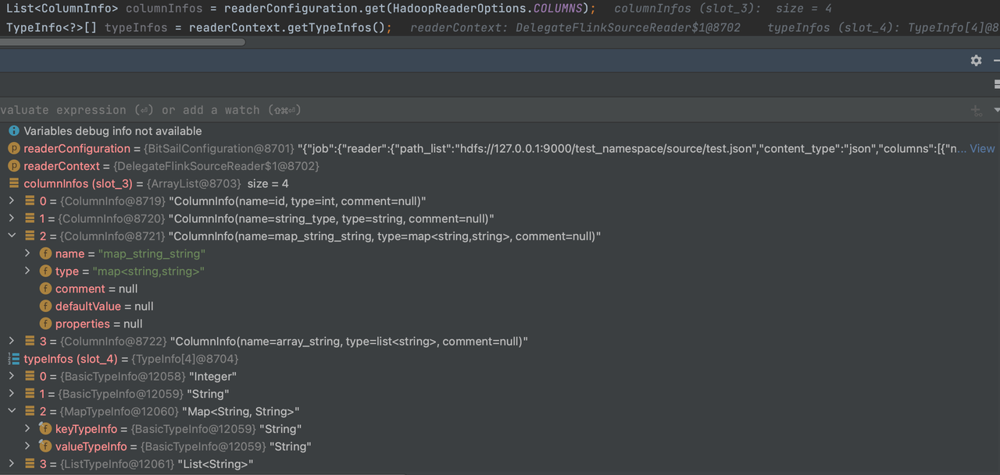
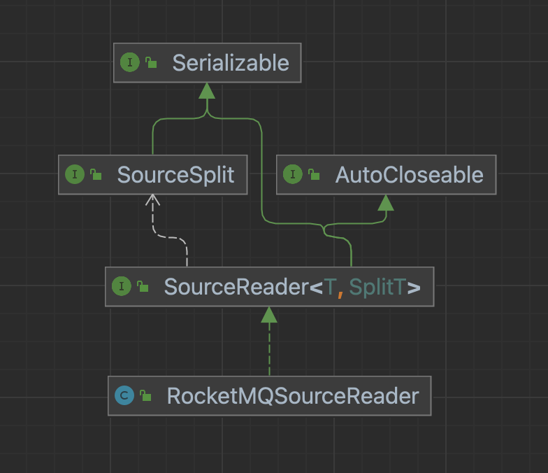

# Source Connector Details

English | [简体中文](../../zh/community/source_connector_detail.md)

-----

## Introduction


- Source: The life cycle management component of the data reading component is mainly responsible for interacting with the framework, structuring the job, and not participating in the actual execution of the job.
- SourceSplit:  Source data split, the core purpose of the big data processing framework is to split large-scale data into multiple reasonable Splits
- State：Job status snapshot, when the checkpoint is enabled, the current execution status will be saved.
- SplitCoordinator: SplitCoordinator assumes the role of creating and managing Split.
- SourceReader: The component that is actually responsible for data reading will read the data after receiving the Split, and then transmit the data to the next operator.

## Source

The life cycle management of the data reading component is mainly responsible for the interaction with the framework and the construction of the job, and it does not participate in the actual execution of the job.

Take RocketMQSource as an example: the Source method needs to implement the Source and ParallelismComputable interfaces.



### Source Interface

```Java
public interface Source<T, SplitT extends SourceSplit, StateT extends Serializable> extends Serializable {

  /**
   * Run in client side for source initialize;
   */
  void configure(ExecutionEnviron execution, BitSailConfiguration readerConfiguration) throws IOException;

  /**
   * Indicate the Source type.
   */
  Boundedness getSourceBoundedness();

  /**
   * Create Source Reader.
   */
  SourceReader<T, SplitT> createReader(SourceReader.Context readerContext);

  /**
   * Create split coordinator.
   */
  SourceSplitCoordinator<SplitT, StateT> createSplitCoordinator(SourceSplitCoordinator.Context<SplitT, StateT> coordinatorContext);

  /**
   * Get Split serializer for the framework,{@link SplitT}should implement from {@link  Serializable}
   */
  default BinarySerializer<SplitT> getSplitSerializer() {
    return new SimpleBinarySerializer<>();
  }

  /**
   * Get State serializer for the framework, {@link StateT}should implement from {@link  Serializable}
   */
  default BinarySerializer<StateT> getSplitCoordinatorCheckpointSerializer() {
    return new SimpleBinarySerializer<>();
  }

  /**
   * Create type info converter for the source, default value {@link BitSailTypeInfoConverter}
   */
  default TypeInfoConverter createTypeInfoConverter() {
    return new BitSailTypeInfoConverter();
  }

  /**
   * Get Source's name.
   */
  String getReaderName();
}
```

#### configure method

We mainly do the distribution and extraction of some client configurations, and can operate on the configuration of the runtime environment `ExecutionEnviron` and `readerConfiguration`.

##### example

```Java
@Override
public void configure(ExecutionEnviron execution, BitSailConfiguration readerConfiguration) {
  this.readerConfiguration = readerConfiguration;
  this.commonConfiguration = execution.getCommonConfiguration();
}
```

#### getSourceBoundedness method

Set the processing method of the job, which is to use the stream processing method, the batch processing method, or the stream-batch unified processing method. In the stream-batch integrated examples, we need to set different processing methods according to different types of jobs。

| Job Type | Boundedness                 |
| -------- | --------------------------- |
| batch    | Boundedness.*BOUNDEDNESS*   |
| stream   | Boundedness.*UNBOUNDEDNESS* |

##### Unified example

```Java
@Override
public Boundedness getSourceBoundedness() {
  return Mode.BATCH.equals(Mode.getJobRunMode(commonConfiguration.get(CommonOptions.JOB_TYPE))) ?
      Boundedness.BOUNDEDNESS :
      Boundedness.UNBOUNDEDNESS;
}
```

##### Batch example

```Java
public Boundedness getSourceBoundedness() {
  return Boundedness.BOUNDEDNESS;
}
```

#### createTypeInfoConverter method

A type converter used to specify the Source connector; we know that most external data systems have their own type definitions, and their definitions will not be completely consistent with BitSail’s type definitions; in order to simplify the conversion of type definitions, we support the relationship between the two being mapped through the configuration file, thereby simplifying the development of the configuration file.

It is the parsing of the `columns` in the `reader` part of the task description Json file. The type of different fields in the `columns` will be parsed from the `ClickhouseReaderOptions.COLUMNS` field to `readerContext.getTypeInfos()` according to the above description file。

##### example

- `BitSailTypeInfoConverter`
  -  Default `TypeInfoConverter`，Directly parse the string of the `ReaderOptions.COLUMNS` field, what type is in the `COLUMNS` field, and what type is in `TypeInfoConverter`.
- `FileMappingTypeInfoConverter`
  -  It will bind the `{readername}-type-converter.yaml` file during BitSail type system conversion to map the database field type and BitSail type. The `ReaderOptions.COLUMNS` field will be mapped to `TypeInfoConverter` after being converted by this mapping file.

###### FileMappingTypeInfoConverter

Databases connected through JDBC, including MySql, Oracle, SqlServer, Kudu, ClickHouse, etc. The characteristic of the data source here is to return the obtained data in the form of `java.sql.ResultSet` interface. For this type of database, we often design the `TypeInfoConverter` object as `FileMappingTypeInfoConverter`. This object will be bound to `{readername}-type-converter.yaml` file during BitSail type system conversion, which is used to map the database field type and BitSail type.

```Java
@Override
public TypeInfoConverter createTypeInfoConverter() {
  return new FileMappingTypeInfoConverter(getReaderName());
}
```

For the parsing of the `{readername}-type-converter.yaml` file, take `clickhouse-type-converter.yaml` as an example.

```Plain
# Clickhouse Type to BitSail Type
engine.type.to.bitsail.type.converter:

  - source.type: int32
    target.type: int

  - source.type: float64
    target.type: double

  - source.type: string
    target.type: string

  - source.type: date
    target.type: date.date

  - source.type: null
    target.type: void

# BitSail Type to Clickhouse Type
bitsail.type.to.engine.type.converter:

  - source.type: int
    target.type: int32

  - source.type: double
    target.type: float64

  - source.type: date.date
    target.type: date

  - source.type: string
    target.type: string
```

The role of this file is to analyze the `columns` in the `reader `part of the job description json file. The types of different fields in the `columns` will be parsed from the `ClickhouseReaderOptions.COLUMNS` field to `readerContext.getTypeInfos()` according to the above description file.

```Json
"reader": {
  "class": "com.bytedance.bitsail.connector.clickhouse.source.ClickhouseSource",
  "jdbc_url": "jdbc:clickhouse://localhost:8123",
  "db_name": "default",
  "table_name": "test_ch_table",
  "split_field": "id",
  "split_config": "{\"name\": \"id\", \"lower_bound\": 0, \"upper_bound\": \"10000\", \"split_num\": 3}",
  "sql_filter": "( id % 2 == 0 )",
  "columns": [
    {
      "name": "id",
      "type": "int64"
    },
    {
      "name": "int_type",
      "type": "int32"
    },
    {
      "name": "double_type",
      "type": "float64"
    },
    {
      "name": "string_type",
      "type": "string"
    },
    {
      "name": "p_date",
      "type": "date"
    }
  ]
},
```



This method is not only applicable to databases, but also applicable to all scenarios that require type mapping between the engine side and the BitSail side during type conversion.

###### BitSailTypeInfoConverter

Usually, the default method is used for type conversion, and the string is directly parsed for the `ReaderOptions.COLUMNS`field.

```Java
@Override
public TypeInfoConverter createTypeInfoConverter() {
  return new BitSailTypeInfoConverter();
}
```

BitSailTypeInfoConverter

Usually, the default method is used for type conversion, and the string is directly parsed for the `ReaderOptions.COLUMNS` field.

```Java
@Override
public TypeInfoConverter createTypeInfoConverter() {
  return new BitSailTypeInfoConverter();
}
```

Take Hadoop as an example:

```Json
"reader": {
  "class": "com.bytedance.bitsail.connector.hadoop.source.HadoopSource",
  "path_list": "hdfs://127.0.0.1:9000/test_namespace/source/test.json",
  "content_type":"json",
  "reader_parallelism_num": 1,
  "columns": [
    {
      "name":"id",
      "type": "int"
    },
    {
      "name": "string_type",
      "type": "string"
    },
    {
      "name": "map_string_string",
      "type": "map<string,string>"
    },
    {
      "name": "array_string",
      "type": "list<string>"
    }
  ]
}
```



#### createSourceReader method

Write the specific data reading logic. The component responsible for data reading will read the data after receiving the Split, and then transmit the data to the next operator.

The specific parameters passed to construct `SourceReader` are determined according to requirements, but it must be ensured that all parameters can be serialized. If it is not serializable, an error will occur when `createJobGraph` is created.

##### example

```Java
public SourceReader<Row, RocketMQSplit> createReader(SourceReader.Context readerContext) {
  return new RocketMQSourceReader(
      readerConfiguration,
      readerContext,
      getSourceBoundedness());
}
```

#### createSplitCoordinator method

Writing specific data split and split allocation logic, the SplitCoordinator assumes the role of creating and managing Splits

The specific parameters passed to construct `SplitCoordinator `are determined according to requirements, but it must be ensured that all parameters can be serialized. If it is not serializable, an error will occur when `createJobGraph` is created.

##### example

```Java
public SourceSplitCoordinator<RocketMQSplit, RocketMQState> createSplitCoordinator(SourceSplitCoordinator
                                                                                       .Context<RocketMQSplit, RocketMQState> coordinatorContext) {
  return new RocketMQSourceSplitCoordinator(
      coordinatorContext,
      readerConfiguration,
      getSourceBoundedness());
}
```

### ParallelismComputable Interface

```Java
public interface ParallelismComputable extends Serializable {

  /**
   * give a parallelism advice for reader/writer based on configurations and upstream parallelism advice
   *
   * @param commonConf     common configuration
   * @param selfConf       reader/writer configuration
   * @param upstreamAdvice parallelism advice from upstream (when an operator has no upstream in DAG, its upstream is
   *                       global parallelism)
   * @return parallelism advice for the reader/writer
   */
  ParallelismAdvice getParallelismAdvice(BitSailConfiguration commonConf,
                                         BitSailConfiguration selfConf,
                                         ParallelismAdvice upstreamAdvice) throws Exception;
}
```

#### getParallelismAdvice method

Used to specify the parallel number of downstream readers. Generally, there are the following methods:

- Use `selfConf.get(ClickhouseReaderOptions.READER_PARALLELISM_NUM)` to specify the degree of parallelism.
- Customize your own parallelism division logic.

##### example

For example, in RocketMQ, we can define that each reader can handle up to 4 queues. *`DEFAULT_ROCKETMQ_PARALLELISM_THRESHOLD `*`= 4`

Obtain the corresponding degree of parallelism through this custom method.

```Java
public ParallelismAdvice getParallelismAdvice(BitSailConfiguration commonConfiguration,
                                                BitSailConfiguration rocketmqConfiguration,
                                                ParallelismAdvice upstreamAdvice) throws Exception {
    String cluster = rocketmqConfiguration.get(RocketMQSourceOptions.CLUSTER);
    String topic = rocketmqConfiguration.get(RocketMQSourceOptions.TOPIC);
    String consumerGroup = rocketmqConfiguration.get(RocketMQSourceOptions.CONSUMER_GROUP);
    DefaultLitePullConsumer consumer = RocketMQUtils.prepareRocketMQConsumer(rocketmqConfiguration, String.format(SOURCE_INSTANCE_NAME_TEMPLATE,
        cluster,
        topic,
        consumerGroup,
        UUID.randomUUID()
    ));
    try {
      consumer.start();
      Collection<MessageQueue> messageQueues = consumer.fetchMessageQueues(topic);
      int adviceParallelism = Math.max(CollectionUtils.size(messageQueues) / DEFAULT_ROCKETMQ_PARALLELISM_THRESHOLD, 1);

      return ParallelismAdvice.builder()
          .adviceParallelism(adviceParallelism)
          .enforceDownStreamChain(true)
          .build();
    } finally {
      consumer.shutdown();
    }
  }
}
```

## SourceSplit

The data fragmentation format of the data source requires us to implement the SourceSplit interface.


### SourceSplit Interface

We are required to implement a method to obtain splitId.

```Java
public interface SourceSplit extends Serializable {
  String uniqSplitId();
}
```

For the specific slice format, developers can customize it according to their own needs.

### example

#### Database

Generally, the primary key is used to divide the data into maximum and minimum values; for classes without a primary key, it is usually recognized as a split and no longer split, so the parameters in the split include the maximum and minimum values of the primary key, and a Boolean type `readTable`. If there is no primary key class or the primary key is not split, the entire table will be regarded as a split. Under this condition, `readTable` is true. If the primary key is split according to the maximum and minimum values, it is set to false.。

Take ClickhouseSourceSplit as an example:

```Java
@Setter
public class ClickhouseSourceSplit implements SourceSplit {
  public static final String SOURCE_SPLIT_PREFIX = "clickhouse_source_split_";
  private static final String BETWEEN_CLAUSE = "( `%s` BETWEEN ? AND ? )";

  private final String splitId;

  /**
   * Read whole table or range [lower, upper]
   */
  private boolean readTable;
  private Long lower;
  private Long upper;

  public ClickhouseSourceSplit(int splitId) {
    this.splitId = SOURCE_SPLIT_PREFIX + splitId;
  }

  @Override
  public String uniqSplitId() {
    return splitId;
  }

  public void decorateStatement(PreparedStatement statement) {
    try {
      if (readTable) {
        lower = Long.MIN_VALUE;
        upper = Long.MAX_VALUE;
      }
      statement.setObject(1, lower);
      statement.setObject(2, upper);
    } catch (SQLException e) {
      throw BitSailException.asBitSailException(CommonErrorCode.RUNTIME_ERROR, "Failed to decorate statement with split " + this, e.getCause());
    }
  }

  public static String getRangeClause(String splitField) {
    return StringUtils.isEmpty(splitField) ? null : String.format(BETWEEN_CLAUSE, splitField);
  }

  @Override
  public String toString() {
    return String.format(
        "{\"split_id\":\"%s\", \"lower\":%s, \"upper\":%s, \"readTable\":%s}",
        splitId, lower, upper, readTable);
  }
}
```

#### Message queue

Generally, splits are divided according to the number of partitions registered in the topic in the message queue. The slice should mainly include the starting point and end point of consumption and the queue of consumption.

Take RocketMQSplit as an example:

```Java
@Builder
@Getter
public class RocketMQSplit implements SourceSplit {

  private MessageQueue messageQueue;

  @Setter
  private long startOffset;

  private long endOffset;

  private String splitId;

  @Override
  public String uniqSplitId() {
    return splitId;
  }

  @Override
  public String toString() {
    return "RocketMQSplit{" +
        "messageQueue=" + messageQueue +
        ", startOffset=" + startOffset +
        ", endOffset=" + endOffset +
        '}';
  }
}
```

#### File system

Generally, files are divided as the smallest granularity, and some formats also support splitting a single file into multiple sub-Splits. The required file slices need to be packed in the file system split.

Take `FtpSourceSplit` as an example:

```Java
public class FtpSourceSplit implements SourceSplit {

  public static final String FTP_SOURCE_SPLIT_PREFIX = "ftp_source_split_";

  private final String splitId;

  @Setter
  private String path;
  @Setter
  private long fileSize;

  public FtpSourceSplit(int splitId) {
    this.splitId = FTP_SOURCE_SPLIT_PREFIX + splitId;
  }

  @Override
  public String uniqSplitId() {
    return splitId;
  }

  @Override
  public boolean equals(Object obj) {
    return (obj instanceof FtpSourceSplit) && (splitId.equals(((FtpSourceSplit) obj).splitId));
  }

}
```

In particular, in the Hadoop file system, we can also use the wrapper of the `org.apache.hadoop.mapred.InputSpli`t class to customize our Split.

```Java
public class HadoopSourceSplit implements SourceSplit {
  private static final long serialVersionUID = 1L;
  private final Class<? extends InputSplit> splitType;
  private transient InputSplit hadoopInputSplit;

  private byte[] hadoopInputSplitByteArray;

  public HadoopSourceSplit(InputSplit inputSplit) {
    if (inputSplit == null) {
      throw new NullPointerException("Hadoop input split must not be null");
    }

    this.splitType = inputSplit.getClass();
    this.hadoopInputSplit = inputSplit;
  }

  public InputSplit getHadoopInputSplit() {
    return this.hadoopInputSplit;
  }

  public void initInputSplit(JobConf jobConf) {
    if (this.hadoopInputSplit != null) {
      return;
    }

    checkNotNull(hadoopInputSplitByteArray);

    try {
      this.hadoopInputSplit = (InputSplit) WritableFactories.newInstance(splitType);

      if (this.hadoopInputSplit instanceof Configurable) {
        ((Configurable) this.hadoopInputSplit).setConf(jobConf);
      } else if (this.hadoopInputSplit instanceof JobConfigurable) {
        ((JobConfigurable) this.hadoopInputSplit).configure(jobConf);
      }

      if (hadoopInputSplitByteArray != null) {
        try (ObjectInputStream objectInputStream = new ObjectInputStream(new ByteArrayInputStream(hadoopInputSplitByteArray))) {
          this.hadoopInputSplit.readFields(objectInputStream);
        }

        this.hadoopInputSplitByteArray = null;
      }
    } catch (Exception e) {
      throw new RuntimeException("Unable to instantiate Hadoop InputSplit", e);
    }
  }

  private void writeObject(ObjectOutputStream out) throws IOException {

    if (hadoopInputSplit != null) {
      try (
          ByteArrayOutputStream byteArrayOutputStream = new ByteArrayOutputStream();
          ObjectOutputStream objectOutputStream = new ObjectOutputStream(byteArrayOutputStream)
      ) {
        this.hadoopInputSplit.write(objectOutputStream);
        objectOutputStream.flush();
        this.hadoopInputSplitByteArray = byteArrayOutputStream.toByteArray();
      }
    }
    out.defaultWriteObject();
  }

  @Override
  public String uniqSplitId() {
    return hadoopInputSplit.toString();
  }
}
```

## State

In scenarios where checkpoints are required, we usually use `Map` to preserve the current execution state.

### Unified example

In the streaming-batch unified scenario, we need to save the state to recover from the abnormally interrupted streaming job.

Take RocketMQState as an example:

```Java
public class RocketMQState implements Serializable {

  private final Map<MessageQueue, String> assignedWithSplitIds;

  public RocketMQState(Map<MessageQueue, String> assignedWithSplitIds) {
    this.assignedWithSplitIds = assignedWithSplitIds;
  }

  public Map<MessageQueue, String> getAssignedWithSplits() {
    return assignedWithSplitIds;
  }
}
```

### Batch example

For batch scenarios, we can use EmptyState to not store the state. If state storage is required, a similar design scheme is adopted for the stream-batch unified scenario.

```Java
public class EmptyState implements Serializable {

  public static EmptyState fromBytes() {
    return new EmptyState();
  }
}
```

## SourceSplitCoordinator

The core purpose of the big data processing framework is to split large-scale data into multiple reasonable Splits, and the SplitCoordinator assumes the role of creating and managing Splits.


### SourceSplitCoordinator Interface

```Java
public interface SourceSplitCoordinator<SplitT extends SourceSplit, StateT> extends Serializable, AutoCloseable {

  void start();

  void addReader(int subtaskId);

  void addSplitsBack(List<SplitT> splits, int subtaskId);

  void handleSplitRequest(int subtaskId, @Nullable String requesterHostname);

  default void handleSourceEvent(int subtaskId, SourceEvent sourceEvent) {
  }

  StateT snapshotState() throws Exception;

  default void notifyCheckpointComplete(long checkpointId) throws Exception {
  }

  void close();

  interface Context<SplitT extends SourceSplit, StateT> {

    boolean isRestored();

    /**
     * Return the state to the split coordinator, for the exactly-once.
     */
    StateT getRestoreState();

    /**
     * Return total parallelism of the source reader.
     */
    int totalParallelism();

    /**
     * When Source reader started, it will be registered itself to coordinator.
     */
    Set<Integer> registeredReaders();

    /**
     * Assign splits to reader.
     */
    void assignSplit(int subtaskId, List<SplitT> splits);

    /**
     * Mainly use in boundedness situation, represents there will no more split will send to source reader.
     */
    void signalNoMoreSplits(int subtask);

    /**
     * If split coordinator have any event want to send source reader, use this method.
     * Like send Pause event to Source Reader in CDC2.0.
     */
    void sendEventToSourceReader(int subtaskId, SourceEvent event);

    /**
     * Schedule to run the callable and handler, often used in un-boundedness mode.
     */
    <T> void runAsync(Callable<T> callable,
                      BiConsumer<T, Throwable> handler,
                      int initialDelay,
                      long interval);

    /**
     * Just run callable and handler once, often used in boundedness mode.
     */
    <T> void runAsyncOnce(Callable<T> callable,
                          BiConsumer<T, Throwable> handler);
  }
}
```

### Construction method

In the construction method, developers generally mainly perform some configuration settings and create containers for shard information storage.

Take the construction of ClickhouseSourceSplitCoordinator as an example:

```Java
public ClickhouseSourceSplitCoordinator(SourceSplitCoordinator.Context<ClickhouseSourceSplit, EmptyState> context,
                                  BitSailConfiguration jobConf) {
  this.context = context;
  this.jobConf = jobConf;
  this.splitAssignmentPlan = Maps.newConcurrentMap();
}
```

In the scenario where State is customized, it is necessary to save and restore the state stored in `SourceSplitCoordinator.Context` during checkpoint.

Take RocketMQSourceSplitCoordinator as an example:

```Java
public RocketMQSourceSplitCoordinator(
    SourceSplitCoordinator.Context<RocketMQSplit, RocketMQState> context,
    BitSailConfiguration jobConfiguration,
    Boundedness boundedness) {
  this.context = context;
  this.jobConfiguration = jobConfiguration;
  this.boundedness = boundedness;
  this.discoveryInternal = jobConfiguration.get(RocketMQSourceOptions.DISCOVERY_INTERNAL);
  this.pendingRocketMQSplitAssignment = Maps.newConcurrentMap();

  this.discoveredPartitions = new HashSet<>();
  if (context.isRestored()) {
    RocketMQState restoreState = context.getRestoreState();
    assignedPartitions = restoreState.getAssignedWithSplits();
    discoveredPartitions.addAll(assignedPartitions.keySet());
  } else {
    assignedPartitions = Maps.newHashMap();
  }

  prepareConsumerProperties();
}
```

### start method

Extract split metadata required by some data sources. 

#### Unified example

Take RocketMQSourceSplitCoordinator as an example:

```Java
private void prepareRocketMQConsumer() {
  try {
    consumer = RocketMQUtils.prepareRocketMQConsumer(jobConfiguration,
        String.format(COORDINATOR_INSTANCE_NAME_TEMPLATE,
            cluster, topic, consumerGroup, UUID.randomUUID()));
    consumer.start();
  } catch (Exception e) {
    throw BitSailException.asBitSailException(RocketMQErrorCode.CONSUMER_CREATE_FAILED, e);
  }
}

@Override
public void start() {
  prepareRocketMQConsumer();
  splitAssigner = new FairRocketMQSplitAssigner(jobConfiguration, assignedPartitions);
  if (discoveryInternal > 0) {
    context.runAsync(
        this::fetchMessageQueues,
        this::handleMessageQueueChanged,
        0,
        discoveryInternal
    );
  } else {
    context.runAsyncOnce(
        this::fetchMessageQueues,
        this::handleMessageQueueChanged
    );
  }
}
```

#### Batch example

Take ClickhouseSourceSplitCoordinator as an example:

```Java
public void start() {
  List<ClickhouseSourceSplit> splitList;
  try {
    SimpleDivideSplitConstructor constructor = new SimpleDivideSplitConstructor(jobConf);
    splitList = constructor.construct();
  } catch (IOException e) {
    ClickhouseSourceSplit split = new ClickhouseSourceSplit(0);
    split.setReadTable(true);
    splitList = Collections.singletonList(split);
    LOG.error("Failed to construct splits, will directly read the table.", e);
  }

  int readerNum = context.totalParallelism();
  LOG.info("Found {} readers and {} splits.", readerNum, splitList.size());
  if (readerNum > splitList.size()) {
    LOG.error("Reader number {} is larger than split number {}.", readerNum, splitList.size());
  }

  for (ClickhouseSourceSplit split : splitList) {
    int readerIndex = ReaderSelector.getReaderIndex(readerNum);
    splitAssignmentPlan.computeIfAbsent(readerIndex, k -> new HashSet<>()).add(split);
    LOG.info("Will assign split {} to the {}-th reader", split.uniqSplitId(), readerIndex);
  }
}
```

### Assigner

Assign the divided splits to the Reader. During the development process, we usually let the SourceSplitCoordinator focus on processing the communication with the Reader. The actual split distribution logic is generally encapsulated in the Assigner. This Assigner can be an encapsulated `Split Assign function`, or it can be a `Split Assigner class`.

#### Assign function example

Take ClickhouseSourceSplitCoordinator as an example:

The `tryAssignSplitsToReader` function assigns the divided slices stored in `splitAssignmentPlan` to the corresponding Reader.

```Java
private void tryAssignSplitsToReader() {
  Map<Integer, List<ClickhouseSourceSplit>> splitsToAssign = new HashMap<>();

  for (Integer readerIndex : splitAssignmentPlan.keySet()) {
    if (CollectionUtils.isNotEmpty(splitAssignmentPlan.get(readerIndex)) && context.registeredReaders().contains(readerIndex)) {
      splitsToAssign.put(readerIndex, Lists.newArrayList(splitAssignmentPlan.get(readerIndex)));
    }
  }

  for (Integer readerIndex : splitsToAssign.keySet()) {
    LOG.info("Try assigning splits reader {}, splits are: [{}]", readerIndex,
        splitsToAssign.get(readerIndex).stream().map(ClickhouseSourceSplit::uniqSplitId).collect(Collectors.toList()));
    splitAssignmentPlan.remove(readerIndex);
    context.assignSplit(readerIndex, splitsToAssign.get(readerIndex));
    context.signalNoMoreSplits(readerIndex);
    LOG.info("Finish assigning splits reader {}", readerIndex);
  }
}
```

#### Assigner class example

Take RocketMQSourceSplitCoordinator as an example:

```Java
public class FairRocketMQSplitAssigner implements SplitAssigner<MessageQueue> {

  private BitSailConfiguration readerConfiguration;

  private AtomicInteger atomicInteger;

  public Map<MessageQueue, String> rocketMQSplitIncrementMapping;

  public FairRocketMQSplitAssigner(BitSailConfiguration readerConfiguration,
                                   Map<MessageQueue, String> rocketMQSplitIncrementMapping) {
    this.readerConfiguration = readerConfiguration;
    this.rocketMQSplitIncrementMapping = rocketMQSplitIncrementMapping;
    this.atomicInteger = new AtomicInteger(CollectionUtils
        .size(rocketMQSplitIncrementMapping.keySet()));
  }

  @Override
  public String assignSplitId(MessageQueue messageQueue) {
    if (!rocketMQSplitIncrementMapping.containsKey(messageQueue)) {
      rocketMQSplitIncrementMapping.put(messageQueue, String.valueOf(atomicInteger.getAndIncrement()));
    }
    return rocketMQSplitIncrementMapping.get(messageQueue);
  }

  @Override
  public int assignToReader(String splitId, int totalParallelism) {
    return splitId.hashCode() % totalParallelism;
  }
}
```

### addReader method

Call Assigner to add splits to Reader.

#### Batch example

Take ClickhouseSourceSplitCoordinator as an example:

```Java
public void addReader(int subtaskId) {
  LOG.info("Found reader {}", subtaskId);
  tryAssignSplitsToReader();
}
```

#### Unified example

Take RocketMQSourceSplitCoordinator as an example:

```Java
private void notifyReaderAssignmentResult() {
  Map<Integer, List<RocketMQSplit>> tmpRocketMQSplitAssignments = new HashMap<>();

  for (Integer pendingAssignmentReader : pendingRocketMQSplitAssignment.keySet()) {

    if (CollectionUtils.isNotEmpty(pendingRocketMQSplitAssignment.get(pendingAssignmentReader))
        && context.registeredReaders().contains(pendingAssignmentReader)) {

      tmpRocketMQSplitAssignments.put(pendingAssignmentReader, Lists.newArrayList(pendingRocketMQSplitAssignment.get(pendingAssignmentReader)));
    }
  }

  for (Integer pendingAssignmentReader : tmpRocketMQSplitAssignments.keySet()) {

    LOG.info("Assigning splits to reader {}, splits = {}.", pendingAssignmentReader,
        tmpRocketMQSplitAssignments.get(pendingAssignmentReader));

    context.assignSplit(pendingAssignmentReader,
        tmpRocketMQSplitAssignments.get(pendingAssignmentReader));
    Set<RocketMQSplit> removes = pendingRocketMQSplitAssignment.remove(pendingAssignmentReader);
    removes.forEach(removeSplit -> {
      assignedPartitions.put(removeSplit.getMessageQueue(), removeSplit.getSplitId());
    });

    LOG.info("Assigned splits to reader {}", pendingAssignmentReader);

    if (Boundedness.BOUNDEDNESS == boundedness) {
      LOG.info("Signal reader {} no more splits assigned in future.", pendingAssignmentReader);
      context.signalNoMoreSplits(pendingAssignmentReader);
    }
  }
}

@Override
public void addReader(int subtaskId) {
  LOG.info(
      "Adding reader {} to RocketMQ Split Coordinator for consumer group {}.",
      subtaskId,
      consumerGroup);
  notifyReaderAssignmentResult();
}
```

### addSplitsBack method

For some splits that have not been processed by the Reader, reassign them. The reassignment strategy can be defined by yourself. The common strategy is hash modulo. All the Splits in the returned Split list are reassigned and then assigned to different Readers.

#### Batch example

以ClickhouseSourceSplitCoordinator为例：

`ReaderSelector` uses the hash modulo strategy to redistribute the Split list.

The tryAssignSplitsToReader method assigns the reassigned Split collection to Reader through Assigner.

```Java
public void addSplitsBack(List<ClickhouseSourceSplit> splits, int subtaskId) {
  LOG.info("Source reader {} return splits {}.", subtaskId, splits);

  int readerNum = context.totalParallelism();
  for (ClickhouseSourceSplit split : splits) {
    int readerIndex = ReaderSelector.getReaderIndex(readerNum);
    splitAssignmentPlan.computeIfAbsent(readerIndex, k -> new HashSet<>()).add(split);
    LOG.info("Re-assign split {} to the {}-th reader.", split.uniqSplitId(), readerIndex);
  }

  tryAssignSplitsToReader();
}
```

#### Unified example

Take RocketMQSourceSplitCoordinator as an example:

`addSplitChangeToPendingAssignment` uses the hash modulo strategy to reassign the Split list.

`notifyReaderAssignmentResult` assigns the reassigned Split collection to Reader through Assigner.

```Java
private synchronized void addSplitChangeToPendingAssignment(Set<RocketMQSplit> newRocketMQSplits) {
  int numReader = context.totalParallelism();
  for (RocketMQSplit split : newRocketMQSplits) {
    int readerIndex = splitAssigner.assignToReader(split.getSplitId(), numReader);
    pendingRocketMQSplitAssignment.computeIfAbsent(readerIndex, r -> new HashSet<>())
        .add(split);
  }
  LOG.debug("RocketMQ splits {} finished assignment.", newRocketMQSplits);
}

@Override
public void addSplitsBack(List<RocketMQSplit> splits, int subtaskId) {
  LOG.info("Source reader {} return splits {}.", subtaskId, splits);
  addSplitChangeToPendingAssignment(new HashSet<>(splits));
  notifyReaderAssignmentResult();
}
```

### snapshotState method

Store the snapshot information of the processing split, which is used in the construction method when restoring.

```Java
public RocketMQState snapshotState() throws Exception {
  return new RocketMQState(assignedPartitions);
}
```

### close method

Closes all open connectors that interact with the data source to read metadata information during split method.

```Java
public void close() {
  if (consumer != null) {
    consumer.shutdown();
  }
}
```

## SourceReader

Each SourceReader is executed in an independent thread. As long as we ensure that the slices assigned by SourceSplitCoordinator to different SourceReaders have no intersection, we can ignore any concurrency details during the execution cycle of SourceReader.



### SourceReader Interface

```Java
public interface SourceReader<T, SplitT extends SourceSplit> extends Serializable, AutoCloseable {

  void start();

  void pollNext(SourcePipeline<T> pipeline) throws Exception;

  void addSplits(List<SplitT> splits);

  /**
   * Check source reader has more elements or not.
   */
  boolean hasMoreElements();

  /**
   * There will no more split will send to this source reader.
   * Source reader could be exited after process all assigned split.
   */
  default void notifyNoMoreSplits() {

  }

  /**
   * Process all events which from {@link SourceSplitCoordinator}.
   */
  default void handleSourceEvent(SourceEvent sourceEvent) {
  }

  /**
   * Store the split to the external system to recover when task failed.
   */
  List<SplitT> snapshotState(long checkpointId);

  /**
   * When all tasks finished snapshot, notify checkpoint complete will be invoked.
   */
  default void notifyCheckpointComplete(long checkpointId) throws Exception {

  }

  interface Context {

    TypeInfo<?>[] getTypeInfos();

    String[] getFieldNames();

    int getIndexOfSubtask();

    void sendSplitRequest();
  }
}
```

### Construction method

Here it is necessary to complete the extraction of various configurations related to data source access, such as database name table name, message queue cluster and topic, identity authentication configuration, and so on.

#### example

```Java
public RocketMQSourceReader(BitSailConfiguration readerConfiguration,
                            Context context,
                            Boundedness boundedness) {
  this.readerConfiguration = readerConfiguration;
  this.boundedness = boundedness;
  this.context = context;
  this.assignedRocketMQSplits = Sets.newHashSet();
  this.finishedRocketMQSplits = Sets.newHashSet();
  this.deserializationSchema = new RocketMQDeserializationSchema(
      readerConfiguration,
      context.getTypeInfos(),
      context.getFieldNames());
  this.noMoreSplits = false;

  cluster = readerConfiguration.get(RocketMQSourceOptions.CLUSTER);
  topic = readerConfiguration.get(RocketMQSourceOptions.TOPIC);
  consumerGroup = readerConfiguration.get(RocketMQSourceOptions.CONSUMER_GROUP);
  consumerTag = readerConfiguration.get(RocketMQSourceOptions.CONSUMER_TAG);
  pollBatchSize = readerConfiguration.get(RocketMQSourceOptions.POLL_BATCH_SIZE);
  pollTimeout = readerConfiguration.get(RocketMQSourceOptions.POLL_TIMEOUT);
  commitInCheckpoint = readerConfiguration.get(RocketMQSourceOptions.COMMIT_IN_CHECKPOINT);
  accessKey = readerConfiguration.get(RocketMQSourceOptions.ACCESS_KEY);
  secretKey = readerConfiguration.get(RocketMQSourceOptions.SECRET_KEY);
}
```

### start method

Obtain the access object of the data source, such as the execution object of the database, the consumer object of the message queue, or the recordReader object of the file system.

#### example

Message queue

```Java
public void start() {
  try {
    if (StringUtils.isNotEmpty(accessKey) && StringUtils.isNotEmpty(secretKey)) {
      AclClientRPCHook aclClientRPCHook = new AclClientRPCHook(
          new SessionCredentials(accessKey, secretKey));
      consumer = new DefaultMQPullConsumer(aclClientRPCHook);
    } else {
      consumer = new DefaultMQPullConsumer();
    }

    consumer.setConsumerGroup(consumerGroup);
    consumer.setNamesrvAddr(cluster);
    consumer.setInstanceName(String.format(SOURCE_READER_INSTANCE_NAME_TEMPLATE,
        cluster, topic, consumerGroup, UUID.randomUUID()));
    consumer.setConsumerPullTimeoutMillis(pollTimeout);
    consumer.start();
  } catch (Exception e) {
    throw BitSailException.asBitSailException(RocketMQErrorCode.CONSUMER_CREATE_FAILED, e);
  }
}
```

Database

```Java
public void start() {
  this.connection = connectionHolder.connect();

  // Construct statement.
  String baseSql = ClickhouseJdbcUtils.getQuerySql(dbName, tableName, columnInfos);
  String querySql = ClickhouseJdbcUtils.decorateSql(baseSql, splitField, filterSql, maxFetchCount, true);
  try {
    this.statement = connection.prepareStatement(querySql);
  } catch (SQLException e) {
    throw new RuntimeException("Failed to prepare statement.", e);
  }

  LOG.info("Task {} started.", subTaskId);
}
```

FTP

```Java
public void start() {
  this.ftpHandler.loginFtpServer();
  if (this.ftpHandler.getFtpConfig().getSkipFirstLine()) {
    this.skipFirstLine = true;
  }
}
```

### addSplits method

Add the Splits list assigned by SourceSplitCoordinator to the current Reader to its own processing queue or set.

#### example

```Java
public void addSplits(List<RocketMQSplit> splits) {
  LOG.info("Subtask {} received {}(s) new splits, splits = {}.",
      context.getIndexOfSubtask(),
      CollectionUtils.size(splits),
      splits);

  assignedRocketMQSplits.addAll(splits);
}
```

### hasMoreElements method

In an unbounded stream computing scenario, it will always return true to ensure that the Reader thread is not destroyed.

In a batch scenario, false will be returned after the slices assigned to the Reader are processed, indicating the end of the Reader's life cycle.

```Java
public boolean hasMoreElements() {
  if (boundedness == Boundedness.UNBOUNDEDNESS) {
    return true;
  }
  if (noMoreSplits) {
    return CollectionUtils.size(assignedRocketMQSplits) != 0;
  }
  return true;
}
```

### pollNext method

When the addSplits method adds the slice processing queue and hasMoreElements returns true, this method is called, and the developer implements this method to actually interact with the data.

Developers need to pay attention to the following issues when implementing the pollNext method:

- Reading of split data
  - Read data from the constructed split.
- Conversion of data types
  - Convert external data to BitSail's Row type

#### example

Take RocketMQSourceReader as an example:

Select a split from the split queue for processing, read its information, and then convert the read information into `BitSail's Row type` and send it downstream for processing.

```Java
public void pollNext(SourcePipeline<Row> pipeline) throws Exception {
  for (RocketMQSplit rocketmqSplit : assignedRocketMQSplits) {
    MessageQueue messageQueue = rocketmqSplit.getMessageQueue();
    PullResult pullResult = consumer.pull(rocketmqSplit.getMessageQueue(),
        consumerTag,
        rocketmqSplit.getStartOffset(),
        pollBatchSize,
        pollTimeout);

    if (Objects.isNull(pullResult) || CollectionUtils.isEmpty(pullResult.getMsgFoundList())) {
      continue;
    }

    for (MessageExt message : pullResult.getMsgFoundList()) {
      Row deserialize = deserializationSchema.deserialize(message.getBody());
      pipeline.output(deserialize);
      if (rocketmqSplit.getStartOffset() >= rocketmqSplit.getEndOffset()) {
        LOG.info("Subtask {} rocketmq split {} in end of stream.",
            context.getIndexOfSubtask(),
            rocketmqSplit);
        finishedRocketMQSplits.add(rocketmqSplit);
        break;
      }
    }
    rocketmqSplit.setStartOffset(pullResult.getNextBeginOffset());
    if (!commitInCheckpoint) {
      consumer.updateConsumeOffset(messageQueue, pullResult.getMaxOffset());
    }
  }
  assignedRocketMQSplits.removeAll(finishedRocketMQSplits);
}
```

#### The way to convert to BitSail Row type

##### RowDeserializer class

Apply different converters to columns of different formats, and set them to the `Field` of the corresponding `Row Field`.

```Java
public class ClickhouseRowDeserializer {

  interface FiledConverter {
    Object apply(ResultSet resultSet) throws SQLException;
  }

  private final List<FiledConverter> converters;
  private final int fieldSize;

  public ClickhouseRowDeserializer(TypeInfo<?>[] typeInfos) {
    this.fieldSize = typeInfos.length;
    this.converters = new ArrayList<>();
    for (int i = 0; i < fieldSize; ++i) {
      converters.add(initFieldConverter(i + 1, typeInfos[i]));
    }
  }

  public Row convert(ResultSet resultSet) {
    Row row = new Row(fieldSize);
    try {
      for (int i = 0; i < fieldSize; ++i) {
        row.setField(i, converters.get(i).apply(resultSet));
      }
    } catch (SQLException e) {
      throw BitSailException.asBitSailException(ClickhouseErrorCode.CONVERT_ERROR, e.getCause());
    }
    return row;
  }

  private FiledConverter initFieldConverter(int index, TypeInfo<?> typeInfo) {
    if (!(typeInfo instanceof BasicTypeInfo)) {
      throw BitSailException.asBitSailException(CommonErrorCode.UNSUPPORTED_COLUMN_TYPE, typeInfo.getTypeClass().getName() + " is not supported yet.");
    }

    Class<?> curClass = typeInfo.getTypeClass();
    if (TypeInfos.BYTE_TYPE_INFO.getTypeClass() == curClass) {
      return resultSet -> resultSet.getByte(index);
    }
    if (TypeInfos.SHORT_TYPE_INFO.getTypeClass() == curClass) {
      return resultSet -> resultSet.getShort(index);
    }
    if (TypeInfos.INT_TYPE_INFO.getTypeClass() == curClass) {
      return resultSet -> resultSet.getInt(index);
    }
    if (TypeInfos.LONG_TYPE_INFO.getTypeClass() == curClass) {
      return resultSet -> resultSet.getLong(index);
    }
    if (TypeInfos.BIG_INTEGER_TYPE_INFO.getTypeClass() == curClass) {
      return resultSet -> {
        BigDecimal dec = resultSet.getBigDecimal(index);
        return dec == null ? null : dec.toBigInteger();
      };
    }
    if (TypeInfos.FLOAT_TYPE_INFO.getTypeClass() == curClass) {
      return resultSet -> resultSet.getFloat(index);
    }
    if (TypeInfos.DOUBLE_TYPE_INFO.getTypeClass() == curClass) {
      return resultSet -> resultSet.getDouble(index);
    }
    if (TypeInfos.BIG_DECIMAL_TYPE_INFO.getTypeClass() == curClass) {
      return resultSet -> resultSet.getBigDecimal(index);
    }
    if (TypeInfos.STRING_TYPE_INFO.getTypeClass() == curClass) {
      return resultSet -> resultSet.getString(index);
    }
    if (TypeInfos.SQL_DATE_TYPE_INFO.getTypeClass() == curClass) {
      return resultSet -> resultSet.getDate(index);
    }
    if (TypeInfos.SQL_TIMESTAMP_TYPE_INFO.getTypeClass() == curClass) {
      return resultSet -> resultSet.getTimestamp(index);
    }
    if (TypeInfos.SQL_TIME_TYPE_INFO.getTypeClass() == curClass) {
      return resultSet -> resultSet.getTime(index);
    }
    if (TypeInfos.BOOLEAN_TYPE_INFO.getTypeClass() == curClass) {
      return resultSet -> resultSet.getBoolean(index);
    }
    if (TypeInfos.VOID_TYPE_INFO.getTypeClass() == curClass) {
      return resultSet -> null;
    }
    throw new UnsupportedOperationException("Unsupported data type: " + typeInfo);
  }
}
```

##### Implement the DeserializationSchema interface

Compared with implementing `RowDeserializer`, we hope that you can implement an implementation class that inherits the `DeserializationSchema` interface, and convert data in a certain format, such as `JSON` and `CSV`, into `BitSail Row type`.


In specific applications, we can use a unified interface to create corresponding implementation classes.

```Java
public class TextInputFormatDeserializationSchema implements DeserializationSchema<Writable, Row> {

  private BitSailConfiguration deserializationConfiguration;

  private TypeInfo<?>[] typeInfos;

  private String[] fieldNames;

  private transient DeserializationSchema<byte[], Row> deserializationSchema;

  public TextInputFormatDeserializationSchema(BitSailConfiguration deserializationConfiguration,
                                               TypeInfo<?>[] typeInfos,
                                               String[] fieldNames) {
    this.deserializationConfiguration = deserializationConfiguration;
    this.typeInfos = typeInfos;
    this.fieldNames = fieldNames;
    ContentType contentType = ContentType.valueOf(
        deserializationConfiguration.getNecessaryOption(HadoopReaderOptions.CONTENT_TYPE, HadoopErrorCode.REQUIRED_VALUE).toUpperCase());
    switch (contentType) {
      case CSV:
        this.deserializationSchema =
            new CsvDeserializationSchema(deserializationConfiguration, typeInfos, fieldNames);
        break;
      case JSON:
        this.deserializationSchema =
            new JsonDeserializationSchema(deserializationConfiguration, typeInfos, fieldNames);
        break;
      default:
        throw BitSailException.asBitSailException(HadoopErrorCode.UNSUPPORTED_ENCODING, "unsupported parser type: " + contentType);
    }
  }

  @Override
  public Row deserialize(Writable message) {
    return deserializationSchema.deserialize((message.toString()).getBytes());
  }

  @Override
  public boolean isEndOfStream(Row nextElement) {
    return false;
  }
}
```

You can also customize the `DeserializationSchema` that currently needs to be parsed:

```Java
public class MapredParquetInputFormatDeserializationSchema implements DeserializationSchema<Writable, Row> {

  private final BitSailConfiguration deserializationConfiguration;

  private final transient DateTimeFormatter localDateTimeFormatter;
  private final transient DateTimeFormatter localDateFormatter;
  private final transient DateTimeFormatter localTimeFormatter;
  private final int fieldSize;
  private final TypeInfo<?>[] typeInfos;
  private final String[] fieldNames;
  private final List<DeserializationConverter> converters;

  public MapredParquetInputFormatDeserializationSchema(BitSailConfiguration deserializationConfiguration,
                                  TypeInfo<?>[] typeInfos,
                                  String[] fieldNames) {

    this.deserializationConfiguration = deserializationConfiguration;
    this.typeInfos = typeInfos;
    this.fieldNames = fieldNames;
    this.localDateTimeFormatter = DateTimeFormatter.ofPattern(
        deserializationConfiguration.get(CommonOptions.DateFormatOptions.DATE_TIME_PATTERN));
    this.localDateFormatter = DateTimeFormatter
        .ofPattern(deserializationConfiguration.get(CommonOptions.DateFormatOptions.DATE_PATTERN));
    this.localTimeFormatter = DateTimeFormatter
        .ofPattern(deserializationConfiguration.get(CommonOptions.DateFormatOptions.TIME_PATTERN));
    this.fieldSize = typeInfos.length;
    this.converters = Arrays.stream(typeInfos).map(this::createTypeInfoConverter).collect(Collectors.toList());
  }

  @Override
  public Row deserialize(Writable message) {
    int arity = fieldNames.length;
    Row row = new Row(arity);
    Writable[] writables = ((ArrayWritable) message).get();
    for (int i = 0; i < fieldSize; ++i) {
      row.setField(i, converters.get(i).convert(writables[i].toString()));
    }
    return row;
  }

  @Override
  public boolean isEndOfStream(Row nextElement) {
    return false;
  }

  private interface DeserializationConverter extends Serializable {
    Object convert(String input);
  }

  private DeserializationConverter createTypeInfoConverter(TypeInfo<?> typeInfo) {
    Class<?> typeClass = typeInfo.getTypeClass();

    if (typeClass == TypeInfos.VOID_TYPE_INFO.getTypeClass()) {
      return field -> null;
    }
    if (typeClass == TypeInfos.BOOLEAN_TYPE_INFO.getTypeClass()) {
      return this::convertToBoolean;
    }
    if (typeClass == TypeInfos.INT_TYPE_INFO.getTypeClass()) {
      return this::convertToInt;
    }
    throw BitSailException.asBitSailException(CsvFormatErrorCode.CSV_FORMAT_COVERT_FAILED,
        String.format("Csv format converter not support type info: %s.", typeInfo));
  }

  private boolean convertToBoolean(String field) {
    return Boolean.parseBoolean(field.trim());
  }

  private int convertToInt(String field) {
    return Integer.parseInt(field.trim());
  }
}
```

### snapshotState method

Generate and save the snapshot information of State for `checkpoint`.

#### example

```Java
public List<RocketMQSplit> snapshotState(long checkpointId) {
  LOG.info("Subtask {} start snapshotting for checkpoint id = {}.", context.getIndexOfSubtask(), checkpointId);
  if (commitInCheckpoint) {
    for (RocketMQSplit rocketMQSplit : assignedRocketMQSplits) {
      try {
        consumer.updateConsumeOffset(rocketMQSplit.getMessageQueue(), rocketMQSplit.getStartOffset());
        LOG.debug("Subtask {} committed message queue = {} in checkpoint id = {}.", context.getIndexOfSubtask(),
            rocketMQSplit.getMessageQueue(),
            checkpointId);
      } catch (MQClientException e) {
        throw new RuntimeException(e);
      }
    }
  }
  return Lists.newArrayList(assignedRocketMQSplits);
}
```

### hasMoreElements method

The `sourceReader.hasMoreElements()` judgment will be made before calling the `pollNext` method each time. If and only if the judgment passes, the `pollNext` method will be called.

#### example

```Java
public boolean hasMoreElements() {
  if (noMoreSplits) {
    return CollectionUtils.size(assignedHadoopSplits) != 0;
  }
  return true;
}
```

### notifyNoMoreSplits method

This method is called when the Reader has processed all splits.

#### example

```Java
public void notifyNoMoreSplits() {
  LOG.info("Subtask {} received no more split signal.", context.getIndexOfSubtask());
  noMoreSplits = true;
}
```