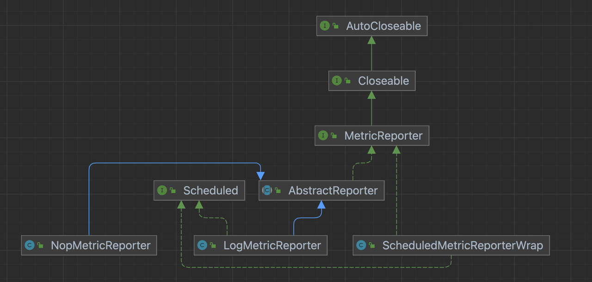
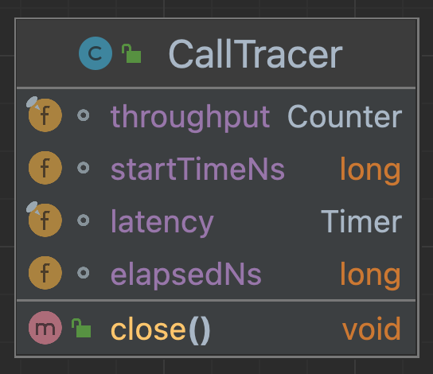
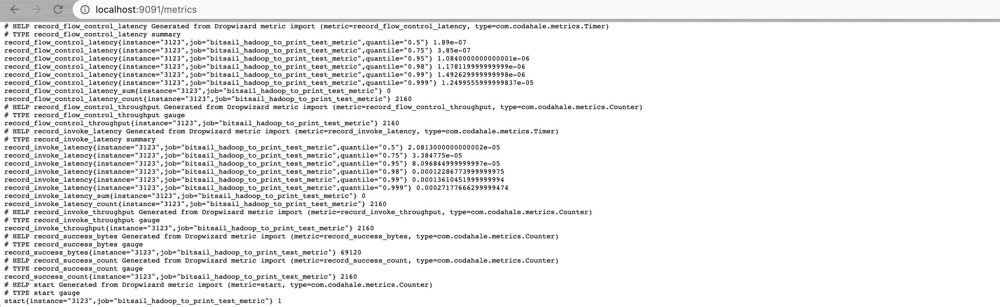

# bitsail-metrics-prometheus

-----

Parent document: [bitsail-components](../README.md)

## BitSail Metrics Introduction

Metric monitoring can report the running status of the current data integration task in real time, and it is convenient for users to locate the problem when the job fails. BitSail povides a Metric collection module that can be used by users to support the Prometheus monitoring system. Users can monitor various indicators when BitSail is running by customizing the Grafana dashboard.


- MetricManager is mainly responsible for the management of MetricGroup, and obtains MetricReporter through `MetricReporterFactory`.
- Scheduled is used to define the time interval for Reporter to report monitoring metrics.
- MetricReporter is used to report the metric to the external backend for processing



To report metrics for different service monitoring systems, you only need to obtain the corresponding MetricReporterBuilder according to METRICS_REPORTER_TYPE in CommonOptions to obtain the corresponding MetricReporter.

### Metrics Type

BitSail's Metrics is implemented by introducing the `com.codahale.metrics` package, and the collected metrics are divided into: Counter, Gauge, Histogram, Meter, Timer:

- Meter is mainly used to count the rate of an event in the system, which can reflect the current processing capacity of the system and help us judge whether resources are insufficient. It is very convenient to help us count the number of requests per second (TPS), the number of queries per second (QPS), the average number of requests per second in the last 1 minute, the average number of requests per second in the last 5 minutes, the average number of requests per second in the last 15 minutes, etc. .
- Guage is the simplest metric, only a simple return value, usually used to record the instantaneous value of some objects or things. Gauge can be used to complete custom measurement types, which can be used to measure the number of tasks in a pending queue, as well as the current memory usage and other scenarios.
- Counter is a cumulative metric, which encapsulates AtomicLong with Gauge internally. It is mainly used to count the total number of jobs in the queue; the number of errors; the number of service requests and other scenarios.
- Histogram is a measure of the distribution of statistical data, providing minimum, maximum, median, and median, 75th percentile, 90th percentile, 95th percentile, 98th percentile, 99th percentile percentile, and 99.9 percentile values. Scenarios used, such as statistical traffic maximum, minimum, average, median, etc.
- The essence of Timer is the combination of Histogram and Meter, which can conveniently count the request rate and processing time, such as disk read delay statistics, interface call delay and other information statistics and other scenarios.

Example applications of BitSail:

- Use CallTracer to count the call throughput and execution delay of the code in *try*



- Use the Timer class metric to count the qps and execution time of the function
- Use the Counter class metric to count the throughput

- Count the number of bytes of successfully written and read records and the number of failed records in DelegateFlinkWriter and DelegateSourcePipeline.

## Prometheus and BitSai Integration

Regarding the installation and use of Prometheus and Grafana, I won't go into details here. Under normal circumstances, Prometheus uses the pull mode to pull monitoring data from jobs or exporters that generate metrics (such as NodeExporter that monitors hosts). BitSail supports the pull mode of Prometheus through PrometheusMetricReporter, and the push mode of Prometheus through PrometheusPushGatewayReporter.

Prometheus adopts the pull mode, and it may be that Prometheus cannot directly pull each target data because it is not in a subnet or a firewall. So here we show the use of PushGateway mode. PushGateway is a transit component. By configuring the BitSail job, the metric is pushed to PushGateway, and Prometheus pulls it from PushGateway. Pushgateway can persist all monitoring data pushed to it. Therefore, even if your monitoring is offline, prometheus can still pull the old monitoring data.

### common configuration

| Param name            | Required | Optional value                                       | Description                                              |
| --------------------- | -------- | ---------------------------------------------------- | -------------------------------------------------------- |
| metrics_reporter_type | No       | "prometheus"、"prometheus_pushgateway"、"log"、"nop" | The type of metrics reporter, the default value is "log" |

### metric configuration

#### PrometheusMetricReporter

| Param name      | Required | Default value | Description                                                 |
| --------------- | -------- | ------------- | ----------------------------------------------------------- |
| prometheus_host | No       | 9999          | The port number that bitsail pushes to the prometheu server |

#### PrometheusPushGatewayReporter

| Param name                         | Required | Default value | Description                                                  |
| ---------------------------------- | -------- | ------------- | ------------------------------------------------------------ |
| pushgateway_host                   | No       | localhost     | host of prometheus pushgateway                               |
| pushgateway_port                   | No       | 9091          | port of prometheus pushgateway                               |
| pushgateway_https_port             | No       | 443           | HTTPS port number                                            |
| pushgateway_report_period_seconds  | No       | 1             | Time interval for pushing data to prometheus pushgateway     |
| pushgateway_delete_on_shutdown     | No       | TRUE          | Whether to delete the metric data when the task ends         |
| pushgateway_jobname                | No       |               | The task name of prometheus pushgateway                      |
| pushgateway_default_jobName_suffix | No       | _metric       | When the task name of prometheus pushgateway is empty, the suffix will be spliced with the bitsail job task name as the default task name. |

#### Example

```Bash
{
  "job": {
    "common": {
      "job_id": 313,
      "instance_id": 3123,
      "job_name": "bitsail_hadoop_to_print_test",
      "user_name": "root",
      "metrics_reporter_type": "prometheus_pushgateway",
      "metric": {
        "pushgateway_delete_on_shutdown": "false"
      }
    }
}
```

Start the prometheus pushgateway service through the container.

```Bash
docker run -d  -p 9091:9091 \
-v "/etc/localtime:/etc/localtime" \
prom/pushgateway
```

Before starting pushgateway, you need to modify the Prometheus configuration file prometheus.yml and restart the service to monitor PushGateway.

```Bash
global:
  scrape_interval: 15s
  evaluation_interval: 60s
  external_labels:
    monitor: codelab-monitor
scrape_configs:
  - job_name: prometheus
    static_configs:
      - targets:
          - 'localhost:9090'
  # 添加PushGateway 监控配置
  - job_name: 'pushgateway'
    static_configs:
      - targets: ['localhost:9091']
```

### Verification and Testing



## Grafana dashboard and Prometheus integration


### Custom Dashboard Processes

#### Add Prometheus data source through Add Data Source


#### Customize the BitSail Metric dashboard through Add Panel


### Grafana configuration template

```json
{
  "annotations": {
    "list": [
      {
        "builtIn": 1,
        "datasource": {
          "type": "grafana",
          "uid": "-- Grafana --"
        },
        "enable": true,
        "hide": true,
        "iconColor": "rgba(0, 211, 255, 1)",
        "name": "Annotations & Alerts",
        "target": {
          "limit": 100,
          "matchAny": false,
          "tags": [],
          "type": "dashboard"
        },
        "type": "dashboard"
      }
    ]
  },
  "editable": true,
  "fiscalYearStartMonth": 0,
  "graphTooltip": 0,
  "id": 3,
  "links": [],
  "liveNow": false,
  "panels": [
    {
      "datasource": {
        "type": "prometheus",
        "uid": "yPH0bsh4z"
      },
      "fieldConfig": {
        "defaults": {
          "color": {
            "mode": "palette-classic"
          },
          "custom": {
            "axisCenteredZero": false,
            "axisColorMode": "text",
            "axisLabel": "",
            "axisPlacement": "auto",
            "barAlignment": 0,
            "drawStyle": "line",
            "fillOpacity": 0,
            "gradientMode": "none",
            "hideFrom": {
              "legend": false,
              "tooltip": false,
              "viz": false
            },
            "lineInterpolation": "linear",
            "lineWidth": 1,
            "pointSize": 5,
            "scaleDistribution": {
              "type": "linear"
            },
            "showPoints": "auto",
            "spanNulls": false,
            "stacking": {
              "group": "A",
              "mode": "none"
            },
            "thresholdsStyle": {
              "mode": "off"
            }
          },
          "mappings": [],
          "thresholds": {
            "mode": "absolute",
            "steps": [
              {
                "color": "green",
                "value": null
              },
              {
                "color": "red",
                "value": 80
              }
            ]
          }
        },
        "overrides": []
      },
      "gridPos": {
        "h": 8,
        "w": 12,
        "x": 0,
        "y": 0
      },
      "id": 12,
      "options": {
        "legend": {
          "calcs": [],
          "displayMode": "list",
          "placement": "bottom",
          "showLegend": false
        },
        "tooltip": {
          "mode": "single",
          "sort": "none"
        }
      },
      "targets": [
        {
          "datasource": {
            "type": "prometheus",
            "uid": "yPH0bsh4z"
          },
          "editorMode": "builder",
          "expr": "avg(record_flow_control_latency{job=\"$pushgateway_job_name\", exported_job=\"$job\", exported_instance=\"$instance\", quantile=\"0.999\"})",
          "legendFormat": "__auto",
          "range": true,
          "refId": "A"
        }
      ],
      "title": "读取、写入流控延迟(ms)",
      "type": "timeseries"
    },
    {
      "datasource": {
        "type": "prometheus",
        "uid": "yPH0bsh4z"
      },
      "fieldConfig": {
        "defaults": {
          "color": {
            "mode": "palette-classic"
          },
          "custom": {
            "axisCenteredZero": false,
            "axisColorMode": "text",
            "axisLabel": "",
            "axisPlacement": "auto",
            "barAlignment": 0,
            "drawStyle": "line",
            "fillOpacity": 0,
            "gradientMode": "none",
            "hideFrom": {
              "legend": false,
              "tooltip": false,
              "viz": false
            },
            "lineInterpolation": "linear",
            "lineWidth": 1,
            "pointSize": 5,
            "scaleDistribution": {
              "type": "linear"
            },
            "showPoints": "auto",
            "spanNulls": false,
            "stacking": {
              "group": "A",
              "mode": "none"
            },
            "thresholdsStyle": {
              "mode": "off"
            }
          },
          "mappings": [],
          "thresholds": {
            "mode": "absolute",
            "steps": [
              {
                "color": "green",
                "value": null
              },
              {
                "color": "red",
                "value": 80
              }
            ]
          }
        },
        "overrides": []
      },
      "gridPos": {
        "h": 8,
        "w": 12,
        "x": 12,
        "y": 0
      },
      "id": 6,
      "options": {
        "legend": {
          "calcs": [],
          "displayMode": "list",
          "placement": "bottom",
          "showLegend": false
        },
        "tooltip": {
          "mode": "single",
          "sort": "none"
        }
      },
      "targets": [
        {
          "datasource": {
            "type": "prometheus",
            "uid": "yPH0bsh4z"
          },
          "editorMode": "builder",
          "expr": "avg(record_invoke_latency{job=\"$pushgateway_job_name\", exported_job=\"$job\", exported_instance=\"$instance\", quantile=\"0.999\"})",
          "legendFormat": "__auto",
          "range": true,
          "refId": "A"
        }
      ],
      "title": "读取、写入延迟 (ms)",
      "type": "timeseries"
    },
    {
      "datasource": {
        "type": "prometheus",
        "uid": "yPH0bsh4z"
      },
      "fieldConfig": {
        "defaults": {
          "color": {
            "mode": "palette-classic"
          },
          "custom": {
            "axisCenteredZero": false,
            "axisColorMode": "text",
            "axisLabel": "",
            "axisPlacement": "auto",
            "barAlignment": 0,
            "drawStyle": "line",
            "fillOpacity": 0,
            "gradientMode": "none",
            "hideFrom": {
              "legend": false,
              "tooltip": false,
              "viz": false
            },
            "lineInterpolation": "linear",
            "lineWidth": 1,
            "pointSize": 5,
            "scaleDistribution": {
              "type": "linear"
            },
            "showPoints": "auto",
            "spanNulls": false,
            "stacking": {
              "group": "A",
              "mode": "none"
            },
            "thresholdsStyle": {
              "mode": "off"
            }
          },
          "mappings": [],
          "thresholds": {
            "mode": "absolute",
            "steps": [
              {
                "color": "green",
                "value": null
              },
              {
                "color": "red",
                "value": 80
              }
            ]
          }
        },
        "overrides": []
      },
      "gridPos": {
        "h": 8,
        "w": 12,
        "x": 0,
        "y": 8
      },
      "id": 4,
      "options": {
        "legend": {
          "calcs": [],
          "displayMode": "list",
          "placement": "bottom",
          "showLegend": false
        },
        "tooltip": {
          "mode": "single",
          "sort": "none"
        }
      },
      "targets": [
        {
          "datasource": {
            "type": "prometheus",
            "uid": "yPH0bsh4z"
          },
          "editorMode": "builder",
          "expr": "avg(max(record_flow_control_latency_count{job=\"$pushgateway_job_name\", exported_job=\"$job\", exported_instance=\"$instance\"}))",
          "legendFormat": "__auto",
          "range": true,
          "refId": "A"
        }
      ],
      "title": "Record Success Count (Records/s)",
      "type": "timeseries"
    },
    {
      "datasource": {
        "type": "prometheus",
        "uid": "yPH0bsh4z"
      },
      "fieldConfig": {
        "defaults": {
          "color": {
            "mode": "palette-classic"
          },
          "custom": {
            "axisCenteredZero": false,
            "axisColorMode": "text",
            "axisLabel": "",
            "axisPlacement": "auto",
            "barAlignment": 0,
            "drawStyle": "line",
            "fillOpacity": 0,
            "gradientMode": "none",
            "hideFrom": {
              "legend": false,
              "tooltip": false,
              "viz": false
            },
            "lineInterpolation": "linear",
            "lineWidth": 1,
            "pointSize": 5,
            "scaleDistribution": {
              "type": "linear"
            },
            "showPoints": "auto",
            "spanNulls": false,
            "stacking": {
              "group": "A",
              "mode": "none"
            },
            "thresholdsStyle": {
              "mode": "off"
            }
          },
          "mappings": [],
          "thresholds": {
            "mode": "absolute",
            "steps": [
              {
                "color": "green",
                "value": null
              },
              {
                "color": "red",
                "value": 80
              }
            ]
          }
        },
        "overrides": []
      },
      "gridPos": {
        "h": 8,
        "w": 12,
        "x": 12,
        "y": 8
      },
      "id": 10,
      "options": {
        "legend": {
          "calcs": [],
          "displayMode": "list",
          "placement": "bottom",
          "showLegend": true
        },
        "tooltip": {
          "mode": "single",
          "sort": "none"
        }
      },
      "targets": [
        {
          "datasource": {
            "type": "prometheus",
            "uid": "yPH0bsh4z"
          },
          "editorMode": "code",
          "expr": "max(record_failed_count{job=\"$pushgateway_job_name\", exported_job=\"$job\", exported_instance=\"$instance\"})",
          "legendFormat": "__auto",
          "range": true,
          "refId": "A"
        }
      ],
      "title": "Record Failed Count",
      "type": "timeseries"
    },
    {
      "datasource": {
        "type": "prometheus",
        "uid": "yPH0bsh4z"
      },
      "fieldConfig": {
        "defaults": {
          "color": {
            "mode": "palette-classic"
          },
          "custom": {
            "axisCenteredZero": false,
            "axisColorMode": "text",
            "axisLabel": "",
            "axisPlacement": "auto",
            "barAlignment": 0,
            "drawStyle": "line",
            "fillOpacity": 0,
            "gradientMode": "none",
            "hideFrom": {
              "legend": false,
              "tooltip": false,
              "viz": false
            },
            "lineInterpolation": "linear",
            "lineWidth": 1,
            "pointSize": 5,
            "scaleDistribution": {
              "type": "linear"
            },
            "showPoints": "auto",
            "spanNulls": false,
            "stacking": {
              "group": "A",
              "mode": "none"
            },
            "thresholdsStyle": {
              "mode": "off"
            }
          },
          "mappings": [],
          "thresholds": {
            "mode": "absolute",
            "steps": [
              {
                "color": "green",
                "value": null
              },
              {
                "color": "red",
                "value": 80
              }
            ]
          }
        },
        "overrides": []
      },
      "gridPos": {
        "h": 9,
        "w": 12,
        "x": 0,
        "y": 16
      },
      "id": 2,
      "options": {
        "legend": {
          "calcs": [],
          "displayMode": "list",
          "placement": "bottom",
          "showLegend": false
        },
        "tooltip": {
          "mode": "single",
          "sort": "none"
        }
      },
      "targets": [
        {
          "datasource": {
            "type": "prometheus",
            "uid": "yPH0bsh4z"
          },
          "editorMode": "builder",
          "expr": "max(record_success_count{job=\"$pushgateway_job_name\", exported_job=\"$job\", exported_instance=\"$instance\"})",
          "legendFormat": "__auto",
          "range": true,
          "refId": "A"
        }
      ],
      "title": "Record Success Count",
      "type": "timeseries"
    },
    {
      "datasource": {
        "type": "prometheus",
        "uid": "yPH0bsh4z"
      },
      "fieldConfig": {
        "defaults": {
          "color": {
            "mode": "palette-classic"
          },
          "custom": {
            "axisCenteredZero": false,
            "axisColorMode": "text",
            "axisLabel": "",
            "axisPlacement": "auto",
            "barAlignment": 0,
            "drawStyle": "line",
            "fillOpacity": 0,
            "gradientMode": "none",
            "hideFrom": {
              "legend": false,
              "tooltip": false,
              "viz": false
            },
            "lineInterpolation": "linear",
            "lineWidth": 1,
            "pointSize": 5,
            "scaleDistribution": {
              "type": "linear"
            },
            "showPoints": "auto",
            "spanNulls": false,
            "stacking": {
              "group": "A",
              "mode": "none"
            },
            "thresholdsStyle": {
              "mode": "off"
            }
          },
          "mappings": [],
          "thresholds": {
            "mode": "absolute",
            "steps": [
              {
                "color": "green",
                "value": null
              },
              {
                "color": "red",
                "value": 80
              }
            ]
          }
        },
        "overrides": []
      },
      "gridPos": {
        "h": 8,
        "w": 12,
        "x": 12,
        "y": 16
      },
      "id": 8,
      "options": {
        "legend": {
          "calcs": [],
          "displayMode": "list",
          "placement": "bottom",
          "showLegend": false
        },
        "tooltip": {
          "mode": "single",
          "sort": "none"
        }
      },
      "targets": [
        {
          "datasource": {
            "type": "prometheus",
            "uid": "yPH0bsh4z"
          },
          "editorMode": "code",
          "expr": "max(record_success_bytes{job=\"$pushgateway_job_name\", exported_job=\"$job\", exported_instance=\"$instance\"})",
          "legendFormat": "__auto",
          "range": true,
          "refId": "A"
        }
      ],
      "title": "Record Success Bytes",
      "type": "timeseries"
    }
  ],
  "refresh": "5s",
  "revision": 1,
  "schemaVersion": 38,
  "style": "dark",
  "tags": [],
  "templating": {
    "list": [
      {
        "current": {
          "selected": false,
          "text": "pushgateway",
          "value": "pushgateway"
        },
        "hide": 0,
        "name": "pushgateway_job_name",
        "options": [
          {
            "selected": true,
            "text": "pushgateway",
            "value": "pushgateway"
          }
        ],
        "query": "pushgateway",
        "skipUrlSync": false,
        "type": "textbox"
      },
      {
        "current": {
          "selected": false,
          "text": "bitsail_hadoop_to_print_test_metric",
          "value": "bitsail_hadoop_to_print_test_metric"
        },
        "hide": 0,
        "name": "job",
        "options": [
          {
            "selected": true,
            "text": "bitsail_hadoop_to_print_test_metric",
            "value": "bitsail_hadoop_to_print_test_metric"
          }
        ],
        "query": "bitsail_hadoop_to_print_test_metric",
        "skipUrlSync": false,
        "type": "textbox"
      },
      {
        "current": {
          "selected": false,
          "text": "3123",
          "value": "3123"
        },
        "hide": 0,
        "name": "instance",
        "options": [
          {
            "selected": true,
            "text": "3123",
            "value": "3123"
          }
        ],
        "query": "3123",
        "skipUrlSync": false,
        "type": "textbox"
      }
    ]
  },
  "time": {
    "from": "now-5m",
    "to": "now"
  },
  "timepicker": {},
  "timezone": "",
  "title": "BitSail",
  "uid": "Nf9bXCb4k",
  "version": 1,
  "weekStart": ""
}
```