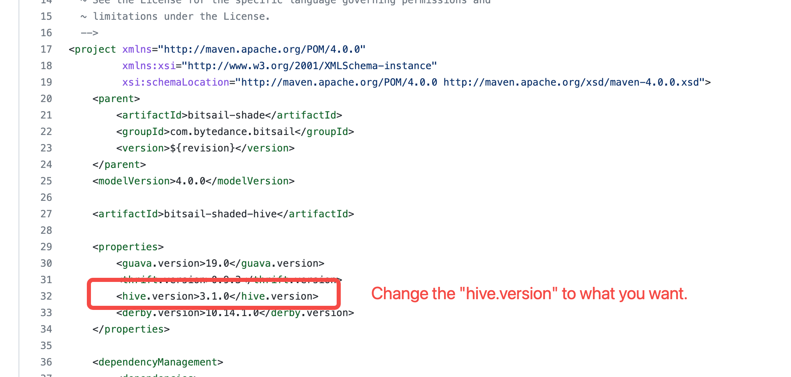

# Develop Environment Setup
English | [简体中文](../../../zh/documents/start/env_setup.md)

-----

## Prerequisite

**Bitsail** supports run integration tests on local IDE. To achieve that, you need:

- JDK1.8
- maven 3.6+
- [Docker desktop](https://www.docker.com/products/docker-desktop/)
- thrift
```bash
install thrift
  Windows:
    1. Download: `http://archive.apache.org/dist/thrift/0.13.0/thrift-0.13.0.exe`
    2. Modify thrift-0.13.0.exe to thrift 
 
  MacOS:
    1. Download: `brew install thrift@0.13.0`
    2. default address: /opt/homebrew/Cellar/thrift@0.13.0/0.13.0/bin/thrift

    Note: Executing `brew install thrift@0.13.0` on MacOS may report an error that the version cannot be found. The solution is as follows, execute it in the terminal:
      1. `brew tap-new $USER/local-tap`
      2. `brew extract --version='0.13.0' thrift $USER/local-tap`
      3. `brew install thrift@0.13.0`
      Reference link: `https://gist.github.com/tonydeng/02e571f273d6cce4230dc8d5f394493c`
 
  Linux:
    1.Download source package：`wget https://archive.apache.org/dist/thrift/0.13.0/thrift-0.13.0.tar.gz`
    2.Install dependencies：`yum install -y autoconf automake libtool cmake ncurses-devel openssl-devel lzo-devel zlib-devel gcc gcc-c++`
    3.`tar zxvf thrift-0.13.0.tar.gz`
    4.`cd thrift-0.13.0`
    5.`./configure --without-tests`
    6.`make`
    7.`make install`
    Check the version after installation is complete：thrift --version
    Note: If you have compiled Doris, you do not need to install thrift, you can directly use $DORIS_HOME/thirdparty/installed/bin/thrift
```

After correctly installing the above required components, we are able to run integration tests on your local IDE.

## Build From Source Code

### Change Hive Version

BitSail uses a shaded module, namely bitsail-shaded-hive, to import hive dependencies.
By default, BitSail uses **3.1.0** as hive version.
Therefore, if you want to deploy BitSail in different hive environment, you can modify the `hive.version` property in [bitsail-shaded-hive](https://github.com/bytedance/bitsail/blob/master/bitsail-shade/bitsail-shaded-hive/pom.xml).




### Package & Structure

- Run the build script to package with flink embedded.
  `bash build.sh`
  If you have your own flink package provided by the cluster, you can also package without flink.
  `mvn clean package -pl bitsail-dist -am -Dmaven.test.skip=true`

After building the project, the output jar files are in the folder `bitsail-dist/target/`.

The project production file structure is as follows:

``` simple
bitsail-archive-${version}-SNAPSHOT    
    /bin  
        /bitsail #Startup script
    /conf
        /bitsail.conf #bitsail system config
    /embedded
        /flink #embedded flink
    /examples #examples configuration files
        /example-datas #examples data
        /Fake_xx_Example.json #Fake source to xx examples config files
        /xx_Print_Example.json #xx to print sink examples config files
    /libs #jar libs
        /bitsail-core.jar #entering jar package
        /connectors #connector plugin jars
            /mapping #connector plugin config files
        /components #components jars，such as metric、dirty-collector
        /clients #bitsail client jar
```

## Run Local Integration Tests

In [`bitsail-connector-test`](https://github.com/bytedance/bitsail/tree/master/bitsail-test/bitsail-connector-test) module, we provide the [EmbeddedFlinkCluster](https://github.com/bytedance/bitsail/blob/master/bitsail-test/bitsail-connector-test/src/main/java/com/bytedance/bitsail/test/connector/test/EmbeddedFlinkCluster.java) class that can be used to start a job in local Flink MiniCluster.


For example, we build an integration test [KafkaSourceITCase](https://github.com/bytedance/bitsail/blob/master/bitsail-connectors/bitsail-connectors-legacy/bitsail-connector-kafka/src/test/java/com/bytedance/bitsail/connector/legacy/kafka/source/KafkaSourceITCase.java) for Kafka source connector.
It uses [test container](https://www.testcontainers.org/modules/kafka/) to start kafka service in local docker.
We can run the `testKafkaSource` method to start a kafka2print task in local flink MiniCluster.

```java
public class KafkaSourceITCase {
  // ...

  @Test
  public void testKafkaSource() throws Exception {
    BitSailConfiguration configuration = JobConfUtils.fromClasspath("kafka_to_print.json");
    updateConfiguration(configuration);
    EmbeddedFlinkCluster.submitJob(configuration);
  }

  // ...
}
```