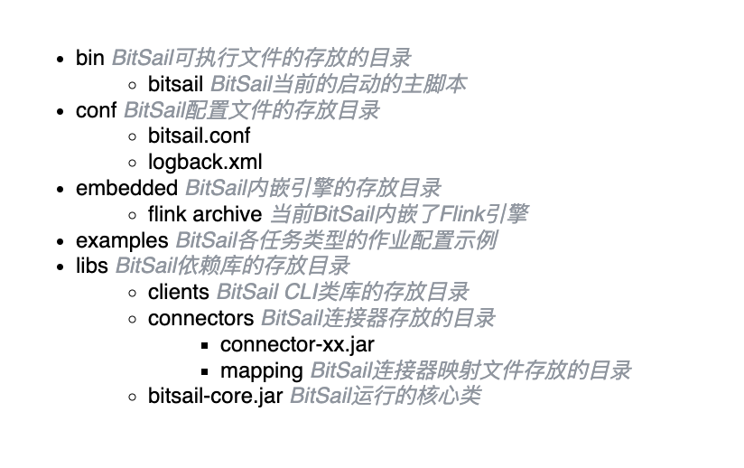
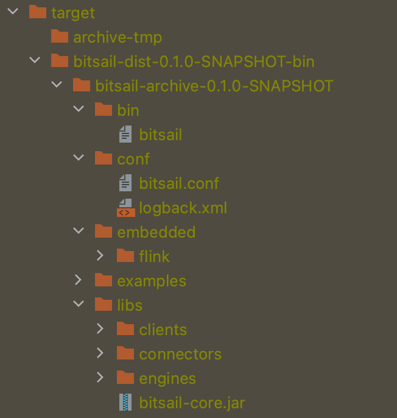

# BitSail Guide Video

English | [简体中文](../../../zh/documents/start/quick_guide.md)

-----

## BitSail demo video

[BitSail demo video](https://zhuanlan.zhihu.com/p/595157599)

## BitSail source code compilation

BitSail has a built-in compilation script `build.sh` in the project, which is stored in the project root directory. Newly downloaded users can directly compile this script, and after successful compilation, they can find the corresponding product in the directory: `bitsail-dist/target/bitsail-dist-${rversion}-bin`.


## BitSail product structure





## BitSail job submission

### Flink Session Job

```Shell
Step 1: Start the Flink Session cluster

Session operation requires the existence of hadoop dependencies in the local environment and the existence of the environment variable HADOOP_CLASSPATH.

bash ./embedded/flink/bin/start-cluster.sh

Step 2: Submit the job to the Flink Session cluster

bash bin/bitsail run \
  --engine flink \
  --execution-mode run \
  --deployment-mode local \
  --conf examples/Fake_Print_Example.json \
  --jm-address <job-manager-address>
```

### Yarn Cluster Job

```Shell
Step 1: Set the HADOOP_HOME environment variable

export HADOOP_HOME=XXX

Step 2: Set HADOOP_HOME so that the submission client can find the configuration path of the yarn cluster, and then submit the job to the yarn cluster

bash ./bin/bitsail run --engine flink \
--conf ~/dts_example/examples/Hive_Print_Example.json \
--execution-mode run \
--deployment-mode yarn-per-job \
--queue default
```

## BitSail Demo

### Fake->MySQL

```Shell
// create mysql table
CREATE TABLE `bitsail_fake_source` (
  `id` bigint(20) NOT NULL AUTO_INCREMENT,
  `name` varchar(255) DEFAULT NULL,
  `price` double DEFAULT NULL,
  `image` blob,
  `start_time` datetime DEFAULT NULL,
  `end_time` datetime DEFAULT NULL,
  `order_id` bigint(20) DEFAULT NULL,
  `enabled` tinyint(4) DEFAULT NULL,
  `datetime` int(11) DEFAULT NULL,
  PRIMARY KEY (`id`)
) ENGINE=InnoDB DEFAULT CHARSET=utf8mb4;
```

### MySQL->Hive

```Shell
// create hive table
CREATE TABLE `bitsail`.`bitsail_mysql_hive`(
  `id` bigint ,
  `name` string ,
  `price` double ,
  `image` binary,
  `start_time` timestamp ,
  `end_time` timestamp,
  `order_id` bigint ,
  `enabled` int,
  `datetime` int
)PARTITIONED BY (`date` string)
ROW FORMAT SERDE
  'org.apache.hadoop.hive.ql.io.parquet.serde.ParquetHiveSerDe'
STORED AS INPUTFORMAT
  'org.apache.hadoop.hive.ql.io.parquet.MapredParquetInputFormat'
OUTPUTFORMAT
  'org.apache.hadoop.hive.ql.io.parquet.MapredParquetOutputFormat'
```