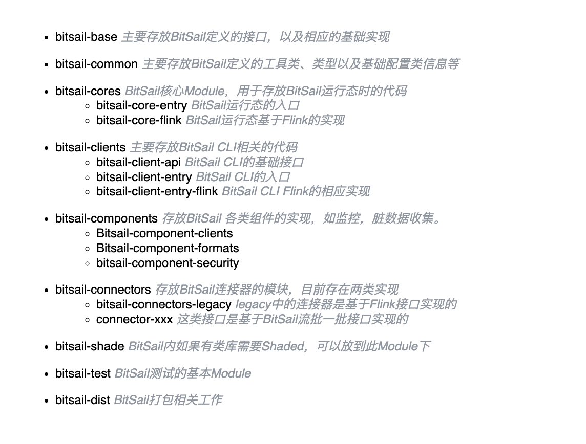
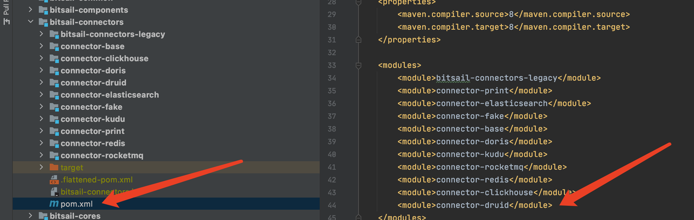
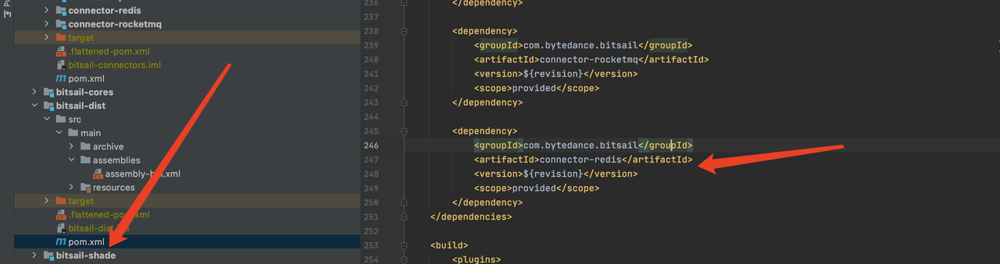
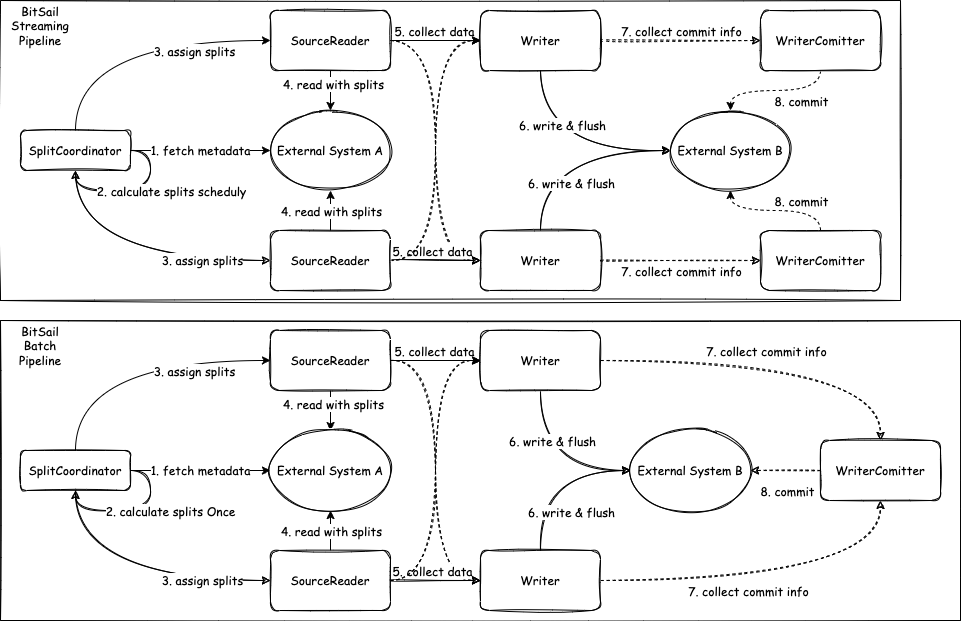
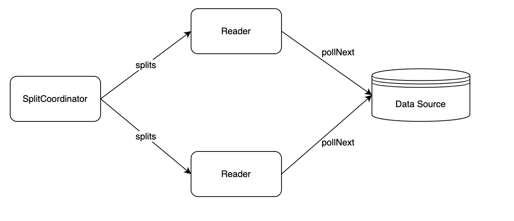
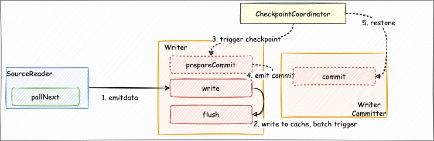
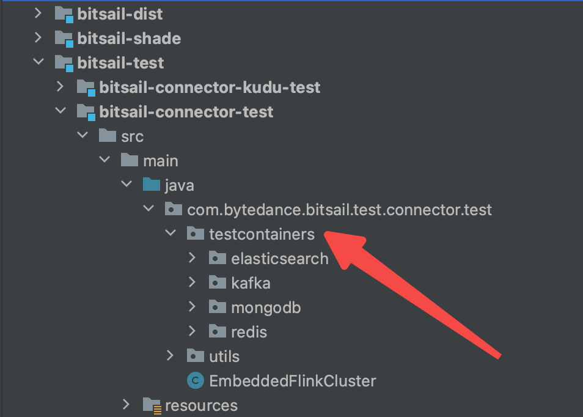

# Connector开发指南

[English](../../en/community/connector_quick_start.md) | 简体中文

-----

## 简介

本文面向BitSail的Connector开发人员，通过开发者的角度全面的阐述开发一个完整Connector的全流程，快速上手Connector开发。

## 目录结构

首先开发者需要fork BitSail仓库，详情参考[Fork BitSail Repo](https://docs.github.com/en/get-started/quickstart/fork-a-repo)，之后通过git clone仓库到本地，并导入到IDE中。同时创建自己的工作分支，使用该分支开发自己的Connector。项目地址：https://github.com/bytedance/bitsail.git。

项目结构如下：



## 开发流程

BitSail 是一款基于分布式架构的数据集成引擎，Connector会并发执行。并由BitSail 框架来负责任务的调度、并发执行、脏数据处理等，开发者只需要实现对应接口即可，具体开发流程如下：

- 工程配置，开发者需要在`bitsail/bitsail-connectors/pom.xml`模块中注册自己的Connector，同时在`bitsail/bitsail-dist/pom.xml`增加自己的Connector模块，同时为你的连接器注册配置文件，来使得框架可以在运行时动态发现它。
  - 

  - 
- Connector开发，实现Source、Sink提供的抽象方法，具体细节参考后续介绍。
- 数据输出类型，目前支持的数据类型为BitSail Row类型，无论是Source在Reader中传递给下游的数据类型，还是Sink从上游消费的数据类型，都应该是BitSail Row类型。

## Architecture

当前Source API的设计同时兼容了流批一批的场景，换言之就是同时支持pull & push 的场景。在此之前，我们需要首先再过一遍传统流批场景中各组件的交互模型。

### Batch Model

传统批式场景中，数据的读取一般分为如下几步: 

- `createSplits`：一般在client端或者中心节点执行，目的是将完整的数据按照指定的规则尽可能拆分为较多的`rangeSplits`，`createSplits`在作业生命周期内有且执行一次。
- `runWithSplit`: 一般在执行节点节点执行，执行节点启动后会向中心节点请求存在的`rangeSplit`，然后再本地进行执行；执行完成后会再次向中心节点请求直到所有`splits`执行完成。
- `commit`：全部的split的执行完成后，一般会在中心节点执行`commit`的操作，用于将数据对外可见。

### Stream Model

传统流式场景中，数据的读取一般分为如下几步: 

- `createSplits`：一般在client端或者中心节点执行，目的是根据滑动窗口或者滚动窗口的策略将数据流划分为`rangeSplits`，`createSplits`在流式作业的生命周期中按照划分窗口的会一直执行。
- `runWithSplit`: 一般在执行节点节点执行，中心节点会向可执行节点发送`rangeSplit`，然后在可执行节点本地进行执行；执行完成后会将处理完的`splits`数据向下游发送。
- `commit`：全部的split的执行完成后，一般会向目标数据源发送`retract message`，实时动态展现结果。

### BitSail Model



- `createSplits`：BitSail通过`SplitCoordinator`模块划分`rangeSplits`，在流式作业中的生命周期中`createSplits`会周期性执行，而在批式作业中仅仅会执行一次。
- `runWithSplit`: 在执行节点节点执行，BitSail中执行节点包括`Reader`和`Writer`模块，中心节点会向可执行节点发送`rangeSplit`，然后在可执行节点本地进行执行；执行完成后会将处理完的`splits`数据向下游发送。
- `commit`：`writer`在完成数据写入后，`committer`来完成提交。在不开启`checkpoint`时，`commit`会在所有`writer`都结束后执行一次；在开启`checkpoint`时，`commit`会在每次`checkpoint`的时候都会执行一次。

## Source Connector



- Source: 数据读取组件的生命周期管理，主要负责和框架的交互，构架作业，不参与作业真正的执行
- SourceSplit:  数据读取分片；大数据处理框架的核心目的就是将大规模的数据拆分成为多个合理的Split
- State：作业状态快照，当开启checkpoint之后，会保存当前执行状态。
- SplitCoordinator: 既然提到了Split，就需要有相应的组件去创建、管理Split；SplitCoordinator承担了这样的角色
- SourceReader: 真正负责数据读取的组件，在接收到Split后会对其进行数据读取，然后将数据传输给下一个算子

Source Connector开发流程如下

1. 首先需要创建`Source`类，需要实现`Source`和`ParallelismComputable`接口，主要负责和框架的交互，构架作业，它不参与作业真正的执行
2. `BitSail`的`Source`采用流批一体的设计思想，通过`getSourceBoundedness`方法设置作业的处理方式，通过`configure`方法定义`readerConfiguration`的配置，通过`createTypeInfoConverter`方法来进行数据类型转换，可以通过`FileMappingTypeInfoConverter`得到用户在yaml文件中自定义的数据源类型和BitSail类型的转换，实现自定义化的类型转换。
3. 最后，定义数据源的数据分片格式`SourceSplit`类和闯将管理`Split`的角色`SourceSplitCoordinator`类
4. 最后完成`SourceReader`实现从`Split`中进行数据的读取。

| Job Type | Boundedness                 |
| -------- | --------------------------- |
| batch    | Boundedness.*BOUNDEDNESS*   |
| stream   | Boundedness.*UNBOUNDEDNESS* |

- 每个`SourceReader`都在独立的线程中执行，并保证`SourceSplitCoordinator`分配给不同`SourceReader`的切片没有交集
- 在`SourceReader`的执行周期中，开发者只需要关注如何从构造好的切片中去读取数据，之后完成数据类型对转换，将外部数据类型转换成`BitSail`的`Row`类型传递给下游即可

### Reader示例

```Java
public class FakeSourceReader extends SimpleSourceReaderBase<Row> {

  private final BitSailConfiguration readerConfiguration;
  private final TypeInfo<?>[] typeInfos;

  private final transient int totalCount;
  private final transient RateLimiter fakeGenerateRate;
  private final transient AtomicLong counter;

  private final FakeRowGenerator fakeRowGenerator;

  public FakeSourceReader(BitSailConfiguration readerConfiguration, Context context) {
    this.readerConfiguration = readerConfiguration;
    this.typeInfos = context.getTypeInfos();
    this.totalCount = readerConfiguration.get(FakeReaderOptions.TOTAL_COUNT);
    this.fakeGenerateRate = RateLimiter.create(readerConfiguration.get(FakeReaderOptions.RATE));
    this.counter = new AtomicLong();
    this.fakeRowGenerator = new FakeRowGenerator(readerConfiguration, context.getIndexOfSubtask());
  }

  @Override
  public void pollNext(SourcePipeline<Row> pipeline) throws Exception {
    fakeGenerateRate.acquire();
    pipeline.output(fakeRowGenerator.fakeOneRecord(typeInfos));
  }

  @Override
  public boolean hasMoreElements() {
    return counter.incrementAndGet() <= totalCount;
  }
}
```

## Sink Connector



- Sink：数据写入组件的生命周期管理，主要负责和框架的交互，构架作业，它不参与作业真正的执行。
- Writer：负责将接收到的数据写到外部存储。
- WriterCommitter(可选)：对数据进行提交操作，来完成两阶段提交的操作；实现exactly-once的语义。

开发者首先需要创建`Sink`类，实现`Sink`接口，主要负责数据写入组件的生命周期管理，构架作业。通过`configure`方法定义`writerConfiguration`的配置，通过`createTypeInfoConverter`方法来进行数据类型转换，将内部类型进行转换写到外部系统，同`Source`部分。之后我们再定义`Writer`类实现具体的数据写入逻辑，在`write`方法调用时将`BitSail Row`类型把数据写到缓存队列中，在`flush`方法调用时将缓存队列中的数据刷写到目标数据源中。

### Writer示例

```Java
public class PrintWriter implements Writer<Row, String, Integer> {
  private static final Logger LOG = LoggerFactory.getLogger(PrintWriter.class);

  private final int batchSize;
  private final List<String> fieldNames;

  private final List<String> writeBuffer;
  private final List<String> commitBuffer;

  private final AtomicInteger printCount;

  public PrintWriter(int batchSize, List<String> fieldNames) {
    this(batchSize, fieldNames, 0);
  }

  public PrintWriter(int batchSize, List<String> fieldNames, int alreadyPrintCount) {
    Preconditions.checkState(batchSize > 0, "batch size must be larger than 0");
    this.batchSize = batchSize;
    this.fieldNames = fieldNames;
    this.writeBuffer = new ArrayList<>(batchSize);
    this.commitBuffer = new ArrayList<>(batchSize);
    printCount = new AtomicInteger(alreadyPrintCount);
  }

  @Override
  public void write(Row element) {
    String[] fields = new String[element.getFields().length];
    for (int i = 0; i < element.getFields().length; ++i) {
      fields[i] = String.format("\"%s\":\"%s\"", fieldNames.get(i), element.getField(i).toString());
    }

    writeBuffer.add("[" + String.join(",", fields) + "]");
    if (writeBuffer.size() == batchSize) {
      this.flush(false);
    }
    printCount.incrementAndGet();
  }

  @Override
  public void flush(boolean endOfInput) {
    commitBuffer.addAll(writeBuffer);
    writeBuffer.clear();
    if (endOfInput) {
      LOG.info("all records are sent to commit buffer.");
    }
  }

  @Override
  public List<String> prepareCommit() {
    return commitBuffer;
  }

  @Override
  public List<Integer> snapshotState(long checkpointId) {
    return Collections.singletonList(printCount.get());
  }
}
```

## 将连接器注册到配置文件中

为你的连接器注册配置文件，来使得框架可以在运行时动态发现它，配置文件的定义如下：

以hive为例，开发者需要在resource目录下新增一个json文件，名字示例为bitsail-connector-hive.json，只要不和其他连接器重复即可

```Plain
{
  "name": "bitsail-connector-hive",
  "classes": [
    "com.bytedance.bitsail.connector.hive.source.HiveSource",
    "com.bytedance.bitsail.connector.hive.sink.HiveSink"
  ],
  "libs": [
    "bitsail-connector-hive-${version}.jar"
  ]
}
```

## 测试模块

在Source或者Sink连接器所在的模块中，新增ITCase测试用例，然后按照如下流程支持

- 通过test container来启动相应的组件



- 编写相应的配置文件

```Json
{
  "job": {
    "common": {
      "job_id": 313,
      "instance_id": 3123,
      "job_name": "bitsail_clickhouse_to_print_test",
      "user_name": "test"
    },
    "reader": {
      "class": "com.bytedance.bitsail.connector.clickhouse.source.ClickhouseSource",
      "jdbc_url": "jdbc:clickhouse://localhost:8123",
      "db_name": "default",
      "table_name": "test_ch_table",
      "split_field": "id",
      "split_config": "{\"name\": \"id\", \"lower_bound\": 0, \"upper_bound\": \"10000\", \"split_num\": 3}",
      "sql_filter": "( id % 2 == 0 )",
      "columns": [
        {
          "name": "id",
          "type": "int64"
        },
        {
          "name": "int_type",
          "type": "int32"
        },
        {
          "name": "double_type",
          "type": "float64"
        },
        {
          "name": "string_type",
          "type": "string"
        },
        {
          "name": "p_date",
          "type": "date"
        }
      ]
    },
    "writer": {
      "class": "com.bytedance.bitsail.connector.legacy.print.sink.PrintSink"
    }
  }
}
```

- 通过代码EmbeddedFlinkCluster.submit来进行作业提交

```Java
@Test
public void testClickhouseToPrint() throws Exception {
  BitSailConfiguration jobConf = JobConfUtils.fromClasspath("clickhouse_to_print.json");
  EmbeddedFlinkCluster.submitJob(jobConf);
}
```

## 提交PR

当开发者实现自己的Connector后，就可以关联自己的issue，提交PR到github上了，提交之前，开发者记得Connector添加文档，通过review之后，大家贡献的Connector就成为BitSail的一部分了，我们按照贡献程度会选取活跃的Contributor成为我们的Committer，参与BitSail社区的重大决策，希望大家积极参与！
