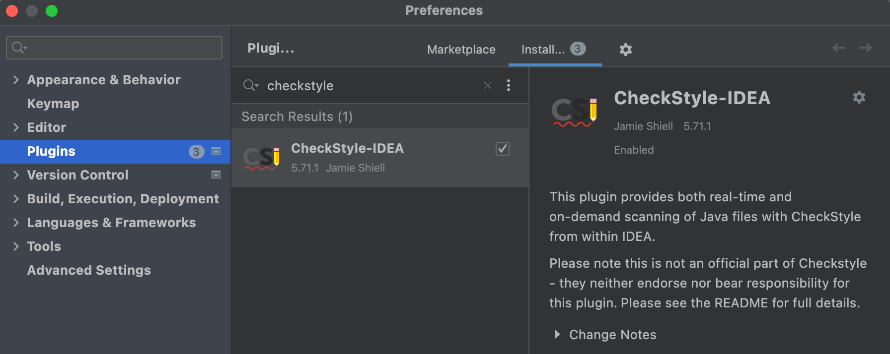
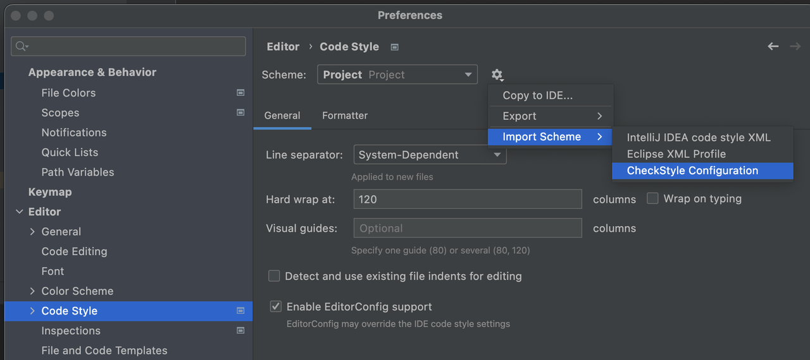
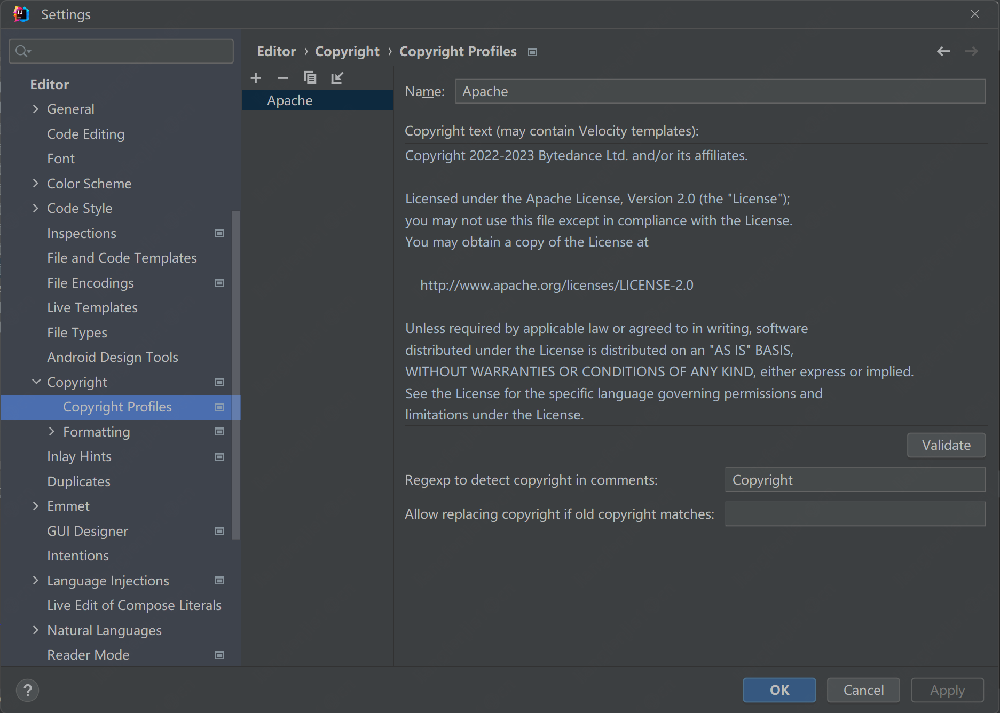

# 贡献者指引

[English](../../en/community/contribute.md) | 简体中文

BitSail社区欢迎大家的贡献！

## 如何参与

- 如果你在使用 BitSail 时遇到任何问题，请提交GitHub Issue进行报告。
- 如果你希望能支持一个新功能，请提交GitHub Issue以请求该功能。
- 在 Slack 频道上可以提出任何问题，或帮助回答其他用户的问题。
- 通过认领GitHub Issue来修复Bug或开发新功能。
- 改进文档、代码注释、拼写错误和测试覆盖率。
- 如果你有一个大的功能要引入，可以在邮件列表中发起一个讨论，收集其他开发者的意见。

## 打开一个GitHub Issue
- 搜索已知问题以检查是否存在现有主题
- 如果是，您可以参与讨论
- 如果不是，根据文档自己创建一个新问题[创建Issue](https://docs.github.com/en/issues/tracking-your-work-with-issues/creating-an-issue)

## 开发环境配置
跳转到[环境配置](../documents/start/env_setup.md)

## 代码风格

BitSail项目使用了[Google Java Style Guide](https://google.github.io/styleguide/javaguide.html)

## IDE配置

我们使用了Intellij作为配置的例子

### CheckStyle

在IDE中安装checkstyle插件



我们为开发者定义了一份checkstyle配置 [tools/maven/checkstyle.xml](https://github.com/bytedance/bitsail/blob/master/tools/maven/checkstyle.xml) 。
在IDE中进行开发时，可将上述checkstyle配置文件导入项目:



导入完成后，运行指令 `mvn checkstyle:check` 即可检查是否满足checkstyle.

### 安装lombok

我们使用了[lombok](https://projectlombok.org/).请在IDE插件安装lombok

### 添加License配置
所有源文件都需要添加许可证头。请复制**下方**的许可证头并将其添加到您的 IDE 版权设置。完成此步骤后，IDE 将自动将许可证添加到新的源文件。

```
Copyright 2022-2023 Bytedance Ltd. and/or its affiliates.

Licensed under the Apache License, Version 2.0 (the "License");
you may not use this file except in compliance with the License.
You may obtain a copy of the License at

    http://www.apache.org/licenses/LICENSE-2.0

Unless required by applicable law or agreed to in writing, software
distributed under the License is distributed on an "AS IS" BASIS,
WITHOUT WARRANTIES OR CONDITIONS OF ANY KIND, either express or implied.
See the License for the specific language governing permissions and
limitations under the License.
```



## 开发小技巧
### maven依赖强制检查
我们在构建过程中检查重叠的包。当您在构建过程中看到冲突错误时，请从 pom 文件中排除有冲突的包。

## 提交一个Pull Request
如果是第一次提交pull request，可以阅读这个文档 [什么是Pull Request](https://docs.github.com/en/pull-requests/collaborating-with-pull-requests/proposing-changes-to-your-work-with-pull-requests/about-pull-requests)

- [Fork ***BitSail*** 代码库](https://docs.github.com/en/get-started/quickstart/fork-a-repo)
- 在你的fork的代码库中生成一个新分支
- 开发你的代码，包括必要的测试用例和编码风格检查
- 提交对分支的更改并推送到你fork的仓库
- 向 ***BitSail*** 存储库创建pull request

如果你是初次涉猎开源项目，可以通过阅读[如何提交一个Pull Request](pr_guide.md)了解更详细的指南。

## 请求代码审查
准备好pull request后，请确保pull request模板清单中的所有项目都已完成。
在pull request中@任意一个项目的committer进行代码审查。

## 如何贡献文档
BitSail的文档保存在项目的`website`目录下，包含中英两个版本。
当文档更新合入项目master分支后，会触发github action生成 [BitSail主页](https://bytedance.github.io/bitsail/) ，所以在分支合并前需要在本地测试更新后的主页效果。

BitSail主页通过 [VuePress](https://vuepress-theme-hope.github.io/v2/) 框架构建，在本地完成markdown文档修改后，可以通过如下步骤测试主页效果:

1. 安装 [yarn](https://yarnpkg.com/) （yarn是一款JS包管理工具）

```bash
# 安装yarn
npm install -g yarn

# 查看版本
yarn --version
```

2. 本地生成网页

```bash
# 安装依赖
yarn install

# 本地起测试网页
yarn docs:dev

# 通过 http://localhost:8080/bitsail/ 访问测试主页
```

> 默认端口是8080, 如果端口冲突, 可以使用 `--port` 来指定端口

```bash
yarn docs:dev --port 9090

# visit http://localhost:9090/bitsail/
```
