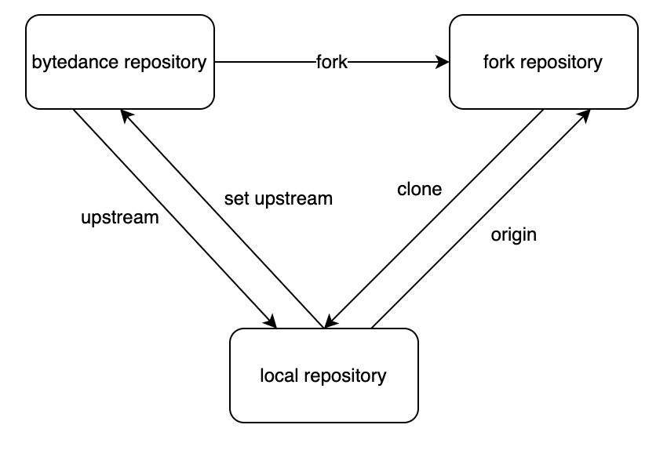
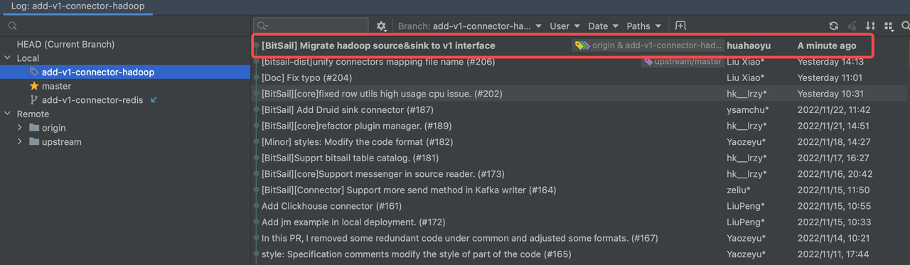

# PR发布指南

[English](../../en/community/pr_guide.md) | 简体中文

-----



## Fork BitSail 到自己的仓库


## Git的账户配置

用户名和邮箱地址的作用：用户名和邮箱地址是本地git客户端的一个变量，每次commit都会用用户名和邮箱纪录，Github的contributions统计就是按邮箱来统计的。

查看自己的账户和邮箱地址：

```Bash
$ git config user.name
$ git config user.email
```

如果是第一次使用，或者需要对其进行修改，执行以下命令，将用户名和邮箱地址替换为你自己的即可。

```Bash
$ git config --global user.name "username"
$ git config --global user.email "your_email@example.com"
```

## 将Fork仓库克隆到本地

可选HTTPS或者SSH方式，之后的操作会以SSH方式示例，如果采用HTTPS方式，只需要将命令中的SSH地址全部替换为HTTPS地址即可。

### HTTPS

```Bash
$ git clone git@github.com:{your_github_id}/bitsail.git
```

### SSH

```Bash
$ git clone https://github.com/{your_github_id}/bitsail.git
```


## 设置origin和upstream

```Bash
$ git remote add origin git@github.com:{your_github_id}/bitsail.git
$ git remote add upstream git@github.com:bytedance/bitsail.git
$ git remote -v
origin  git@github.com:{your_github_id}/bitsail.git (fetch)
origin  git@github.com:{your_github_id}/bitsail.git (push)
upstream        git@github.com:bytedance/bitsail.git (fetch)
upstream        git@github.com:bytedance/bitsail.git (push)
```

如果`git`的`origin`设置错误，可以执行`git `*`remote`*` rm `*`origin`**清除后重新设置*

`upstream`同理，设置错误可以通过`git `*`remote`*` rm `*`upstream`*清除后重新设置

## 创建自己的工作分支

```Bash
查看所有分支
$ git branch -a
在本地新建一个分支
$ git branch {your_branch_name}
切换到我的新分支
$ git checkout {your_branch_name}
将本地分支推送到fork仓库
$ git push -u origin {your_branch_name}
```

分支名称示例：add-sink-connector-redis

之后就可以在自己的工作分支进行代码的编写，测试，并及时同步到你的个人分支。

```Bash
编辑区添加到暂存区
$ git add .
暂存区提交到分支
$ git commit -m "[BitSail] Message"
同步Fork仓库
$ git push -u origin <分支名>
```

## 同步代码

BitSail对接口或者版本的更新迭代会谨慎的考量，如果开发者开发周期短，可以在提交代码前对原始仓库做一次同步即可，但是如果不幸遇到了大的版本变更，开发者可以随时跟进对原始仓库的变更。

这里为了保证代码分支的干净，推荐采用rebase的方式进行合并。

```Bash
$ git fetch upstream
$ git rebase upstream/master
```

在rebase过程中，有可能会报告文件的冲突

例如如下情况，我们要去手动合并产生冲突的文件`bitsail-connectors/pom.xml`

```Bash
$ git rebase upstream/master
Auto-merging bitsail-dist/pom.xml
Auto-merging bitsail-connectors/pom.xml
CONFLICT (content): Merge conflict in bitsail-connectors/pom.xml
error: could not apply 054a4d3... [BitSail] Migrate hadoop source&sink to v1 interface
Resolve all conflicts manually, mark them as resolved with
"git add/rm <conflicted_files>", then run "git rebase --continue".
You can instead skip this commit: run "git rebase --skip".
To abort and get back to the state before "git rebase", run "git rebase --abort".
Could not apply 054a4d3... [BitSail] Migrate hadoop source&sink to v1 interface
```

产生冲突的部分如下所示，`=======`为界， 决定您是否想只保持分支的更改、只保持其他分支的更改，还是进行全新的更改（可能包含两个分支的更改）。 删除冲突标记` <<<<<<<`、`=======`、`>>>>>>>`，并在最终合并中进行所需的更改。

```Plain
<modules>
    <module>bitsail-connectors-legacy</module>
    <module>connector-print</module>
    <module>connector-elasticsearch</module>
    <module>connector-fake</module>
    <module>connector-base</module>
    <module>connector-doris</module>
    <module>connector-kudu</module>
    <module>connector-rocketmq</module>
    <module>connector-redis</module>
    <module>connector-clickhouse</module>
<<<<<<< HEAD
    <module>connector-druid</module>
=======
    <module>connector-hadoop</module>
>>>>>>> 054a4d3 ([BitSail] Migrate hadoop source&sink to v1 interface)
</modules>
```

处理完成的示例：

```Plain
<modules>
    <module>bitsail-connectors-legacy</module>
    <module>connector-print</module>
    <module>connector-elasticsearch</module>
    <module>connector-fake</module>
    <module>connector-base</module>
    <module>connector-doris</module>
    <module>connector-kudu</module>
    <module>connector-rocketmq</module>
    <module>connector-redis</module>
    <module>connector-clickhouse</module>
    <module>connector-druid</module>
    <module>connector-hadoop</module>
</modules>
```

处理完成之后执行`git add <conflicted_files>`，比如该例中执行：

```Bash
$ git add bitsail-connectors/pom.xml
$ git rebase --continue
```

之后会出现如下窗口，这个是Vim编辑界面，编辑模式按照Vim的进行即可，通常我们只需要对第一行进行Commit信息进行编辑，也可以不修改，完成后按照Vim的退出方式，依次按`: w q 回车`即可。


之后出现如下表示rebase成功。

```Bash
$ git rebase --continue
[detached HEAD 9dcf4ee] [BitSail] Migrate hadoop source&sink to v1 interface
 15 files changed, 766 insertions(+)
 create mode 100644 bitsail-connectors/connector-hadoop/pom.xml
 create mode 100644 bitsail-connectors/connector-hadoop/src/main/java/com/bytedance/bitsail/connector/hadoop/constant/HadoopConstants.java
 create mode 100644 bitsail-connectors/connector-hadoop/src/main/java/com/bytedance/bitsail/connector/hadoop/error/TextInputFormatErrorCode.java
 create mode 100644 bitsail-connectors/connector-hadoop/src/main/java/com/bytedance/bitsail/connector/hadoop/format/HadoopDeserializationSchema.java
 create mode 100644 bitsail-connectors/connector-hadoop/src/main/java/com/bytedance/bitsail/connector/hadoop/option/HadoopReaderOptions.java
 create mode 100644 bitsail-connectors/connector-hadoop/src/main/java/com/bytedance/bitsail/connector/hadoop/sink/HadoopSink.java
 create mode 100644 bitsail-connectors/connector-hadoop/src/main/java/com/bytedance/bitsail/connector/hadoop/sink/HadoopWriter.java
 create mode 100644 bitsail-connectors/connector-hadoop/src/main/java/com/bytedance/bitsail/connector/hadoop/source/HadoopSource.java
 create mode 100644 bitsail-connectors/connector-hadoop/src/main/java/com/bytedance/bitsail/connector/hadoop/source/coordinator/HadoopSourceSplitCoordinator.java
 create mode 100644 bitsail-connectors/connector-hadoop/src/main/java/com/bytedance/bitsail/connector/hadoop/source/reader/HadoopSourceReader.java
 create mode 100644 bitsail-connectors/connector-hadoop/src/main/java/com/bytedance/bitsail/connector/hadoop/source/reader/HadoopSourceReaderCommonBasePlugin.java
 create mode 100644 bitsail-connectors/connector-hadoop/src/main/java/com/bytedance/bitsail/connector/hadoop/source/split/HadoopSourceSplit.java
 create mode 100644 bitsail-connectors/connector-hadoop/src/main/resources/bitsail-connector-unified-hadoop.json
Successfully rebased and updated refs/heads/add-v1-connector-hadoop.
```

此时可以看到我们的`commit`已经被提到了最前面：


rebase之后代码可能无法正常推送

```Bash
$ git push
To github.com:love-star/bitsail.git
 ! [rejected]        add-v1-connector-hadoop -> add-v1-connector-hadoop (non-fast-forward)
error: failed to push some refs to 'github.com:love-star/bitsail.git'
hint: Updates were rejected because the tip of your current branch is behind
hint: its remote counterpart. Integrate the remote changes (e.g.
hint: 'git pull ...') before pushing again.
hint: See the 'Note about fast-forwards' in 'git push --help' for details.
```

此时需要`git push -f` 强制推送，强制推送是一个有风险的操作，操作前请仔细检查以避免出现无关代码被强制覆盖的问题。

```Bash
$ git push -f
Enumerating objects: 177, done.
Counting objects: 100% (177/177), done.
Delta compression using up to 12 threads
Compressing objects: 100% (110/110), done.
Writing objects: 100% (151/151), 26.55 KiB | 1.40 MiB/s, done.
Total 151 (delta 40), reused 0 (delta 0), pack-reused 0
remote: Resolving deltas: 100% (40/40), completed with 10 local objects.
To github.com:love-star/bitsail.git
 + adb90f4...b72d931 add-v1-connector-hadoop -> add-v1-connector-hadoop (forced update)
```

此时分支已经和原始仓库同步，之后的代码编写都会建立在最新的基础上。

## 提交代码

当开发者开发完毕，首先需要完成一次仓库的rebase，具体参考同步代码的场景。rebase之后，git的历史如下所示：


在Github界面如图所示


我们希望在提交PR前仅仅保留一个Commit以保证分支的干净，如果有多次提交，最后可以合并为一个提交。具体操作如下：

```Bash
$ git reset --soft HEAD~N(N为需要合并的提交次数)
$ git add .
$ git commit -m "[BitSail] Message"
$ git push -f
```

比如此例中，执行

```Bash
$ git reset --soft HEAD~4
$ git add .
$ git commit -m "[BitSail#106][Connector] Migrate hadoop source connector to v1 interface"
$ git push -f
```

合并后：



## 提交PR


提交PR时，应注意Commit message和PR message的规范：


### Commit message 规范

1. 创建一个新的Github issue或者关联一个已经存在的 issue
2. 在issue description中描述你想要进行的工作. 
3. 在commit message关联你的issue，格式如下：

```Plain
[BitSail#${IssueNumber}][${Module}] Description
[BitSail#1234][Connector] Improve reader split algorithm to Kudu source connector

//For Minor change
[Minor] Description
```

1. commit message的module格式列表如下，如果开发者的工作关联了多个module，选择最相关的module即可，例如：如果你在 kafka connector添加了新的feature，并且改变了common、components和cores中的代码，这时commit message应该绑定的module格式为[Connector]。

```Plain
[Common] bitsail-common
[Core] base client component cores
[Connector] all connector related changes
[Doc] documentation or java doc changes
[Build] build, dependency changes
```

注意

- commit 需遵循规范，给维护者减少维护成本及工作量，对于不符合规范的commit，我们不予合并。
- 对于解决同一个Issue的PR，只能存在一个commit message，如果出现多次提交的message，我们希望你能将commit message 压缩成一个。
- message 尽量保持清晰简洁，但是也千万不要因为过度追求简洁导致描述不清楚，如果有必要，我们也不介意message过长，前提是，能够把解决方案、修复内容描述清楚。

### PR message规范

PR message应概括清楚问题的前因后果，如果存在对应issue要附加issue地址，保证问题是可追溯的。
