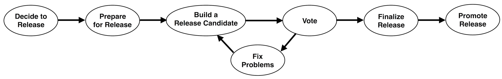

# BitSail 发版指南

[English](../../en/community/release_guide.md) | 简体中文

-----

## 提交 pull request 的流程

提交一个新的 commit 的标准程序

1. 创建一个新的Github issue或者关联一个已经存在的 issue
2. 在issue description中描述你想要进行的工作. 
3. 在commit message关联你的issue，格式如下：

```Plain
[BitSail#${IssueNumber}][${Module}] Description
[BitSail#1234][Connector] Improve reader split algorithm to Kudu source connector

//For Minor change
[Minor] Description
```

4. commit message的module格式列表如下，如果开发者的工作关联了多个module，选择最相关的module即可，例如：如果你在 kafka connector添加了新的feature，并且改变了common、components和cores中的代码，这时commit message应该绑定的module格式为[Connector]。

```Plain
[Common] bitsail-common
[Core] base client component cores
[Connector] all connector related changes
[Doc] documentation or java doc changes
[Build] build, dependency changes
```

## release 流程



### 1. release 决议阶段

因为目前的订阅mailing list的用户不多，使用 Github issue 来讨论release相关的话题应该会有更好的可见性。

我们可以在 Github 上开始一个新的讨论，主题如下

`0.1.0` 发布讨论

决定发布和选择Release Manager是发布过程的第一步。 这是整个社区基于共识的决定。

任何人都可以在 Github issue上提议一个release，给出可靠的论据并提名一名committer作为Release Manager （包括他们自己）。 没有正式的流程，没有投票要求，也没有时间要求。 任何异议都应在开始发布之前以协商的方式解决。

### 2. relase 准备阶段

A. 审理 release-blocking issues

B. 审查和更新文件

C. 跨团队测试

D. 查看发行说明

E. 验证构建和测试

F. 创建发布分支

G. 修改master的版本

### 3. release candidate 构建阶段

由于我们暂时没有maven central access，我们将在github上构建一个release candidate，让其他用户测试。

A. 添加 git release 标签

B. 发布在Github上供公众下载

### 4. release candidate 投票阶段

一旦release分支和release candidate准备就绪，release manager将要求其他committers测试release candidate并开始对相应的 Github Issue 进行投票。 我们至少需要 3 个来自 PMC 成员的盲选票。

### 5. 问题修复阶段

社区审查和投票期间发现的任何问题都应在此步骤中解决。

代码更改应该以标准pull requests的方式提交给 master 分支，并使用标准的贡献流程进行审查。 之后将相关更改同步到发布分支中。 使用 cherry-pick 命令将这些代码更改的commits应用于release分支，再次使用标准的贡献过程进行代码审查和合并。

解决所有问题后，将更改构建新的release candidate。

### 6. release 结束阶段

一旦release candidate通过投票，我们就可以最终确定release。

A. 将release分支版本从 `x.x.x-rc1` 更改为 `x.x.x`。 例如 `0.1.0-rc1` 到 `0.1.0`

B. `git commit -am “[MINOR] 更新release版本以反映release版本 ${RELEASE_VERSION}”`

C.推送到release分支

D. 解决相关Github issue

E. 创建一个新的 Github release，去掉之前推送的 release version 标签

### 7. release 发布阶段

在我们发布release后的 24 小时内，会在所有社区渠道上推广该版本，包括微信、飞书、mailing list。

### 参考:

Flink release 指南: [Creating a Flink Release](https://cwiki.apache.org/confluence/display/FLINK/Creating+a+Flink+Release)

Hudi release 指南: [Apache Hudi Release Guide](https://cwiki.apache.org/confluence/display/HUDI/Apache+Hudi+-+Release+Guide)