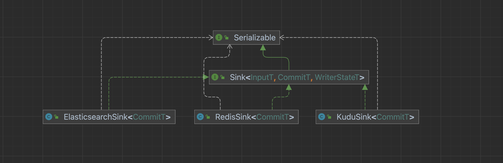
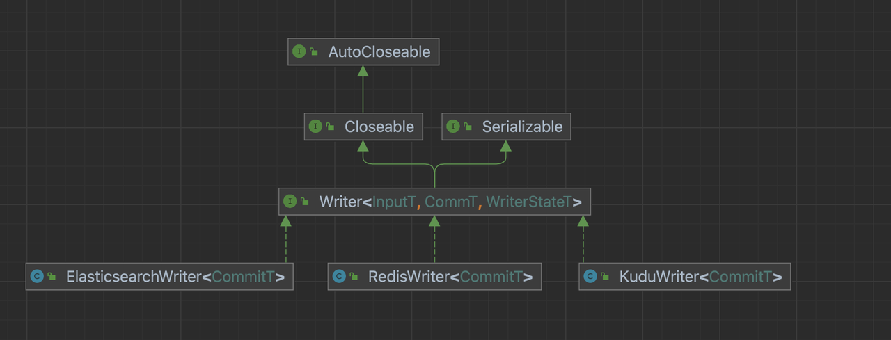

# Sink Connector 详解

[English](../../en/community/sink_connector_detail.md) | 简体中文

-----

## BitSail Sink Connector交互流程介绍


- Sink：数据写入组件的生命周期管理，主要负责和框架的交互，构架作业，它不参与作业真正的执行。
- Writer：负责将接收到的数据写到外部存储。
- WriterCommitter(可选)：对数据进行提交操作，来完成两阶段提交的操作；实现exactly-once的语义。

开发者首先需要创建`Sink`类，实现`Sink`接口，主要负责数据写入组件的生命周期管理，构架作业。通过`configure`方法定义`writerConfiguration`的配置，通过`createTypeInfoConverter`方法来进行数据类型转换，将内部类型进行转换写到外部系统，同`Source`部分。之后我们再定义`Writer`类实现具体的数据写入逻辑，在`write`方法调用时将`BitSail Row`类型把数据写到缓存队列中，在`flush`方法调用时将缓存队列中的数据刷写到目标数据源中。

## Sink

数据写入组件的生命周期管理，主要负责和框架的交互，构架作业，它不参与作业真正的执行。

对于每一个Sink任务，我们要实现一个继承Sink接口的类。



### Sink接口

```Java
public interface Sink<InputT, CommitT extends Serializable, WriterStateT extends Serializable> extends Serializable {

  /**
   * @return The name of writer operation.
   */
  String getWriterName();

  /**
   * Configure writer with user defined options.
   *
   * @param commonConfiguration Common options.
   * @param writerConfiguration Options for writer.
   */
  void configure(BitSailConfiguration commonConfiguration, BitSailConfiguration writerConfiguration) throws Exception;

  /**
   * Create a writer for processing elements.
   *
   * @return An initialized writer.
   */
  Writer<InputT, CommitT, WriterStateT> createWriter(Writer.Context<WriterStateT> context) throws IOException;

  /**
   * @return A converter which supports conversion from BitSail {@link TypeInfo}
   * and external engine type.
   */
  default TypeInfoConverter createTypeInfoConverter() {
    return new BitSailTypeInfoConverter();
  }

  /**
   * @return A committer for commit committable objects.
   */
  default Optional<WriterCommitter<CommitT>> createCommitter() {
    return Optional.empty();
  }

  /**
   * @return A serializer which convert committable object to byte array.
   */
  default BinarySerializer<CommitT> getCommittableSerializer() {
    return new SimpleBinarySerializer<CommitT>();
  }

  /**
   * @return A serializer which convert state object to byte array.
   */
  default BinarySerializer<WriterStateT> getWriteStateSerializer() {
    return new SimpleBinarySerializer<WriterStateT>();
  }
}
```

### configure方法

负责configuration的初始化，通过commonConfiguration中的配置区分流式任务或者批式任务，向Writer类传递writerConfiguration。

#### 示例

ElasticsearchSink：

```Java
public void configure(BitSailConfiguration commonConfiguration, BitSailConfiguration writerConfiguration) {
  writerConf = writerConfiguration;
}
```

### createWriter方法

负责生成一个继承自Writer接口的connector Writer类。

### createTypeInfoConverter方法

类型转换，将内部类型进行转换写到外部系统，同Source部分。

### createCommitter方法

可选方法，书写具体数据提交逻辑，一般用于想要保证数据exactly-once语义的场景，writer在完成数据写入后，committer来完成提交，进而实现二阶段提交，详细可以参考Doris Connector的实现。

## Writer

具体的数据写入逻辑



### Writer接口

```Java
public interface Writer<InputT, CommT, WriterStateT> extends Serializable, Closeable {

  /**
   * Output an element to target source.
   *
   * @param element Input data from upstream.
   */
  void write(InputT element) throws IOException;

  /**
   * Flush buffered input data to target source.
   *
   * @param endOfInput Flag indicates if all input data are delivered.
   */
  void flush(boolean endOfInput) throws IOException;

  /**
   * Prepare commit information before snapshotting when checkpoint is triggerred.
   *
   * @return Information to commit in this checkpoint.
   * @throws IOException Exceptions encountered when preparing committable information.
   */
  List<CommT> prepareCommit() throws IOException;

  /**
   * Do snapshot for at each checkpoint.
   *
   * @param checkpointId The id of checkpoint when snapshot triggered.
   * @return The current state of writer.
   * @throws IOException Exceptions encountered when snapshotting.
   */
  default List<WriterStateT> snapshotState(long checkpointId) throws IOException {
    return Collections.emptyList();
  }

  /**
   * Closing writer when operator is closed.
   *
   * @throws IOException Exception encountered when closing writer.
   */
  default void close() throws IOException {

  }

  interface Context<WriterStateT> extends Serializable {

    TypeInfo<?>[] getTypeInfos();

    int getIndexOfSubTaskId();

    boolean isRestored();

    List<WriterStateT> getRestoreStates();
  }
}
```

### 构造方法

根据writerConfiguration配置初始化数据源的连接对象。

#### 示例

```Java
public RedisWriter(BitSailConfiguration writerConfiguration) {
  // initialize ttl
  int ttl = writerConfiguration.getUnNecessaryOption(RedisWriterOptions.TTL, -1);
  TtlType ttlType;
  try {
    ttlType = TtlType.valueOf(StringUtils.upperCase(writerConfiguration.get(RedisWriterOptions.TTL_TYPE)));
  } catch (IllegalArgumentException e) {
    throw BitSailException.asBitSailException(RedisPluginErrorCode.ILLEGAL_VALUE,
        String.format("unknown ttl type: %s", writerConfiguration.get(RedisWriterOptions.TTL_TYPE)));
  }
  int ttlInSeconds = ttl < 0 ? -1 : ttl * ttlType.getContainSeconds();
  log.info("ttl is {}(s)", ttlInSeconds);

  // initialize commandDescription
  String redisDataType = StringUtils.upperCase(writerConfiguration.get(RedisWriterOptions.REDIS_DATA_TYPE));
  String additionalKey = writerConfiguration.getUnNecessaryOption(RedisWriterOptions.ADDITIONAL_KEY, "default_redis_key");
  this.commandDescription = initJedisCommandDescription(redisDataType, ttlInSeconds, additionalKey);
  this.columnSize = writerConfiguration.get(RedisWriterOptions.COLUMNS).size();

  // initialize jedis pool
  JedisPoolConfig jedisPoolConfig = new JedisPoolConfig();
  jedisPoolConfig.setMaxTotal(writerConfiguration.get(RedisWriterOptions.JEDIS_POOL_MAX_TOTAL_CONNECTIONS));
  jedisPoolConfig.setMaxIdle(writerConfiguration.get(RedisWriterOptions.JEDIS_POOL_MAX_IDLE_CONNECTIONS));
  jedisPoolConfig.setMinIdle(writerConfiguration.get(RedisWriterOptions.JEDIS_POOL_MIN_IDLE_CONNECTIONS));
  jedisPoolConfig.setMaxWait(Duration.ofMillis(writerConfiguration.get(RedisWriterOptions.JEDIS_POOL_MAX_WAIT_TIME_IN_MILLIS)));

  String redisHost = writerConfiguration.getNecessaryOption(RedisWriterOptions.HOST, RedisPluginErrorCode.REQUIRED_VALUE);
  int redisPort = writerConfiguration.getNecessaryOption(RedisWriterOptions.PORT, RedisPluginErrorCode.REQUIRED_VALUE);
  String redisPassword = writerConfiguration.get(RedisWriterOptions.PASSWORD);
  int timeout = writerConfiguration.get(RedisWriterOptions.CLIENT_TIMEOUT_MS);

  if (StringUtils.isEmpty(redisPassword)) {
    this.jedisPool = new JedisPool(jedisPoolConfig, redisHost, redisPort, timeout);
  } else {
    this.jedisPool = new JedisPool(jedisPoolConfig, redisHost, redisPort, timeout, redisPassword);
  }

  // initialize record queue
  int batchSize = writerConfiguration.get(RedisWriterOptions.WRITE_BATCH_INTERVAL);
  this.recordQueue = new CircularFifoQueue<>(batchSize);

  this.logSampleInterval = writerConfiguration.get(RedisWriterOptions.LOG_SAMPLE_INTERVAL);
  this.jedisFetcher = RetryerBuilder.<Jedis>newBuilder()
      .retryIfResult(Objects::isNull)
      .retryIfRuntimeException()
      .withStopStrategy(StopStrategies.stopAfterAttempt(3))
      .withWaitStrategy(WaitStrategies.exponentialWait(100, 5, TimeUnit.MINUTES))
      .build()
      .wrap(jedisPool::getResource);

  this.maxAttemptCount = writerConfiguration.get(RedisWriterOptions.MAX_ATTEMPT_COUNT);
  this.retryer = RetryerBuilder.<Boolean>newBuilder()
      .retryIfResult(needRetry -> Objects.equals(needRetry, true))
      .retryIfException(e -> !(e instanceof BitSailException))
      .withWaitStrategy(WaitStrategies.fixedWait(3, TimeUnit.SECONDS))
      .withStopStrategy(StopStrategies.stopAfterAttempt(maxAttemptCount))
      .build();
}
```

### write方法

该方法调用时会将BitSail Row类型把数据写到缓存队列中，也可以在这里对Row类型数据进行各种格式预处理。直接存储到缓存队列中，或者进行加工处理。如果这里设定了缓存队列的大小，那么在缓存队列写满后要调用flush进行刷写。

#### 示例

redis：将BitSail Row格式的数据直接存储到一定大小的缓存队列中

```Java
public void write(Row record) throws IOException {
  validate(record);
  this.recordQueue.add(record);
  if (recordQueue.isAtFullCapacity()) {
    flush(false);
  }
}
```

Druid：将BitSail Row格式的数据做格式预处理，转化到StringBuffer中储存起来。

```Java
@Override
public void write(final Row element) {
  final StringJoiner joiner = new StringJoiner(DEFAULT_FIELD_DELIMITER, "", "");
  for (int i = 0; i < element.getArity(); i++) {
    final Object v = element.getField(i);
    if (v != null) {
      joiner.add(v.toString());
    }
  }
  // timestamp column is a required field to add in Druid.
  // See https://druid.apache.org/docs/24.0.0/ingestion/data-model.html#primary-timestamp
  joiner.add(String.valueOf(processTime));
  data.append(joiner);
  data.append(DEFAULT_LINE_DELIMITER);
}
```

### flush方法

该方法中主要实现将write方法的缓存中的数据刷写到目标数据源中。

#### 示例

redis：将缓存队列中的BitSail Row格式的数据刷写到目标数据源中。

```Java
public void flush(boolean endOfInput) throws IOException {
  processorId++;
  try (PipelineProcessor processor = genPipelineProcessor(recordQueue.size(), this.complexTypeWithTtl)) {
    Row record;
    while ((record = recordQueue.poll()) != null) {

      String key = (String) record.getField(0);
      String value = (String) record.getField(1);
      String scoreOrHashKey = value;
      if (columnSize == SORTED_SET_OR_HASH_COLUMN_SIZE) {
        value = (String) record.getField(2);
        // Replace empty key with additionalKey in sorted set and hash.
        if (key.length() == 0) {
          key = commandDescription.getAdditionalKey();
        }
      }

      if (commandDescription.getJedisCommand() == JedisCommand.ZADD) {
        // sorted set
        processor.addInitialCommand(new Command(commandDescription, key.getBytes(), parseScoreFromString(scoreOrHashKey), value.getBytes()));
      } else if (commandDescription.getJedisCommand() == JedisCommand.HSET) {
        // hash
        processor.addInitialCommand(new Command(commandDescription, key.getBytes(), scoreOrHashKey.getBytes(), value.getBytes()));
      } else if (commandDescription.getJedisCommand() == JedisCommand.HMSET) {
        //mhset
        if ((record.getArity() - 1) % 2 != 0) {
          throw new BitSailException(CONVERT_NOT_SUPPORT, "Inconsistent data entry.");
        }
        List<byte[]> datas = Arrays.stream(record.getFields())
            .collect(Collectors.toList()).stream().map(o -> ((String) o).getBytes())
            .collect(Collectors.toList()).subList(1, record.getFields().length);
        Map<byte[], byte[]> map = new HashMap<>((record.getArity() - 1) / 2);
        for (int index = 0; index < datas.size(); index = index + 2) {
          map.put(datas.get(index), datas.get(index + 1));
        }
        processor.addInitialCommand(new Command(commandDescription, key.getBytes(), map));
      } else {
        // set and string
        processor.addInitialCommand(new Command(commandDescription, key.getBytes(), value.getBytes()));
      }
    }
    retryer.call(processor::run);
  } catch (ExecutionException | RetryException e) {
    if (e.getCause() instanceof BitSailException) {
      throw (BitSailException) e.getCause();
    } else if (e.getCause() instanceof RedisUnexpectedException) {
      throw (RedisUnexpectedException) e.getCause();
    }
    throw e;
  } catch (IOException e) {
    throw new RuntimeException("Error while init jedis client.", e);
  }
}
```

Druid：使用HTTP post方式提交sink作业给数据源。

```Java
private HttpURLConnection provideHttpURLConnection(final String coordinatorURL) throws IOException {
    final URL url = new URL("http://" + coordinatorURL + DRUID_ENDPOINT);
    final HttpURLConnection con = (HttpURLConnection) url.openConnection();
    con.setRequestMethod("POST");
    con.setRequestProperty("Content-Type", "application/json");
    con.setRequestProperty("Accept", "application/json, text/plain, */*");
    con.setDoOutput(true);
    return con;
  }
  
  public void flush(final boolean endOfInput) throws IOException {
    final ParallelIndexIOConfig ioConfig = provideDruidIOConfig(data);
    final ParallelIndexSupervisorTask indexTask = provideIndexTask(ioConfig);
    final String inputJSON = provideInputJSONString(indexTask);
    final byte[] input = inputJSON.getBytes();
    try (final OutputStream os = httpURLConnection.getOutputStream()) {
      os.write(input, 0, input.length);
    }
    try (final BufferedReader br =
                 new BufferedReader(new InputStreamReader(httpURLConnection.getInputStream(), StandardCharsets.UTF_8))) {
      final StringBuilder response = new StringBuilder();
      String responseLine;
      while ((responseLine = br.readLine()) != null) {
        response.append(responseLine.trim());
      }
      LOG.info("Druid write task has been sent, and the response is {}", response);
    }
  }
```

### close方法

关闭之前创建的各种目标数据源连接对象。

#### 示例

```Java
public void close() throws IOException {
  bulkProcessor.close();
  restClient.close();
  checkErrorAndRethrow();
}
```