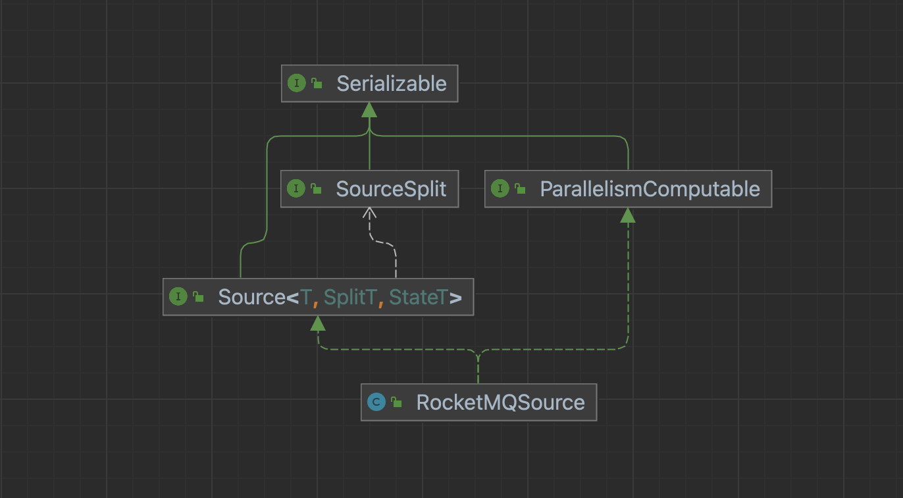
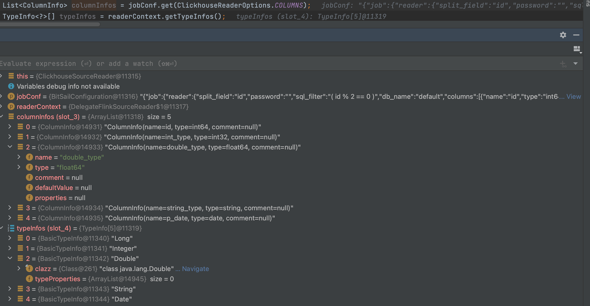
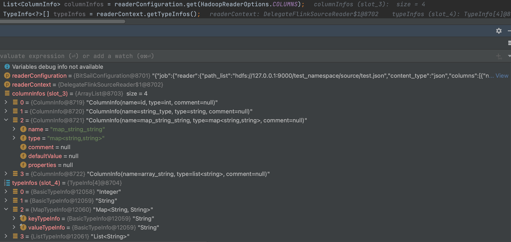
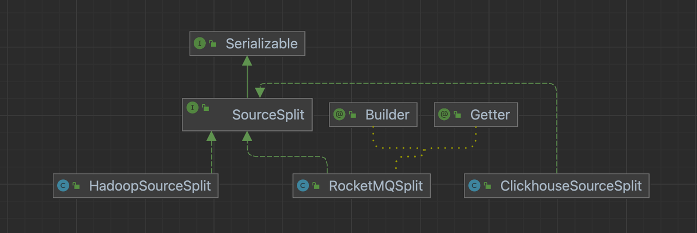
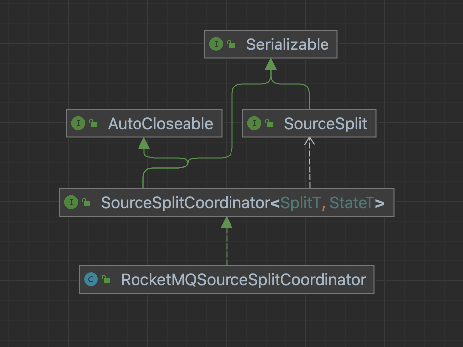
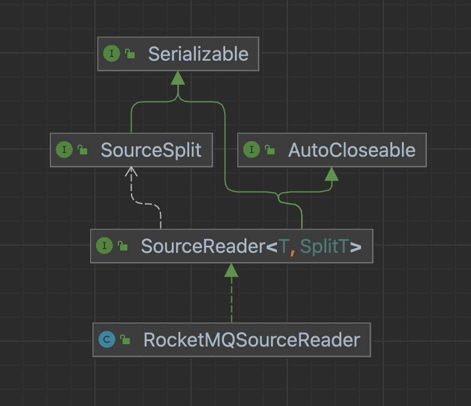
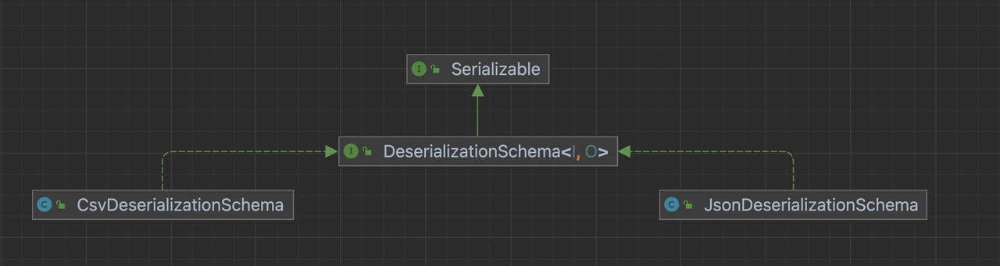

# Source Connector 详解

[English](../../en/community/source_connector_detail.md) | 简体中文

-----

## BitSail Source Connector交互流程介绍


- Source: 参与数据读取组件的生命周期管理，主要负责和框架的交互，构架作业，不参与作业真正的执行。
- SourceSplit:  数据读取分片，大数据处理框架的核心目的就是将大规模的数据拆分成为多个合理的Split并行处理。
- State：作业状态快照，当开启checkpoint之后，会保存当前执行状态。
- SplitCoordinator: SplitCoordinator承担创建、管理Split的角色。
- SourceReader: 真正负责数据读取的组件，在接收到Split后会对其进行数据读取，然后将数据传输给下一个算子。

## Source

数据读取组件的生命周期管理，主要负责和框架的交互，构架作业，它不参与作业真正的执行。

以RocketMQSource为例：Source方法需要实现Source和ParallelismComputable接口。



### Source接口

```Java
public interface Source<T, SplitT extends SourceSplit, StateT extends Serializable>
    extends Serializable, TypeInfoConverterFactory {

  /**
   * Run in client side for source initialize;
   */
  void configure(ExecutionEnviron execution, BitSailConfiguration readerConfiguration) throws IOException;

  /**
   * Indicate the Source type.
   */
  Boundedness getSourceBoundedness();

  /**
   * Create Source Reader.
   */
  SourceReader<T, SplitT> createReader(SourceReader.Context readerContext);

  /**
   * Create split coordinator.
   */
  SourceSplitCoordinator<SplitT, StateT> createSplitCoordinator(SourceSplitCoordinator.Context<SplitT, StateT> coordinatorContext);

  /**
   * Get Split serializer for the framework,{@link SplitT}should implement from {@link  Serializable}
   */
  default BinarySerializer<SplitT> getSplitSerializer() {
    return new SimpleBinarySerializer<>();
  }

  /**
   * Get State serializer for the framework, {@link StateT}should implement from {@link  Serializable}
   */
  default BinarySerializer<StateT> getSplitCoordinatorCheckpointSerializer() {
    return new SimpleBinarySerializer<>();
  }

  /**
   * Create type info converter for the source, default value {@link BitSailTypeInfoConverter}
   */
  default TypeInfoConverter createTypeInfoConverter() {
    return new BitSailTypeInfoConverter();
  }

  /**
   * Get Source' name.
   */
  String getReaderName();
}
```

#### configure方法

主要去做一些客户端的配置的分发和提取，可以操作运行时环境ExecutionEnviron的配置和readerConfiguration的配置。

##### 示例

```Java
@Override
public void configure(ExecutionEnviron execution, BitSailConfiguration readerConfiguration) {
  this.readerConfiguration = readerConfiguration;
  this.commonConfiguration = execution.getCommonConfiguration();
}
```

#### getSourceBoundedness方法

设置作业的处理方式，是采用流式处理方法、批式处理方法，或者是流批一体的处理方式，在流批一体的场景中，我们需要根据作业的不同类型设置不同的处理方式。

具体对应关系如下：

| Job Type | Boundedness                 |
| -------- | --------------------------- |
| batch    | Boundedness.*BOUNDEDNESS*   |
| stream   | Boundedness.*UNBOUNDEDNESS* |

##### 流批一体场景示例

```Java
@Override
public Boundedness getSourceBoundedness() {
  return Mode.BATCH.equals(Mode.getJobRunMode(commonConfiguration.get(CommonOptions.JOB_TYPE))) ?
      Boundedness.BOUNDEDNESS :
      Boundedness.UNBOUNDEDNESS;
}
```

##### 批式场景示例

```Java
public Boundedness getSourceBoundedness() {
  return Boundedness.BOUNDEDNESS;
}
```

#### createTypeInfoConverter方法

用于指定Source连接器的类型转换器；我们知道大多数的外部数据系统都存在着自己的类型定义，它们的定义与BitSail的类型定义不会完全一致；为了简化类型定义的转换，我们支持了通过配置文件来映射两者之间的关系，进而来简化配置文件的开发。

在行为上表现为对任务描述Json文件中`reader`部分的`columns`的解析，对于`columns`中不同字段的type会根据上面描述文件从`ClickhouseReaderOptions.`*`COLUMNS`*字段中解析到`readerContext.getTypeInfos()`中。

##### 实现

- `BitSailTypeInfoConverter`
  -  默认的`TypeInfoConverter`，直接对`ReaderOptions.`*`COLUMNS`*字段进行字符串的直接解析，*`COLUMNS`*字段中是什么类型，`TypeInfoConverter`中就是什么类型。
- `FileMappingTypeInfoConverter`
  -  会在BitSail类型系统转换时去绑定`{readername}-type-converter.yaml`文件，做数据库字段类型和BitSail类型的映射。`ReaderOptions.`*`COLUMNS`*字段在通过这个映射文件转换后才会映射到`TypeInfoConverter`中。

##### 示例

###### FileMappingTypeInfoConverter

通过JDBC方式连接的数据库，包括MySql、Oracle、SqlServer、Kudu、ClickHouse等。这里数据源的特点是以`java.sql.ResultSet`的接口形式返回获取的数据，对于这类数据库，我们往往将`TypeInfoConverter`对象设计为`FileMappingTypeInfoConverter`，这个对象会在BitSail类型系统转换时去绑定`{readername}-type-converter.yaml`文件，做数据库字段类型和BitSail类型的映射。

```Java
@Override
public TypeInfoConverter createTypeInfoConverter() {
  return new FileMappingTypeInfoConverter(getReaderName());
}
```

对于`{readername}-type-converter.yaml`文件的解析，以`clickhouse-type-converter.yaml`为例。

```Plain
# Clickhouse Type to BitSail Type
engine.type.to.bitsail.type.converter:

  - source.type: int32
    target.type: int

  - source.type: float64
    target.type: double

  - source.type: string
    target.type: string

  - source.type: date
    target.type: date.date

  - source.type: null
    target.type: void

# BitSail Type to Clickhouse Type
bitsail.type.to.engine.type.converter:

  - source.type: int
    target.type: int32

  - source.type: double
    target.type: float64

  - source.type: date.date
    target.type: date

  - source.type: string
    target.type: string
```

这个文件起到的作用是进行job描述json文件中`reader`部分的`columns`的解析，对于`columns`中不同字段的type会根据上面描述文件从`ClickhouseReaderOptions.`*`COLUMNS`*字段中解析到`readerContext.getTypeInfos()`中。

```Json
"reader": {
  "class": "com.bytedance.bitsail.connector.clickhouse.source.ClickhouseSource",
  "jdbc_url": "jdbc:clickhouse://localhost:8123",
  "db_name": "default",
  "table_name": "test_ch_table",
  "split_field": "id",
  "split_config": "{\"name\": \"id\", \"lower_bound\": 0, \"upper_bound\": \"10000\", \"split_num\": 3}",
  "sql_filter": "( id % 2 == 0 )",
  "columns": [
    {
      "name": "id",
      "type": "int64"
    },
    {
      "name": "int_type",
      "type": "int32"
    },
    {
      "name": "double_type",
      "type": "float64"
    },
    {
      "name": "string_type",
      "type": "string"
    },
    {
      "name": "p_date",
      "type": "date"
    }
  ]
},
```



这种方式不仅仅适用于数据库，也适用于所有需要在类型转换中需要引擎侧和BitSail侧进行类型映射的场景。

###### BitSailTypeInfoConverter

通常采用默认的方式进行类型转换，直接对`ReaderOptions.``COLUMNS`字段进行字符串的直接解析。

```Java
@Override
public TypeInfoConverter createTypeInfoConverter() {
  return new BitSailTypeInfoConverter();
}
```

以Hadoop为例：

```Json
"reader": {
  "class": "com.bytedance.bitsail.connector.hadoop.source.HadoopSource",
  "path_list": "hdfs://127.0.0.1:9000/test_namespace/source/test.json",
  "content_type":"json",
  "reader_parallelism_num": 1,
  "columns": [
    {
      "name":"id",
      "type": "int"
    },
    {
      "name": "string_type",
      "type": "string"
    },
    {
      "name": "map_string_string",
      "type": "map<string,string>"
    },
    {
      "name": "array_string",
      "type": "list<string>"
    }
  ]
}
```



#### createSourceReader方法

书写具体的数据读取逻辑，负责数据读取的组件，在接收到Split后会对其进行数据读取，然后将数据传输给下一个算子。

具体传入构造SourceReader的参数按需求决定，但是一定要保证所有参数可以序列化。如果不可序列化，将会在createJobGraph的时候出错。

##### 示例

```Java
public SourceReader<Row, RocketMQSplit> createReader(SourceReader.Context readerContext) {
  return new RocketMQSourceReader(
      readerConfiguration,
      readerContext,
      getSourceBoundedness());
}
```

#### createSplitCoordinator方法

书写具体的数据分片、分片分配逻辑，SplitCoordinator承担了去创建、管理Split的角色。

具体传入构造SplitCoordinator的参数按需求决定，但是一定要保证所有参数可以序列化。如果不可序列化，将会在createJobGraph的时候出错。

##### 示例

```Java
public SourceSplitCoordinator<RocketMQSplit, RocketMQState> createSplitCoordinator(SourceSplitCoordinator
                                                                                       .Context<RocketMQSplit, RocketMQState> coordinatorContext) {
  return new RocketMQSourceSplitCoordinator(
      coordinatorContext,
      readerConfiguration,
      getSourceBoundedness());
}
```

### ParallelismComputable接口

```Java
public interface ParallelismComputable extends Serializable {

  /**
   * give a parallelism advice for reader/writer based on configurations and upstream parallelism advice
   *
   * @param commonConf     common configuration
   * @param selfConf       reader/writer configuration
   * @param upstreamAdvice parallelism advice from upstream (when an operator has no upstream in DAG, its upstream is
   *                       global parallelism)
   * @return parallelism advice for the reader/writer
   */
  ParallelismAdvice getParallelismAdvice(BitSailConfiguration commonConf,
                                         BitSailConfiguration selfConf,
                                         ParallelismAdvice upstreamAdvice) throws Exception;
}
```

#### getParallelismAdvice方法

用于指定下游reader的并行数目。一般有以下的方式：

可以选择`selfConf.get(ClickhouseReaderOptions.`*`READER_PARALLELISM_NUM`*`)`来指定并行度。

也可以自定义自己的并行度划分逻辑。

##### 示例

比如在RocketMQ中，我们可以定义每1个reader可以处理至多4个队列*`DEFAULT_ROCKETMQ_PARALLELISM_THRESHOLD `*`= 4`

通过这种自定义的方式获取对应的并行度。

```Java
public ParallelismAdvice getParallelismAdvice(BitSailConfiguration commonConfiguration,
                                                BitSailConfiguration rocketmqConfiguration,
                                                ParallelismAdvice upstreamAdvice) throws Exception {
    String cluster = rocketmqConfiguration.get(RocketMQSourceOptions.CLUSTER);
    String topic = rocketmqConfiguration.get(RocketMQSourceOptions.TOPIC);
    String consumerGroup = rocketmqConfiguration.get(RocketMQSourceOptions.CONSUMER_GROUP);
    DefaultLitePullConsumer consumer = RocketMQUtils.prepareRocketMQConsumer(rocketmqConfiguration, String.format(SOURCE_INSTANCE_NAME_TEMPLATE,
        cluster,
        topic,
        consumerGroup,
        UUID.randomUUID()
    ));
    try {
      consumer.start();
      Collection<MessageQueue> messageQueues = consumer.fetchMessageQueues(topic);
      int adviceParallelism = Math.max(CollectionUtils.size(messageQueues) / DEFAULT_ROCKETMQ_PARALLELISM_THRESHOLD, 1);

      return ParallelismAdvice.builder()
          .adviceParallelism(adviceParallelism)
          .enforceDownStreamChain(true)
          .build();
    } finally {
      consumer.shutdown();
    }
  }
}
```

## SourceSplit

数据源的数据分片格式，需要我们实现SourceSplit接口。



### SourceSplit接口

要求我们实现一个实现一个获取splitId的方法。

```Java
public interface SourceSplit extends Serializable {
  String uniqSplitId();
}
```

对于具体切片的格式，开发者可以按照自己的需求进行自定义。

### 示例

#### JDBC类存储

一般会通过主键，来对数据进行最大、最小值的划分；对于无主键类则通常会将其认定为一个split，不再进行拆分，所以split中的参数包括主键的最大最小值，以及一个布尔类型的`readTable`，如果无主键类或是不进行主键的切分则整张表会视为一个split，此时`readTable`为`true`，如果按主键最大最小值进行切分，则设置为`false`。

以ClickhouseSourceSplit为例：

```Java
@Setter
public class ClickhouseSourceSplit implements SourceSplit {
  public static final String SOURCE_SPLIT_PREFIX = "clickhouse_source_split_";
  private static final String BETWEEN_CLAUSE = "( `%s` BETWEEN ? AND ? )";

  private final String splitId;

  /**
   * Read whole table or range [lower, upper]
   */
  private boolean readTable;
  private Long lower;
  private Long upper;

  public ClickhouseSourceSplit(int splitId) {
    this.splitId = SOURCE_SPLIT_PREFIX + splitId;
  }

  @Override
  public String uniqSplitId() {
    return splitId;
  }

  public void decorateStatement(PreparedStatement statement) {
    try {
      if (readTable) {
        lower = Long.MIN_VALUE;
        upper = Long.MAX_VALUE;
      }
      statement.setObject(1, lower);
      statement.setObject(2, upper);
    } catch (SQLException e) {
      throw BitSailException.asBitSailException(CommonErrorCode.RUNTIME_ERROR, "Failed to decorate statement with split " + this, e.getCause());
    }
  }

  public static String getRangeClause(String splitField) {
    return StringUtils.isEmpty(splitField) ? null : String.format(BETWEEN_CLAUSE, splitField);
  }

  @Override
  public String toString() {
    return String.format(
        "{\"split_id\":\"%s\", \"lower\":%s, \"upper\":%s, \"readTable\":%s}",
        splitId, lower, upper, readTable);
  }
}
```

#### 消息队列

一般按照消息队列中topic注册的partitions的数量进行split的划分，切片中主要应包含消费的起点和终点以及消费的队列。

以RocketMQSplit为例：

```Java
@Builder
@Getter
public class RocketMQSplit implements SourceSplit {

  private MessageQueue messageQueue;

  @Setter
  private long startOffset;

  private long endOffset;

  private String splitId;

  @Override
  public String uniqSplitId() {
    return splitId;
  }

  @Override
  public String toString() {
    return "RocketMQSplit{" +
        "messageQueue=" + messageQueue +
        ", startOffset=" + startOffset +
        ", endOffset=" + endOffset +
        '}';
  }
}
```

#### 文件系统

一般会按照文件作为最小粒度进行划分，同时有些格式也支持将单个文件拆分为多个子Splits。文件系统split中需要包装所需的文件切片。

以FtpSourceSplit为例：

```Java
public class FtpSourceSplit implements SourceSplit {

  public static final String FTP_SOURCE_SPLIT_PREFIX = "ftp_source_split_";

  private final String splitId;

  @Setter
  private String path;
  @Setter
  private long fileSize;

  public FtpSourceSplit(int splitId) {
    this.splitId = FTP_SOURCE_SPLIT_PREFIX + splitId;
  }

  @Override
  public String uniqSplitId() {
    return splitId;
  }

  @Override
  public boolean equals(Object obj) {
    return (obj instanceof FtpSourceSplit) && (splitId.equals(((FtpSourceSplit) obj).splitId));
  }

}
```

特别的，在Hadoop文件系统中，我们也可以利用对`org.apache.hadoop.mapred.InputSplit`类的包装来自定义我们的Split。

```Java
public class HadoopSourceSplit implements SourceSplit {
  private static final long serialVersionUID = 1L;
  private final Class<? extends InputSplit> splitType;
  private transient InputSplit hadoopInputSplit;

  private byte[] hadoopInputSplitByteArray;

  public HadoopSourceSplit(InputSplit inputSplit) {
    if (inputSplit == null) {
      throw new NullPointerException("Hadoop input split must not be null");
    }

    this.splitType = inputSplit.getClass();
    this.hadoopInputSplit = inputSplit;
  }

  public InputSplit getHadoopInputSplit() {
    return this.hadoopInputSplit;
  }

  public void initInputSplit(JobConf jobConf) {
    if (this.hadoopInputSplit != null) {
      return;
    }

    checkNotNull(hadoopInputSplitByteArray);

    try {
      this.hadoopInputSplit = (InputSplit) WritableFactories.newInstance(splitType);

      if (this.hadoopInputSplit instanceof Configurable) {
        ((Configurable) this.hadoopInputSplit).setConf(jobConf);
      } else if (this.hadoopInputSplit instanceof JobConfigurable) {
        ((JobConfigurable) this.hadoopInputSplit).configure(jobConf);
      }

      if (hadoopInputSplitByteArray != null) {
        try (ObjectInputStream objectInputStream = new ObjectInputStream(new ByteArrayInputStream(hadoopInputSplitByteArray))) {
          this.hadoopInputSplit.readFields(objectInputStream);
        }

        this.hadoopInputSplitByteArray = null;
      }
    } catch (Exception e) {
      throw new RuntimeException("Unable to instantiate Hadoop InputSplit", e);
    }
  }

  private void writeObject(ObjectOutputStream out) throws IOException {

    if (hadoopInputSplit != null) {
      try (
          ByteArrayOutputStream byteArrayOutputStream = new ByteArrayOutputStream();
          ObjectOutputStream objectOutputStream = new ObjectOutputStream(byteArrayOutputStream)
      ) {
        this.hadoopInputSplit.write(objectOutputStream);
        objectOutputStream.flush();
        this.hadoopInputSplitByteArray = byteArrayOutputStream.toByteArray();
      }
    }
    out.defaultWriteObject();
  }

  @Override
  public String uniqSplitId() {
    return hadoopInputSplit.toString();
  }
}
```

## State

在需要做checkpoint的场景下，通常我们会通过Map来保留当前的执行状态

### 流批一体场景

在流批一体场景中，我们需要保存状态以便从异常中断的流式作业恢复

以RocketMQState为例：

```Java
public class RocketMQState implements Serializable {

  private final Map<MessageQueue, String> assignedWithSplitIds;

  public RocketMQState(Map<MessageQueue, String> assignedWithSplitIds) {
    this.assignedWithSplitIds = assignedWithSplitIds;
  }

  public Map<MessageQueue, String> getAssignedWithSplits() {
    return assignedWithSplitIds;
  }
}
```

### 批式场景

对于批式场景，我们可以使用`EmptyState`不存储状态，如果需要状态存储，和流批一体场景采用相似的设计方案。

```Java
public class EmptyState implements Serializable {

  public static EmptyState fromBytes() {
    return new EmptyState();
  }
}
```

## SourceSplitCoordinator

大数据处理框架的核心目的就是将大规模的数据拆分成为多个合理的Split，SplitCoordinator承担这个创建、管理Split的角色。



### SourceSplitCoordinator接口

```Java
public interface SourceSplitCoordinator<SplitT extends SourceSplit, StateT> extends Serializable, AutoCloseable {

  void start();

  void addReader(int subtaskId);

  void addSplitsBack(List<SplitT> splits, int subtaskId);

  void handleSplitRequest(int subtaskId, @Nullable String requesterHostname);

  default void handleSourceEvent(int subtaskId, SourceEvent sourceEvent) {
  }

  StateT snapshotState() throws Exception;

  default void notifyCheckpointComplete(long checkpointId) throws Exception {
  }

  void close();

  interface Context<SplitT extends SourceSplit, StateT> {

    boolean isRestored();

    /**
     * Return the state to the split coordinator, for the exactly-once.
     */
    StateT getRestoreState();

    /**
     * Return total parallelism of the source reader.
     */
    int totalParallelism();

    /**
     * When Source reader started, it will be registered itself to coordinator.
     */
    Set<Integer> registeredReaders();

    /**
     * Assign splits to reader.
     */
    void assignSplit(int subtaskId, List<SplitT> splits);

    /**
     * Mainly use in boundedness situation, represents there will no more split will send to source reader.
     */
    void signalNoMoreSplits(int subtask);

    /**
     * If split coordinator have any event want to send source reader, use this method.
     * Like send Pause event to Source Reader in CDC2.0.
     */
    void sendEventToSourceReader(int subtaskId, SourceEvent event);

    /**
     * Schedule to run the callable and handler, often used in un-boundedness mode.
     */
    <T> void runAsync(Callable<T> callable,
                      BiConsumer<T, Throwable> handler,
                      int initialDelay,
                      long interval);

    /**
     * Just run callable and handler once, often used in boundedness mode.
     */
    <T> void runAsyncOnce(Callable<T> callable,
                          BiConsumer<T, Throwable> handler);
  }
}
```

### 构造方法

开发者在构造方法中一般主要进行一些配置的设置和分片信息存储的容器的创建。

以ClickhouseSourceSplitCoordinator的构造为例：

```Java
public ClickhouseSourceSplitCoordinator(SourceSplitCoordinator.Context<ClickhouseSourceSplit, EmptyState> context,
                                  BitSailConfiguration jobConf) {
  this.context = context;
  this.jobConf = jobConf;
  this.splitAssignmentPlan = Maps.newConcurrentMap();
}
```

在自定义了State的场景中，需要对checkpoint时存储在`SourceSplitCoordinator.Context`的状态进行保存和恢复。

以RocketMQSourceSplitCoordinator为例：

```Java
public RocketMQSourceSplitCoordinator(
    SourceSplitCoordinator.Context<RocketMQSplit, RocketMQState> context,
    BitSailConfiguration jobConfiguration,
    Boundedness boundedness) {
  this.context = context;
  this.jobConfiguration = jobConfiguration;
  this.boundedness = boundedness;
  this.discoveryInternal = jobConfiguration.get(RocketMQSourceOptions.DISCOVERY_INTERNAL);
  this.pendingRocketMQSplitAssignment = Maps.newConcurrentMap();

  this.discoveredPartitions = new HashSet<>();
  if (context.isRestored()) {
    RocketMQState restoreState = context.getRestoreState();
    assignedPartitions = restoreState.getAssignedWithSplits();
    discoveredPartitions.addAll(assignedPartitions.keySet());
  } else {
    assignedPartitions = Maps.newHashMap();
  }

  prepareConsumerProperties();
}
```

### start方法

进行一些数据源所需分片元数据的提取工作，如果有抽象出来的Split Assigner类，一般在这里进行初始化。如果使用的是封装的Split Assign函数，这里会进行待分配切片的初始化工作。

#### 流批一体场景

以RocketMQSourceSplitCoordinator为例：

```Java
private void prepareRocketMQConsumer() {
  try {
    consumer = RocketMQUtils.prepareRocketMQConsumer(jobConfiguration,
        String.format(COORDINATOR_INSTANCE_NAME_TEMPLATE,
            cluster, topic, consumerGroup, UUID.randomUUID()));
    consumer.start();
  } catch (Exception e) {
    throw BitSailException.asBitSailException(RocketMQErrorCode.CONSUMER_CREATE_FAILED, e);
  }
}

@Override
public void start() {
  prepareRocketMQConsumer();
  splitAssigner = new FairRocketMQSplitAssigner(jobConfiguration, assignedPartitions);
  if (discoveryInternal > 0) {
    context.runAsync(
        this::fetchMessageQueues,
        this::handleMessageQueueChanged,
        0,
        discoveryInternal
    );
  } else {
    context.runAsyncOnce(
        this::fetchMessageQueues,
        this::handleMessageQueueChanged
    );
  }
}
```

#### 批式场景

以ClickhouseSourceSplitCoordinator为例：

```Java
public void start() {
  List<ClickhouseSourceSplit> splitList;
  try {
    SimpleDivideSplitConstructor constructor = new SimpleDivideSplitConstructor(jobConf);
    splitList = constructor.construct();
  } catch (IOException e) {
    ClickhouseSourceSplit split = new ClickhouseSourceSplit(0);
    split.setReadTable(true);
    splitList = Collections.singletonList(split);
    LOG.error("Failed to construct splits, will directly read the table.", e);
  }

  int readerNum = context.totalParallelism();
  LOG.info("Found {} readers and {} splits.", readerNum, splitList.size());
  if (readerNum > splitList.size()) {
    LOG.error("Reader number {} is larger than split number {}.", readerNum, splitList.size());
  }

  for (ClickhouseSourceSplit split : splitList) {
    int readerIndex = ReaderSelector.getReaderIndex(readerNum);
    splitAssignmentPlan.computeIfAbsent(readerIndex, k -> new HashSet<>()).add(split);
    LOG.info("Will assign split {} to the {}-th reader", split.uniqSplitId(), readerIndex);
  }
}
```

### Assigner

将划分好的切片分配给Reader，开发过程中，我们通常让SourceSplitCoordinator专注于处理和Reader 的通讯工作，实际split的分发逻辑一般封装在Assigner进行，这个Assigner可以是一个封装的Split Assign函数，也可以是一个抽象出来的Split Assigner类。

#### Assign函数示例

以ClickhouseSourceSplitCoordinator为例：

tryAssignSplitsToReader函数将存储在splitAssignmentPlan中的划分好的切片分配给相应的Reader。

```Java
private void tryAssignSplitsToReader() {
  Map<Integer, List<ClickhouseSourceSplit>> splitsToAssign = new HashMap<>();

  for (Integer readerIndex : splitAssignmentPlan.keySet()) {
    if (CollectionUtils.isNotEmpty(splitAssignmentPlan.get(readerIndex)) && context.registeredReaders().contains(readerIndex)) {
      splitsToAssign.put(readerIndex, Lists.newArrayList(splitAssignmentPlan.get(readerIndex)));
    }
  }

  for (Integer readerIndex : splitsToAssign.keySet()) {
    LOG.info("Try assigning splits reader {}, splits are: [{}]", readerIndex,
        splitsToAssign.get(readerIndex).stream().map(ClickhouseSourceSplit::uniqSplitId).collect(Collectors.toList()));
    splitAssignmentPlan.remove(readerIndex);
    context.assignSplit(readerIndex, splitsToAssign.get(readerIndex));
    context.signalNoMoreSplits(readerIndex);
    LOG.info("Finish assigning splits reader {}", readerIndex);
  }
}
```

#### Assigner方法示例

以RocketMQSourceSplitCoordinator为例：

```Java
public class FairRocketMQSplitAssigner implements SplitAssigner<MessageQueue> {

  private BitSailConfiguration readerConfiguration;

  private AtomicInteger atomicInteger;

  public Map<MessageQueue, String> rocketMQSplitIncrementMapping;

  public FairRocketMQSplitAssigner(BitSailConfiguration readerConfiguration,
                                   Map<MessageQueue, String> rocketMQSplitIncrementMapping) {
    this.readerConfiguration = readerConfiguration;
    this.rocketMQSplitIncrementMapping = rocketMQSplitIncrementMapping;
    this.atomicInteger = new AtomicInteger(CollectionUtils
        .size(rocketMQSplitIncrementMapping.keySet()));
  }

  @Override
  public String assignSplitId(MessageQueue messageQueue) {
    if (!rocketMQSplitIncrementMapping.containsKey(messageQueue)) {
      rocketMQSplitIncrementMapping.put(messageQueue, String.valueOf(atomicInteger.getAndIncrement()));
    }
    return rocketMQSplitIncrementMapping.get(messageQueue);
  }

  @Override
  public int assignToReader(String splitId, int totalParallelism) {
    return splitId.hashCode() % totalParallelism;
  }
}
```

### addReader方法

调用Assigner，为Reader添加切片。

#### 批式场景示例

以ClickhouseSourceSplitCoordinator为例：

```Java
public void addReader(int subtaskId) {
  LOG.info("Found reader {}", subtaskId);
  tryAssignSplitsToReader();
}
```

#### 流批一体场景示例

以RocketMQSourceSplitCoordinator为例：

```Java
private void notifyReaderAssignmentResult() {
  Map<Integer, List<RocketMQSplit>> tmpRocketMQSplitAssignments = new HashMap<>();

  for (Integer pendingAssignmentReader : pendingRocketMQSplitAssignment.keySet()) {

    if (CollectionUtils.isNotEmpty(pendingRocketMQSplitAssignment.get(pendingAssignmentReader))
        && context.registeredReaders().contains(pendingAssignmentReader)) {

      tmpRocketMQSplitAssignments.put(pendingAssignmentReader, Lists.newArrayList(pendingRocketMQSplitAssignment.get(pendingAssignmentReader)));
    }
  }

  for (Integer pendingAssignmentReader : tmpRocketMQSplitAssignments.keySet()) {

    LOG.info("Assigning splits to reader {}, splits = {}.", pendingAssignmentReader,
        tmpRocketMQSplitAssignments.get(pendingAssignmentReader));

    context.assignSplit(pendingAssignmentReader,
        tmpRocketMQSplitAssignments.get(pendingAssignmentReader));
    Set<RocketMQSplit> removes = pendingRocketMQSplitAssignment.remove(pendingAssignmentReader);
    removes.forEach(removeSplit -> {
      assignedPartitions.put(removeSplit.getMessageQueue(), removeSplit.getSplitId());
    });

    LOG.info("Assigned splits to reader {}", pendingAssignmentReader);

    if (Boundedness.BOUNDEDNESS == boundedness) {
      LOG.info("Signal reader {} no more splits assigned in future.", pendingAssignmentReader);
      context.signalNoMoreSplits(pendingAssignmentReader);
    }
  }
}

@Override
public void addReader(int subtaskId) {
  LOG.info(
      "Adding reader {} to RocketMQ Split Coordinator for consumer group {}.",
      subtaskId,
      consumerGroup);
  notifyReaderAssignmentResult();
}
```

### addSplitsBack方法

对于一些Reader没有处理完的切片，进行重新分配，重新分配的策略可以自己定义，常用的策略是哈希取模，对于返回的Split列表中的所有Split进行重新分配后再Assign给不同的Reader。

#### 批式场景示例

以ClickhouseSourceSplitCoordinator为例：

ReaderSelector使用哈希取模的策略对Split列表进行重分配。

tryAssignSplitsToReader方法将重分配后的Split集合通过Assigner分配给Reader。

```Java
public void addSplitsBack(List<ClickhouseSourceSplit> splits, int subtaskId) {
  LOG.info("Source reader {} return splits {}.", subtaskId, splits);

  int readerNum = context.totalParallelism();
  for (ClickhouseSourceSplit split : splits) {
    int readerIndex = ReaderSelector.getReaderIndex(readerNum);
    splitAssignmentPlan.computeIfAbsent(readerIndex, k -> new HashSet<>()).add(split);
    LOG.info("Re-assign split {} to the {}-th reader.", split.uniqSplitId(), readerIndex);
  }

  tryAssignSplitsToReader();
}
```

#### 流批一体场景示例

以RocketMQSourceSplitCoordinator为例：

addSplitChangeToPendingAssignment使用哈希取模的策略对Split列表进行重分配。

notifyReaderAssignmentResult将重分配后的Split集合通过Assigner分配给Reader。

```Java
private synchronized void addSplitChangeToPendingAssignment(Set<RocketMQSplit> newRocketMQSplits) {
  int numReader = context.totalParallelism();
  for (RocketMQSplit split : newRocketMQSplits) {
    int readerIndex = splitAssigner.assignToReader(split.getSplitId(), numReader);
    pendingRocketMQSplitAssignment.computeIfAbsent(readerIndex, r -> new HashSet<>())
        .add(split);
  }
  LOG.debug("RocketMQ splits {} finished assignment.", newRocketMQSplits);
}

@Override
public void addSplitsBack(List<RocketMQSplit> splits, int subtaskId) {
  LOG.info("Source reader {} return splits {}.", subtaskId, splits);
  addSplitChangeToPendingAssignment(new HashSet<>(splits));
  notifyReaderAssignmentResult();
}
```

### snapshotState方法

存储处理切片的快照信息，用于恢复时在构造方法中使用。

```Java
public RocketMQState snapshotState() throws Exception {
  return new RocketMQState(assignedPartitions);
}
```

### close方法

关闭在分片过程中与数据源交互读取元数据信息的所有未关闭连接器。

```Java
public void close() {
  if (consumer != null) {
    consumer.shutdown();
  }
}
```

## SourceReader

每个SourceReader都在独立的线程中执行，只要我们保证SourceSplitCoordinator分配给不同SourceReader的切片没有交集，在SourceReader的执行周期中，我们就可以不考虑任何有关并发的细节。



### SourceReader接口

```Java
public interface SourceReader<T, SplitT extends SourceSplit> extends Serializable, AutoCloseable {

  void start();

  void pollNext(SourcePipeline<T> pipeline) throws Exception;

  void addSplits(List<SplitT> splits);

  /**
   * Check source reader has more elements or not.
   */
  boolean hasMoreElements();

  /**
   * There will no more split will send to this source reader.
   * Source reader could be exited after process all assigned split.
   */
  default void notifyNoMoreSplits() {

  }

  /**
   * Process all events which from {@link SourceSplitCoordinator}.
   */
  default void handleSourceEvent(SourceEvent sourceEvent) {
  }

  /**
   * Store the split to the external system to recover when task failed.
   */
  List<SplitT> snapshotState(long checkpointId);

  /**
   * When all tasks finished snapshot, notify checkpoint complete will be invoked.
   */
  default void notifyCheckpointComplete(long checkpointId) throws Exception {

  }

  interface Context {

    TypeInfo<?>[] getTypeInfos();

    String[] getFieldNames();

    int getIndexOfSubtask();

    void sendSplitRequest();
  }
}
```

### 构造方法

这里需要完成和数据源访问各种配置的提取，比如数据库库名表名、消息队列cluster和topic、身份认证的配置等等。

#### 示例

```Java
public RocketMQSourceReader(BitSailConfiguration readerConfiguration,
                            Context context,
                            Boundedness boundedness) {
  this.readerConfiguration = readerConfiguration;
  this.boundedness = boundedness;
  this.context = context;
  this.assignedRocketMQSplits = Sets.newHashSet();
  this.finishedRocketMQSplits = Sets.newHashSet();
  this.deserializationSchema = new RocketMQDeserializationSchema(
      readerConfiguration,
      context.getTypeInfos(),
      context.getFieldNames());
  this.noMoreSplits = false;

  cluster = readerConfiguration.get(RocketMQSourceOptions.CLUSTER);
  topic = readerConfiguration.get(RocketMQSourceOptions.TOPIC);
  consumerGroup = readerConfiguration.get(RocketMQSourceOptions.CONSUMER_GROUP);
  consumerTag = readerConfiguration.get(RocketMQSourceOptions.CONSUMER_TAG);
  pollBatchSize = readerConfiguration.get(RocketMQSourceOptions.POLL_BATCH_SIZE);
  pollTimeout = readerConfiguration.get(RocketMQSourceOptions.POLL_TIMEOUT);
  commitInCheckpoint = readerConfiguration.get(RocketMQSourceOptions.COMMIT_IN_CHECKPOINT);
  accessKey = readerConfiguration.get(RocketMQSourceOptions.ACCESS_KEY);
  secretKey = readerConfiguration.get(RocketMQSourceOptions.SECRET_KEY);
}
```

### start方法

初始化数据源的访问对象，例如数据库的执行对象、消息队列的consumer对象或者文件系统的连接。

#### 示例

消息队列

```Java
public void start() {
  try {
    if (StringUtils.isNotEmpty(accessKey) && StringUtils.isNotEmpty(secretKey)) {
      AclClientRPCHook aclClientRPCHook = new AclClientRPCHook(
          new SessionCredentials(accessKey, secretKey));
      consumer = new DefaultMQPullConsumer(aclClientRPCHook);
    } else {
      consumer = new DefaultMQPullConsumer();
    }

    consumer.setConsumerGroup(consumerGroup);
    consumer.setNamesrvAddr(cluster);
    consumer.setInstanceName(String.format(SOURCE_READER_INSTANCE_NAME_TEMPLATE,
        cluster, topic, consumerGroup, UUID.randomUUID()));
    consumer.setConsumerPullTimeoutMillis(pollTimeout);
    consumer.start();
  } catch (Exception e) {
    throw BitSailException.asBitSailException(RocketMQErrorCode.CONSUMER_CREATE_FAILED, e);
  }
}
```

数据库

```Java
public void start() {
  this.connection = connectionHolder.connect();

  // Construct statement.
  String baseSql = ClickhouseJdbcUtils.getQuerySql(dbName, tableName, columnInfos);
  String querySql = ClickhouseJdbcUtils.decorateSql(baseSql, splitField, filterSql, maxFetchCount, true);
  try {
    this.statement = connection.prepareStatement(querySql);
  } catch (SQLException e) {
    throw new RuntimeException("Failed to prepare statement.", e);
  }

  LOG.info("Task {} started.", subTaskId);
}
```

FTP

```Java
public void start() {
  this.ftpHandler.loginFtpServer();
  if (this.ftpHandler.getFtpConfig().getSkipFirstLine()) {
    this.skipFirstLine = true;
  }
}
```

### addSplits方法

将SourceSplitCoordinator给当前Reader分配的Splits列表添加到自己的处理队列（Queue）或者集合（Set）中。

#### 示例

```Java
public void addSplits(List<RocketMQSplit> splits) {
  LOG.info("Subtask {} received {}(s) new splits, splits = {}.",
      context.getIndexOfSubtask(),
      CollectionUtils.size(splits),
      splits);

  assignedRocketMQSplits.addAll(splits);
}
```

### hasMoreElements方法

在无界的流计算场景中，会一直返回true保证Reader线程不被销毁。

在批式场景中，分配给该Reader的切片处理完之后会返回false，表示该Reader生命周期的结束。

```Java
public boolean hasMoreElements() {
  if (boundedness == Boundedness.UNBOUNDEDNESS) {
    return true;
  }
  if (noMoreSplits) {
    return CollectionUtils.size(assignedRocketMQSplits) != 0;
  }
  return true;
}
```

### pollNext方法

在addSplits方法添加完成切片处理队列且hasMoreElements返回true时，该方法调用，开发者实现此方法真正和数据交互。

开发者在实现pollNext方法时候需要关注下列问题：

- 切片数据的读取
  - 从构造好的切片中去读取数据。
- 数据类型的转换
  - 将外部数据转换成BitSail的Row类型

#### 示例

以RocketMQSourceReader为例：

从split队列中选取split进行处理，读取其信息，之后需要将读取到的信息转换成BitSail的Row类型，发送给下游处理。

```Java
public void pollNext(SourcePipeline<Row> pipeline) throws Exception {
  for (RocketMQSplit rocketmqSplit : assignedRocketMQSplits) {
    MessageQueue messageQueue = rocketmqSplit.getMessageQueue();
    PullResult pullResult = consumer.pull(rocketmqSplit.getMessageQueue(),
        consumerTag,
        rocketmqSplit.getStartOffset(),
        pollBatchSize,
        pollTimeout);

    if (Objects.isNull(pullResult) || CollectionUtils.isEmpty(pullResult.getMsgFoundList())) {
      continue;
    }

    for (MessageExt message : pullResult.getMsgFoundList()) {
      Row deserialize = deserializationSchema.deserialize(message.getBody());
      pipeline.output(deserialize);
      if (rocketmqSplit.getStartOffset() >= rocketmqSplit.getEndOffset()) {
        LOG.info("Subtask {} rocketmq split {} in end of stream.",
            context.getIndexOfSubtask(),
            rocketmqSplit);
        finishedRocketMQSplits.add(rocketmqSplit);
        break;
      }
    }
    rocketmqSplit.setStartOffset(pullResult.getNextBeginOffset());
    if (!commitInCheckpoint) {
      consumer.updateConsumeOffset(messageQueue, pullResult.getMaxOffset());
    }
  }
  assignedRocketMQSplits.removeAll(finishedRocketMQSplits);
}
```

#### 转换为BitSail Row类型的常用方式

##### 自定义RowDeserializer类

对于不同格式的列应用不同converter，设置到相应Row的Field。

```Java
public class ClickhouseRowDeserializer {

  interface FiledConverter {
    Object apply(ResultSet resultSet) throws SQLException;
  }

  private final List<FiledConverter> converters;
  private final int fieldSize;

  public ClickhouseRowDeserializer(TypeInfo<?>[] typeInfos) {
    this.fieldSize = typeInfos.length;
    this.converters = new ArrayList<>();
    for (int i = 0; i < fieldSize; ++i) {
      converters.add(initFieldConverter(i + 1, typeInfos[i]));
    }
  }

  public Row convert(ResultSet resultSet) {
    Row row = new Row(fieldSize);
    try {
      for (int i = 0; i < fieldSize; ++i) {
        row.setField(i, converters.get(i).apply(resultSet));
      }
    } catch (SQLException e) {
      throw BitSailException.asBitSailException(ClickhouseErrorCode.CONVERT_ERROR, e.getCause());
    }
    return row;
  }

  private FiledConverter initFieldConverter(int index, TypeInfo<?> typeInfo) {
    if (!(typeInfo instanceof BasicTypeInfo)) {
      throw BitSailException.asBitSailException(CommonErrorCode.UNSUPPORTED_COLUMN_TYPE, typeInfo.getTypeClass().getName() + " is not supported yet.");
    }

    Class<?> curClass = typeInfo.getTypeClass();
    if (TypeInfos.BYTE_TYPE_INFO.getTypeClass() == curClass) {
      return resultSet -> resultSet.getByte(index);
    }
    if (TypeInfos.SHORT_TYPE_INFO.getTypeClass() == curClass) {
      return resultSet -> resultSet.getShort(index);
    }
    if (TypeInfos.INT_TYPE_INFO.getTypeClass() == curClass) {
      return resultSet -> resultSet.getInt(index);
    }
    if (TypeInfos.LONG_TYPE_INFO.getTypeClass() == curClass) {
      return resultSet -> resultSet.getLong(index);
    }
    if (TypeInfos.BIG_INTEGER_TYPE_INFO.getTypeClass() == curClass) {
      return resultSet -> {
        BigDecimal dec = resultSet.getBigDecimal(index);
        return dec == null ? null : dec.toBigInteger();
      };
    }
    if (TypeInfos.FLOAT_TYPE_INFO.getTypeClass() == curClass) {
      return resultSet -> resultSet.getFloat(index);
    }
    if (TypeInfos.DOUBLE_TYPE_INFO.getTypeClass() == curClass) {
      return resultSet -> resultSet.getDouble(index);
    }
    if (TypeInfos.BIG_DECIMAL_TYPE_INFO.getTypeClass() == curClass) {
      return resultSet -> resultSet.getBigDecimal(index);
    }
    if (TypeInfos.STRING_TYPE_INFO.getTypeClass() == curClass) {
      return resultSet -> resultSet.getString(index);
    }
    if (TypeInfos.SQL_DATE_TYPE_INFO.getTypeClass() == curClass) {
      return resultSet -> resultSet.getDate(index);
    }
    if (TypeInfos.SQL_TIMESTAMP_TYPE_INFO.getTypeClass() == curClass) {
      return resultSet -> resultSet.getTimestamp(index);
    }
    if (TypeInfos.SQL_TIME_TYPE_INFO.getTypeClass() == curClass) {
      return resultSet -> resultSet.getTime(index);
    }
    if (TypeInfos.BOOLEAN_TYPE_INFO.getTypeClass() == curClass) {
      return resultSet -> resultSet.getBoolean(index);
    }
    if (TypeInfos.VOID_TYPE_INFO.getTypeClass() == curClass) {
      return resultSet -> null;
    }
    throw new UnsupportedOperationException("Unsupported data type: " + typeInfo);
  }
}
```

##### 实现DeserializationSchema接口

相对于实现RowDeserializer，我们更希望大家去实现一个继承DeserializationSchema接口的实现类，将一定类型格式的数据对数据比如JSON、CSV转换为BitSail Row类型。



在具体的应用时，我们可以使用统一的接口创建相应的实现类

```Java
public class TextInputFormatDeserializationSchema implements DeserializationSchema<Writable, Row> {

  private BitSailConfiguration deserializationConfiguration;

  private TypeInfo<?>[] typeInfos;

  private String[] fieldNames;

  private transient DeserializationSchema<byte[], Row> deserializationSchema;

  public TextInputFormatDeserializationSchema(BitSailConfiguration deserializationConfiguration,
                                               TypeInfo<?>[] typeInfos,
                                               String[] fieldNames) {
    this.deserializationConfiguration = deserializationConfiguration;
    this.typeInfos = typeInfos;
    this.fieldNames = fieldNames;
    ContentType contentType = ContentType.valueOf(
        deserializationConfiguration.getNecessaryOption(HadoopReaderOptions.CONTENT_TYPE, HadoopErrorCode.REQUIRED_VALUE).toUpperCase());
    switch (contentType) {
      case CSV:
        this.deserializationSchema =
            new CsvDeserializationSchema(deserializationConfiguration, typeInfos, fieldNames);
        break;
      case JSON:
        this.deserializationSchema =
            new JsonDeserializationSchema(deserializationConfiguration, typeInfos, fieldNames);
        break;
      default:
        throw BitSailException.asBitSailException(HadoopErrorCode.UNSUPPORTED_ENCODING, "unsupported parser type: " + contentType);
    }
  }

  @Override
  public Row deserialize(Writable message) {
    return deserializationSchema.deserialize((message.toString()).getBytes());
  }

  @Override
  public boolean isEndOfStream(Row nextElement) {
    return false;
  }
}
```

也可以自定义当前需要解析类专用的DeserializationSchema：

```Java
public class MapredParquetInputFormatDeserializationSchema implements DeserializationSchema<Writable, Row> {

  private final BitSailConfiguration deserializationConfiguration;

  private final transient DateTimeFormatter localDateTimeFormatter;
  private final transient DateTimeFormatter localDateFormatter;
  private final transient DateTimeFormatter localTimeFormatter;
  private final int fieldSize;
  private final TypeInfo<?>[] typeInfos;
  private final String[] fieldNames;
  private final List<DeserializationConverter> converters;

  public MapredParquetInputFormatDeserializationSchema(BitSailConfiguration deserializationConfiguration,
                                  TypeInfo<?>[] typeInfos,
                                  String[] fieldNames) {

    this.deserializationConfiguration = deserializationConfiguration;
    this.typeInfos = typeInfos;
    this.fieldNames = fieldNames;
    this.localDateTimeFormatter = DateTimeFormatter.ofPattern(
        deserializationConfiguration.get(CommonOptions.DateFormatOptions.DATE_TIME_PATTERN));
    this.localDateFormatter = DateTimeFormatter
        .ofPattern(deserializationConfiguration.get(CommonOptions.DateFormatOptions.DATE_PATTERN));
    this.localTimeFormatter = DateTimeFormatter
        .ofPattern(deserializationConfiguration.get(CommonOptions.DateFormatOptions.TIME_PATTERN));
    this.fieldSize = typeInfos.length;
    this.converters = Arrays.stream(typeInfos).map(this::createTypeInfoConverter).collect(Collectors.toList());
  }

  @Override
  public Row deserialize(Writable message) {
    int arity = fieldNames.length;
    Row row = new Row(arity);
    Writable[] writables = ((ArrayWritable) message).get();
    for (int i = 0; i < fieldSize; ++i) {
      row.setField(i, converters.get(i).convert(writables[i].toString()));
    }
    return row;
  }

  @Override
  public boolean isEndOfStream(Row nextElement) {
    return false;
  }

  private interface DeserializationConverter extends Serializable {
    Object convert(String input);
  }

  private DeserializationConverter createTypeInfoConverter(TypeInfo<?> typeInfo) {
    Class<?> typeClass = typeInfo.getTypeClass();

    if (typeClass == TypeInfos.VOID_TYPE_INFO.getTypeClass()) {
      return field -> null;
    }
    if (typeClass == TypeInfos.BOOLEAN_TYPE_INFO.getTypeClass()) {
      return this::convertToBoolean;
    }
    if (typeClass == TypeInfos.INT_TYPE_INFO.getTypeClass()) {
      return this::convertToInt;
    }
    throw BitSailException.asBitSailException(CsvFormatErrorCode.CSV_FORMAT_COVERT_FAILED,
        String.format("Csv format converter not support type info: %s.", typeInfo));
  }

  private boolean convertToBoolean(String field) {
    return Boolean.parseBoolean(field.trim());
  }

  private int convertToInt(String field) {
    return Integer.parseInt(field.trim());
  }
}
```

### snapshotState方法

生成并保存State的快照信息，用于ckeckpoint。

#### 示例

```Java
public List<RocketMQSplit> snapshotState(long checkpointId) {
  LOG.info("Subtask {} start snapshotting for checkpoint id = {}.", context.getIndexOfSubtask(), checkpointId);
  if (commitInCheckpoint) {
    for (RocketMQSplit rocketMQSplit : assignedRocketMQSplits) {
      try {
        consumer.updateConsumeOffset(rocketMQSplit.getMessageQueue(), rocketMQSplit.getStartOffset());
        LOG.debug("Subtask {} committed message queue = {} in checkpoint id = {}.", context.getIndexOfSubtask(),
            rocketMQSplit.getMessageQueue(),
            checkpointId);
      } catch (MQClientException e) {
        throw new RuntimeException(e);
      }
    }
  }
  return Lists.newArrayList(assignedRocketMQSplits);
}
```

### hasMoreElements方法

每次调用pollNext方法之前会做sourceReader.hasMoreElements()的判断，当且仅当判断通过，pollNext方法才会被调用。

#### 示例

```Java
public boolean hasMoreElements() {
  if (noMoreSplits) {
    return CollectionUtils.size(assignedHadoopSplits) != 0;
  }
  return true;
}
```

### notifyNoMoreSplits方法

当Reader处理完所有切片之后，会调用此方法。

#### 示例

```Java
public void notifyNoMoreSplits() {
  LOG.info("Subtask {} received no more split signal.", context.getIndexOfSubtask());
  noMoreSplits = true;
}
```
