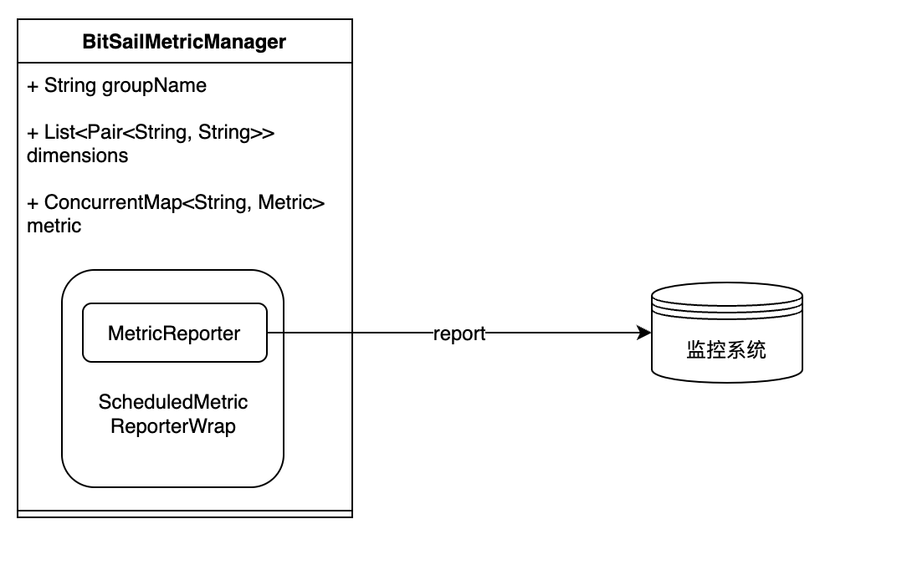
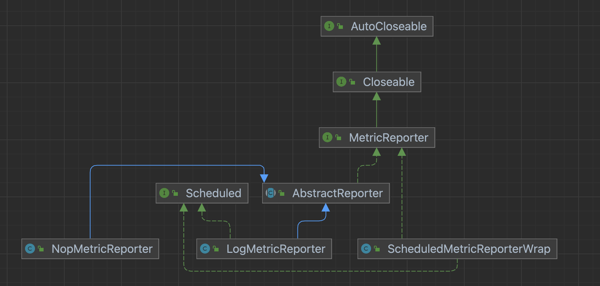
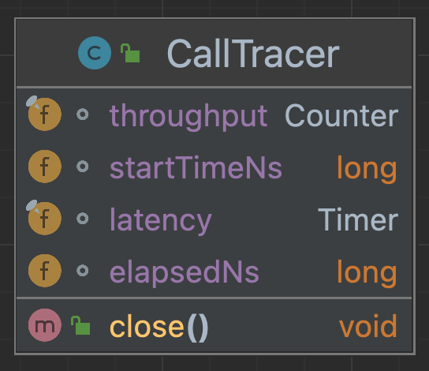
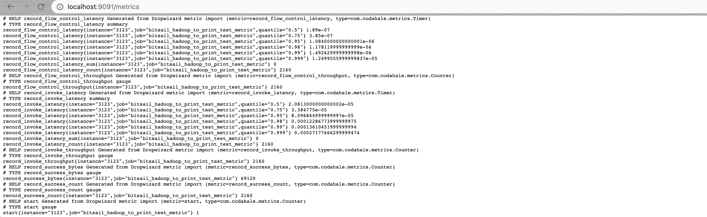
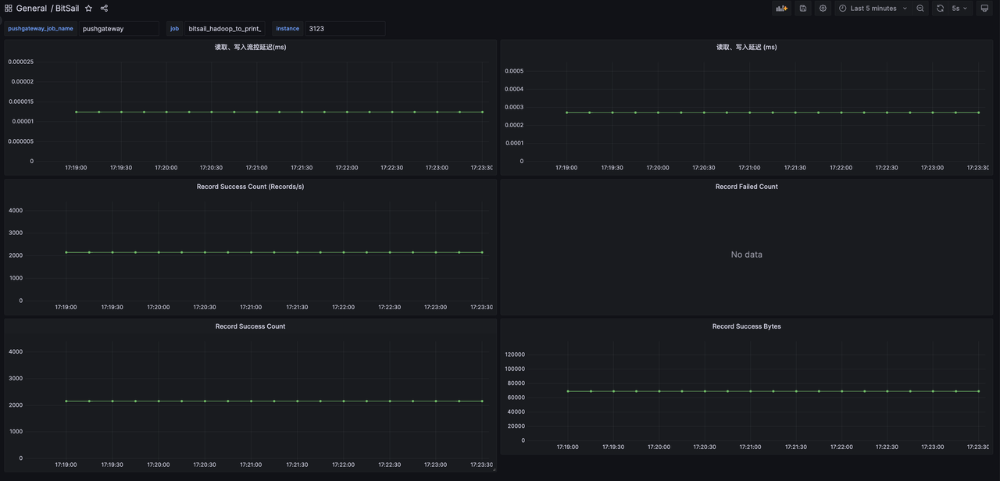
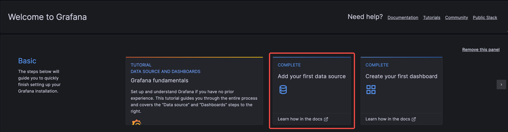
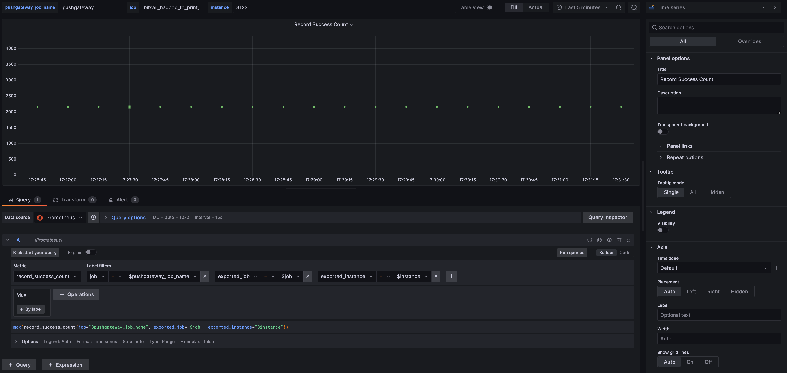

# bitsail-metrics-prometheus

-----

上级文档: [bitsail-components](../README.md)

## BitSail Metrics介绍

Metric监控能实时汇报目前数据集成任务运行的状态，在作业故障时候方便使用者定位到问题所在。BitSail提供一个可供用户使用的Metric收集模块，实现了对Prometheus监控系统的支持，用户可以通过自定义Grafana仪表盘实现对BitSail运行时各类指标的监控。



- MetricManager主要负责MetricGroup的管理，通过`MetricReporterFactory`来获取MetricReporter。
- Scheduled用来定义Reporter汇报监metric的时间间隔。
- MetricReporter用来将metric汇报给外部的backend处理



对不同的服务监控系统进行metrics的汇报，只需要根据CommonOptions中的METRICS_REPORTER_TYPE获取相应的MetricReporterBuilder，获取对应的MetricReporter。

### 监控指标

BitSail的Metrics是通过引入`com.codahale.metrics`包实现的，将收集的metrics分为：Counter，Gauge，Histogram、Meter、Timer：

- Meter 主要用于统计系统中某一个事件的速率，可以反应系统当前的处理能力，帮助我们判断资源是否已经不足。可以很方便帮助我们统计，每秒请求数（TPS）、每秒查询数（QPS）、最近 1 分钟平均每秒请求数、最近 5 分钟平均每秒请求数、最近 15 分钟平均每秒请求数等。
- Guage 是最简单的度量指标，只有一个简单的返回值，通常用来记录一些对象或者事物的瞬时值。通过 Gauge 可以完成自定义的度量类型，可以用于衡量一个待处理队列中任务的个数，以及目前内存使用量等等场景。
- Counter 是累计型的度量指标，内部用 Gauge 封装了 AtomicLong。主要用它来统计队列中 Job 的总数；错误出现次数；服务请求数等等场景。
- Histogram 是统计数据的分布情况的度量指标，提供了最小值，最大值，中间值，还有中位数，75 百分位，90 百分位，95 百分位，98 百分位，99 百分位，和 99.9 百分位的值。使用的场景，例如统计流量最大值、最小值、平均值、中位值等等。
- Timer 本质是 Histogram 和 Meter 的结合，可以很方便的统计请求的速率和处理时间，例如磁盘读延迟统计，以及接口调用的延迟等信息的统计等等场景。

BitSail的应用示例：

- 使用CallTracer用来统计*try*中代码的调用吞吐量和执行延迟
    - 

    - 使用Timer类metric统计了函数的qps和执行耗时
    - 使用Counter类metric统计了吞吐量
- 在DelegateFlinkWriter和DelegateSourcePipeline中统计写入和读取成功的record的字节数和失败的记录数。

## Prometheus和BitSai集成

关于Prometheus和Grafana安装使用，这里就不再过多赘述。Prometheus在正常情况下是采用pull模式从产生metric的作业或者exporter（比如专门监控主机的NodeExporter）拉取监控数据。BitSail通过PrometheusMetricReporter支持Prometheus的pull模式，通过PrometheusPushGatewayReporter支持Prometheus的push模式。

Prometheus 采用 pull 模式，可能由于不在一个子网或者防火墙原因，导致 Prometheus 无法直接拉取各个 target 数据。所以这里我们展示PushGateway模式的使用，PushGateway是一个中转组件，通过配置BitSail作业将metric推到PushGateway，Prometheus再从PushGateway拉取。Pushgateway 可以持久化推送给它的所有监控数据。因此，即使你的监控已经下线，prometheus 还可以拉取到旧的监控数据。

### common配置

| 参数名称              | 是否必填 | 参数枚举值                                           | 参数含义                              |
| --------------------- | -------- | ---------------------------------------------------- | ------------------------------------- |
| metrics_reporter_type | 否       | "prometheus"、"prometheus_pushgateway"、"log"、"nop" | metrics reporter的类型，默认值为"log" |

### metric配置

#### PrometheusMetricReporter

| 参数名称        | 是否必填 | 参数默认值 | 参数含义                              |
| --------------- | -------- | ---------- | ------------------------------------- |
| prometheus_host | 否       | 9999       | bitsail推送至prometheu server的端口号 |

#### PrometheusPushGatewayReporter

| 参数名称                           | 是否必填 | 参数默认值 | 参数含义                                                     |
| ---------------------------------- | -------- | ---------- | ------------------------------------------------------------ |
| pushgateway_host                   | 否       | localhost  | prometheus pushgateway的host                                 |
| pushgateway_port                   | 否       | 9091       | prometheus pushgateway的port                                 |
| pushgateway_https_port             | 否       | 443        | HTTPS端口号                                                  |
| pushgateway_report_period_seconds  | 否       | 1          | 向prometheus pushgateway推送数据的时间间隔                   |
| pushgateway_delete_on_shutdown     | 否       | TRUE       | 任务结束时是否删除监控数据                                   |
| pushgateway_jobname                | 否       | 无         | prometheus pushgateway的任务名                               |
| pushgateway_default_jobName_suffix | 否       | _metric    | prometheus pushgateway的任务名为空时，会使用bitsail作业任务名拼接该suffix作为默认任务名。 |

#### Example

```Bash
{
  "job": {
    "common": {
      "job_id": 313,
      "instance_id": 3123,
      "job_name": "bitsail_hadoop_to_print_test",
      "user_name": "root",
      "metrics_reporter_type": "prometheus_pushgateway",
      "metric": {
        "pushgateway_delete_on_shutdown": "false"
      }
    }
}
```

测试时我们通过容器开启prometheus pushgateway服务。

```Bash
docker run -d  -p 9091:9091 \
-v "/etc/localtime:/etc/localtime" \
prom/pushgateway
```

在启动pushgateway前，需要修改Prometheus配置文件 prometheus.yml并重启服务，使其监控PushGateway。

```Bash
global:
  scrape_interval: 15s
  evaluation_interval: 60s
  external_labels:
    monitor: codelab-monitor
scrape_configs:
  - job_name: prometheus
    static_configs:
      - targets:
          - 'localhost:9090'
  # 添加PushGateway 监控配置
  - job_name: 'pushgateway'
    static_configs:
      - targets: ['localhost:9091']
```

### 验证与测试



## Grafana仪表盘和Prometheus集成



### 自定义仪表盘流程

#### 通过Add Data Source添加Prometheus数据源



#### 通过Add Panel自定义BitSail Metric仪表盘



### Grafana 配置模版

```json
{
  "annotations": {
    "list": [
      {
        "builtIn": 1,
        "datasource": {
          "type": "grafana",
          "uid": "-- Grafana --"
        },
        "enable": true,
        "hide": true,
        "iconColor": "rgba(0, 211, 255, 1)",
        "name": "Annotations & Alerts",
        "target": {
          "limit": 100,
          "matchAny": false,
          "tags": [],
          "type": "dashboard"
        },
        "type": "dashboard"
      }
    ]
  },
  "editable": true,
  "fiscalYearStartMonth": 0,
  "graphTooltip": 0,
  "id": 3,
  "links": [],
  "liveNow": false,
  "panels": [
    {
      "datasource": {
        "type": "prometheus",
        "uid": "yPH0bsh4z"
      },
      "fieldConfig": {
        "defaults": {
          "color": {
            "mode": "palette-classic"
          },
          "custom": {
            "axisCenteredZero": false,
            "axisColorMode": "text",
            "axisLabel": "",
            "axisPlacement": "auto",
            "barAlignment": 0,
            "drawStyle": "line",
            "fillOpacity": 0,
            "gradientMode": "none",
            "hideFrom": {
              "legend": false,
              "tooltip": false,
              "viz": false
            },
            "lineInterpolation": "linear",
            "lineWidth": 1,
            "pointSize": 5,
            "scaleDistribution": {
              "type": "linear"
            },
            "showPoints": "auto",
            "spanNulls": false,
            "stacking": {
              "group": "A",
              "mode": "none"
            },
            "thresholdsStyle": {
              "mode": "off"
            }
          },
          "mappings": [],
          "thresholds": {
            "mode": "absolute",
            "steps": [
              {
                "color": "green",
                "value": null
              },
              {
                "color": "red",
                "value": 80
              }
            ]
          }
        },
        "overrides": []
      },
      "gridPos": {
        "h": 8,
        "w": 12,
        "x": 0,
        "y": 0
      },
      "id": 12,
      "options": {
        "legend": {
          "calcs": [],
          "displayMode": "list",
          "placement": "bottom",
          "showLegend": false
        },
        "tooltip": {
          "mode": "single",
          "sort": "none"
        }
      },
      "targets": [
        {
          "datasource": {
            "type": "prometheus",
            "uid": "yPH0bsh4z"
          },
          "editorMode": "builder",
          "expr": "avg(record_flow_control_latency{job=\"$pushgateway_job_name\", exported_job=\"$job\", exported_instance=\"$instance\", quantile=\"0.999\"})",
          "legendFormat": "__auto",
          "range": true,
          "refId": "A"
        }
      ],
      "title": "读取、写入流控延迟(ms)",
      "type": "timeseries"
    },
    {
      "datasource": {
        "type": "prometheus",
        "uid": "yPH0bsh4z"
      },
      "fieldConfig": {
        "defaults": {
          "color": {
            "mode": "palette-classic"
          },
          "custom": {
            "axisCenteredZero": false,
            "axisColorMode": "text",
            "axisLabel": "",
            "axisPlacement": "auto",
            "barAlignment": 0,
            "drawStyle": "line",
            "fillOpacity": 0,
            "gradientMode": "none",
            "hideFrom": {
              "legend": false,
              "tooltip": false,
              "viz": false
            },
            "lineInterpolation": "linear",
            "lineWidth": 1,
            "pointSize": 5,
            "scaleDistribution": {
              "type": "linear"
            },
            "showPoints": "auto",
            "spanNulls": false,
            "stacking": {
              "group": "A",
              "mode": "none"
            },
            "thresholdsStyle": {
              "mode": "off"
            }
          },
          "mappings": [],
          "thresholds": {
            "mode": "absolute",
            "steps": [
              {
                "color": "green",
                "value": null
              },
              {
                "color": "red",
                "value": 80
              }
            ]
          }
        },
        "overrides": []
      },
      "gridPos": {
        "h": 8,
        "w": 12,
        "x": 12,
        "y": 0
      },
      "id": 6,
      "options": {
        "legend": {
          "calcs": [],
          "displayMode": "list",
          "placement": "bottom",
          "showLegend": false
        },
        "tooltip": {
          "mode": "single",
          "sort": "none"
        }
      },
      "targets": [
        {
          "datasource": {
            "type": "prometheus",
            "uid": "yPH0bsh4z"
          },
          "editorMode": "builder",
          "expr": "avg(record_invoke_latency{job=\"$pushgateway_job_name\", exported_job=\"$job\", exported_instance=\"$instance\", quantile=\"0.999\"})",
          "legendFormat": "__auto",
          "range": true,
          "refId": "A"
        }
      ],
      "title": "读取、写入延迟 (ms)",
      "type": "timeseries"
    },
    {
      "datasource": {
        "type": "prometheus",
        "uid": "yPH0bsh4z"
      },
      "fieldConfig": {
        "defaults": {
          "color": {
            "mode": "palette-classic"
          },
          "custom": {
            "axisCenteredZero": false,
            "axisColorMode": "text",
            "axisLabel": "",
            "axisPlacement": "auto",
            "barAlignment": 0,
            "drawStyle": "line",
            "fillOpacity": 0,
            "gradientMode": "none",
            "hideFrom": {
              "legend": false,
              "tooltip": false,
              "viz": false
            },
            "lineInterpolation": "linear",
            "lineWidth": 1,
            "pointSize": 5,
            "scaleDistribution": {
              "type": "linear"
            },
            "showPoints": "auto",
            "spanNulls": false,
            "stacking": {
              "group": "A",
              "mode": "none"
            },
            "thresholdsStyle": {
              "mode": "off"
            }
          },
          "mappings": [],
          "thresholds": {
            "mode": "absolute",
            "steps": [
              {
                "color": "green",
                "value": null
              },
              {
                "color": "red",
                "value": 80
              }
            ]
          }
        },
        "overrides": []
      },
      "gridPos": {
        "h": 8,
        "w": 12,
        "x": 0,
        "y": 8
      },
      "id": 4,
      "options": {
        "legend": {
          "calcs": [],
          "displayMode": "list",
          "placement": "bottom",
          "showLegend": false
        },
        "tooltip": {
          "mode": "single",
          "sort": "none"
        }
      },
      "targets": [
        {
          "datasource": {
            "type": "prometheus",
            "uid": "yPH0bsh4z"
          },
          "editorMode": "builder",
          "expr": "avg(max(record_flow_control_latency_count{job=\"$pushgateway_job_name\", exported_job=\"$job\", exported_instance=\"$instance\"}))",
          "legendFormat": "__auto",
          "range": true,
          "refId": "A"
        }
      ],
      "title": "Record Success Count (Records/s)",
      "type": "timeseries"
    },
    {
      "datasource": {
        "type": "prometheus",
        "uid": "yPH0bsh4z"
      },
      "fieldConfig": {
        "defaults": {
          "color": {
            "mode": "palette-classic"
          },
          "custom": {
            "axisCenteredZero": false,
            "axisColorMode": "text",
            "axisLabel": "",
            "axisPlacement": "auto",
            "barAlignment": 0,
            "drawStyle": "line",
            "fillOpacity": 0,
            "gradientMode": "none",
            "hideFrom": {
              "legend": false,
              "tooltip": false,
              "viz": false
            },
            "lineInterpolation": "linear",
            "lineWidth": 1,
            "pointSize": 5,
            "scaleDistribution": {
              "type": "linear"
            },
            "showPoints": "auto",
            "spanNulls": false,
            "stacking": {
              "group": "A",
              "mode": "none"
            },
            "thresholdsStyle": {
              "mode": "off"
            }
          },
          "mappings": [],
          "thresholds": {
            "mode": "absolute",
            "steps": [
              {
                "color": "green",
                "value": null
              },
              {
                "color": "red",
                "value": 80
              }
            ]
          }
        },
        "overrides": []
      },
      "gridPos": {
        "h": 8,
        "w": 12,
        "x": 12,
        "y": 8
      },
      "id": 10,
      "options": {
        "legend": {
          "calcs": [],
          "displayMode": "list",
          "placement": "bottom",
          "showLegend": true
        },
        "tooltip": {
          "mode": "single",
          "sort": "none"
        }
      },
      "targets": [
        {
          "datasource": {
            "type": "prometheus",
            "uid": "yPH0bsh4z"
          },
          "editorMode": "code",
          "expr": "max(record_failed_count{job=\"$pushgateway_job_name\", exported_job=\"$job\", exported_instance=\"$instance\"})",
          "legendFormat": "__auto",
          "range": true,
          "refId": "A"
        }
      ],
      "title": "Record Failed Count",
      "type": "timeseries"
    },
    {
      "datasource": {
        "type": "prometheus",
        "uid": "yPH0bsh4z"
      },
      "fieldConfig": {
        "defaults": {
          "color": {
            "mode": "palette-classic"
          },
          "custom": {
            "axisCenteredZero": false,
            "axisColorMode": "text",
            "axisLabel": "",
            "axisPlacement": "auto",
            "barAlignment": 0,
            "drawStyle": "line",
            "fillOpacity": 0,
            "gradientMode": "none",
            "hideFrom": {
              "legend": false,
              "tooltip": false,
              "viz": false
            },
            "lineInterpolation": "linear",
            "lineWidth": 1,
            "pointSize": 5,
            "scaleDistribution": {
              "type": "linear"
            },
            "showPoints": "auto",
            "spanNulls": false,
            "stacking": {
              "group": "A",
              "mode": "none"
            },
            "thresholdsStyle": {
              "mode": "off"
            }
          },
          "mappings": [],
          "thresholds": {
            "mode": "absolute",
            "steps": [
              {
                "color": "green",
                "value": null
              },
              {
                "color": "red",
                "value": 80
              }
            ]
          }
        },
        "overrides": []
      },
      "gridPos": {
        "h": 9,
        "w": 12,
        "x": 0,
        "y": 16
      },
      "id": 2,
      "options": {
        "legend": {
          "calcs": [],
          "displayMode": "list",
          "placement": "bottom",
          "showLegend": false
        },
        "tooltip": {
          "mode": "single",
          "sort": "none"
        }
      },
      "targets": [
        {
          "datasource": {
            "type": "prometheus",
            "uid": "yPH0bsh4z"
          },
          "editorMode": "builder",
          "expr": "max(record_success_count{job=\"$pushgateway_job_name\", exported_job=\"$job\", exported_instance=\"$instance\"})",
          "legendFormat": "__auto",
          "range": true,
          "refId": "A"
        }
      ],
      "title": "Record Success Count",
      "type": "timeseries"
    },
    {
      "datasource": {
        "type": "prometheus",
        "uid": "yPH0bsh4z"
      },
      "fieldConfig": {
        "defaults": {
          "color": {
            "mode": "palette-classic"
          },
          "custom": {
            "axisCenteredZero": false,
            "axisColorMode": "text",
            "axisLabel": "",
            "axisPlacement": "auto",
            "barAlignment": 0,
            "drawStyle": "line",
            "fillOpacity": 0,
            "gradientMode": "none",
            "hideFrom": {
              "legend": false,
              "tooltip": false,
              "viz": false
            },
            "lineInterpolation": "linear",
            "lineWidth": 1,
            "pointSize": 5,
            "scaleDistribution": {
              "type": "linear"
            },
            "showPoints": "auto",
            "spanNulls": false,
            "stacking": {
              "group": "A",
              "mode": "none"
            },
            "thresholdsStyle": {
              "mode": "off"
            }
          },
          "mappings": [],
          "thresholds": {
            "mode": "absolute",
            "steps": [
              {
                "color": "green",
                "value": null
              },
              {
                "color": "red",
                "value": 80
              }
            ]
          }
        },
        "overrides": []
      },
      "gridPos": {
        "h": 8,
        "w": 12,
        "x": 12,
        "y": 16
      },
      "id": 8,
      "options": {
        "legend": {
          "calcs": [],
          "displayMode": "list",
          "placement": "bottom",
          "showLegend": false
        },
        "tooltip": {
          "mode": "single",
          "sort": "none"
        }
      },
      "targets": [
        {
          "datasource": {
            "type": "prometheus",
            "uid": "yPH0bsh4z"
          },
          "editorMode": "code",
          "expr": "max(record_success_bytes{job=\"$pushgateway_job_name\", exported_job=\"$job\", exported_instance=\"$instance\"})",
          "legendFormat": "__auto",
          "range": true,
          "refId": "A"
        }
      ],
      "title": "Record Success Bytes",
      "type": "timeseries"
    }
  ],
  "refresh": "5s",
  "revision": 1,
  "schemaVersion": 38,
  "style": "dark",
  "tags": [],
  "templating": {
    "list": [
      {
        "current": {
          "selected": false,
          "text": "pushgateway",
          "value": "pushgateway"
        },
        "hide": 0,
        "name": "pushgateway_job_name",
        "options": [
          {
            "selected": true,
            "text": "pushgateway",
            "value": "pushgateway"
          }
        ],
        "query": "pushgateway",
        "skipUrlSync": false,
        "type": "textbox"
      },
      {
        "current": {
          "selected": false,
          "text": "bitsail_hadoop_to_print_test_metric",
          "value": "bitsail_hadoop_to_print_test_metric"
        },
        "hide": 0,
        "name": "job",
        "options": [
          {
            "selected": true,
            "text": "bitsail_hadoop_to_print_test_metric",
            "value": "bitsail_hadoop_to_print_test_metric"
          }
        ],
        "query": "bitsail_hadoop_to_print_test_metric",
        "skipUrlSync": false,
        "type": "textbox"
      },
      {
        "current": {
          "selected": false,
          "text": "3123",
          "value": "3123"
        },
        "hide": 0,
        "name": "instance",
        "options": [
          {
            "selected": true,
            "text": "3123",
            "value": "3123"
          }
        ],
        "query": "3123",
        "skipUrlSync": false,
        "type": "textbox"
      }
    ]
  },
  "time": {
    "from": "now-5m",
    "to": "now"
  },
  "timepicker": {},
  "timezone": "",
  "title": "BitSail",
  "uid": "Nf9bXCb4k",
  "version": 1,
  "weekStart": ""
}
```