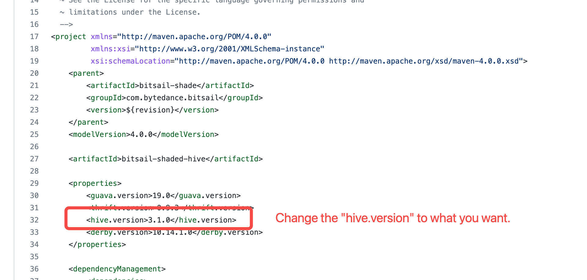

---
dir:
  order: 5
---

# 常见问题
1. **能否详细介绍一下mysql2hive，比如并发度怎么计算，以及它的整体性能的一些情况。**

> mysql2hive有自动计算并发度的策略，和slave的个数有关，同时也会有一个上限，防止对mysql负载造成比较大的压力。
>
> - input的默认并发数与数据的大小和分布有关，由createInputSplits函数确定，最大为100。
> - output的默认并发数和数据量的条数以及大小有关，具体规则为：max(input建议并发数, min(一亿/32并发，100G/32并发))，最大为100。
>
> 在性能上目前能稳定支持百亿行，对于千万级别的表，能够在分钟级完成导入。

2. **自动并发度具体是怎么做的呢？目前我们都是固定并发度，开发和运维成本都比较高。**

> 根据输入数据的条数和大小，设置一个自动推算的算法。假设我们的数据有一亿条或100G，多少条我们给它分配一个并发度，多大的数据量给它分配一个并发度，同时我们还要考虑每个数据源它所能承受并发度的上限，防止并发太大导致输入、输出数据源负载较高。
> 
> 参考文档：[并发度推算](parallelism.md)

3. **BitSail是否支持ClickHouse写入呢？**

> 目前BitSail已经支持了ClickHouse的读取，同样在未来也会支持ClickHouse的写入，在BitSail开源后，我们已经补齐了一些比较常见的Connector。但从整个Connector生态上来说，还是远远不够的，因为每家公司使用的Connector、场景都是不一样的，我们希望号召大家一起参与贡献，共同去完善整个Connector生态，同时我们也启动了贡献者激励活动，鼓励大家的参与和完善。

4. **场景那么多，那脏数据我们应该如何去辨别呢？**

> 目前的策略是这样的：涉及数据源读写的数据不认为是脏数据，比如网络的抖动导致数据写失败了，如果认为是脏数据，最终会导致数据缺失。
>
>  这里提到的脏数据，更加聚焦在数据传输过程中，数据解析、数据转换失败、数据溢出等场景，这类数据会被认为是脏数据，而正常的读写不判断为脏数据。

5. **BitSail的应用场景，是有哪些呢？**

> BitSail是一款提供高性能高可靠的海量数据间数据同步的数据引擎，并提供流批一体和湖仓一体的数据处理能力。在架构层面是支撑分布式和云原生的一个数据集成引擎。
>
> 在数据建设过程中，以下几种场景会比较适合使用BitSail：
>
> - 有明显的数据集成需求，但当前还没有一些明确的方案；
> - 在成熟度、稳定性或者性能上遇到了问题或者在技术架构上遇到问题，比如说想支持分布式，云原生架构；想支持流批一体的能力；基于CDC的增量数据同步等。
>
> BitSail在以上场景上有着深厚的沉淀，也是BitSail目前或者未来会覆盖的场景。

6. **BitSail优势会体现在哪些层面呢？**

> BitSail的核心竞争力主要体现在下面几个维度：
>
> - 产品的成熟性：BitSail经受了字节众多业务线生产环境验证，在性能和可靠性上做了很多优化，在成熟度上更加有保障；
> - 架构的完备性：在架构上支持流批一体和湖仓一体，完美兼容了Hadoop生态，在资源的使用上比较弹性。
> - 基础功能的丰富性：数据集成发展到现在这个阶段已经到了深水区，我们不仅需要能用，还需要好用。在这个层面，BitSail积累了丰富的经验，比如应对脏数据收集、类型转化、并发度推算等，这些是数据集成领域会经常面对的一些问题。

7. **BitSail有web操作界面吗？入门操作视频有吗？**

> 目前没有产品入口。BitSail旨在提供用户一个通用的数据集成引擎，以实现不同数据源间数据同步，未来规划是和不同的开发平台和调度平台打通。
>
> 入门操作视频后面会有，包括每次的分享也会有视频留存，大家可以做一些参考，我们在网站上也会去补一些用户入门视频。

8. **BitSail是否支持实时采集服务器上日志文件里的日志呢？**

> 目前还不支持，如果有需要可以在GitHub上提个issue，我们会和社区的开发者讨论可行性和需求度后一起把这个功能做上线。

9. **BitSail计划会支持Spark吗？**

> 目前没有支持spark的计划。BitSail目前正在做一个多引擎的架构，但并不是说会去支持不同的计算引擎，比如说Flink、Spark。BitSail的目标是想做到对用户屏蔽引擎，用户不需要感知底层引擎存在，只需要感受到BitSail数据同步的能力。BitSail 要做的是针对数据集成的场景，怎么去优化我们的性能，提高我们的运行效率。

10. **K8s的Runtime，有roadmap吗？**

> 目前，正在去做K8s的Runtime的实现和支持。

11. **支持上游表结构变更同步到下游吗？**

> 框架层面是支持的，但是具体的支持要以具体Connector的实现为准。

12. **目前flink版本支持1.11，有支持1.13的版本吗？**

> 目前我们已经在GitHub上开启了相应的issue，去开启这个1.11升级的流程。接下来我们会开始去做这个事情，也欢迎大家一起参与到这个流程当中。

13. **目前是否支持kafka到Hive？**

> 是支持的，我们已经对kafka到Hive做了一定的优化，开发者可以直接去上手BitSail的感受这个流程。

14. **Connector可以支持同一类型数据源的多个版本吗？**

> 是可以支持的。包括kafka，其实都会出现这种情况。所以说，我们实现这种动态加载，也是为了避免同一Connector的不同版本出现内冲突的情况。

15. **BitSail如何管理和监控这些数据集成作业的？是用命令行的形式吗？**

> 是的，目前是通过命令行的形式。

16. **BitSail支持数据转换吗？是否支持分支判断写入不同目标？**

> 现在还未支持transform，未来有和社区共建的计划。

17. **成为BitSail Contributor的要求是怎么样的？**

> 提交一个Commit，即可成为BitSail Contributor。关于Committer提名，我们希望从不同的维度去评估一个Contributor的贡献来提名Committer，包括文档贡献、代码贡献，以及社区建设上的贡献，综合这三个方面的贡献来评估，鼓励大家多维度地去参与社区的建设。

18. **BitSail是否支持CDC数据源写入Hudi呢？**

> 字节内部的CDC数据源和开源的差异较大，所以内部的CDC Connector目前还在开源改造阶段，我们的计划是在11、12月调研并接入一些比较知名的开源的CDC Connector，同时完成开发，并提交到BitSail的仓库。

19. **激励计划奖品有数量限制吗？**

> 激励计划的奖品是没有数量限制的，我们希望大家都能广泛参与。

20. **目前分库分表能否支持？**

> 目前是不支持的。我理解这个问题更深层次的是用户比较关心能不能把一个任务基于CDC的数据，全部导入Hudi中，这个也是社区反响较大的一个feature。我们会在CDC Connector开发完成之后高优的去推进。

21. **BitSail底层也是flink吗？和flink connector有什么区别呀？**

> 当前我们有一些legacy connector与flink稍有些耦合。但我们长期的发展路线是会跟底层的引擎解耦，目前新接口的Reader和Writer接口都是与引擎解耦的，未来用户在使用的过程中是不会感受到底层的引擎的。

22. **BitSail是否支持sql，像flink那样呢？**

> 目前很多用户比较关心中间支不支持transform，目前预留出了transform的接口，但是目前没有对接Sql引擎，如果有兴趣的话可以去GitHub上提一个issue，我们评估后去做一个实现。

23. **BitSail支持一源多目标这种场景吗？就像值转换，一种输入，多种输出支持等**

> 字节内部有一个多个数据源写入Hudi的场景，所以BitSail引擎层面是支持的，不过多种输入和多种输出的场景有些多，比如多种输入时是否需要做聚合，多种输出时是单纯的复制数据还是需要分流，这些问题需要看具体使用场景来进行定制化开发。

24. **BitSail是否支持 SpringBoot3？**

> 不支持。

25. **CDC同步到MQ，扩容会导致消息乱序，这个该怎么解决？**

> 这个问题比较困难，提高链路的鲁棒性和容错机制能够尽量减少短暂乱序的影响，我们采取的方案是离线写入Hive的场景在binlog落盘归档时保留一个时间窗口来容忍短暂的乱序，实时场景依赖udi的排序机制来保证最终一致性，只要链路上数据不丢，落到湖或者仓中的数据就能保证准确性。

26. **BitSail是否支持几何类型？**

> 还不支持。

27. **增量更新是怎么做的？**

> 字节内部有一套CDC的机制，将全量数据和增量数据全部都打到Message Queue里面，BitSail引擎直接对接Message Queue，做全量和增量的结合。

28. **如何在hive2.x或者hive3.x的环境中部署BitSail?**

> BitSail使用`bitsail-shaded-hive`模块来管理hive依赖，在其中使用**3.1.0**作为默认hive版本。
> 因此，用户如果想在其他版本的hive环境中部署和使用BitSail，需要先修改 [bitsail-shaded-hive](https://github.com/bytedance/bitsail/blob/master/bitsail-shade/bitsail-shaded-hive/pom.xml) 中的hive版本信息（如图所示）。
>
> 

29. **目前是否支持JDK 11？**

> 目前BitSail仅支持JDK 8。

30. **本地运行集成测试（ITCase）或者E2E测试出错？**

> 因为集成测试和E2E测试依赖docker构建数据源，所以需要预先在本地安装docker。如果确认本地已安装docker，请通过issue来反馈您的问题。

31. **如何在没有hadoop的本地环境进行hadoop相关数据源的测试？**

> 通过 [build.sh](https://github.com/bytedance/bitsail/blob/master/build.sh) 脚本构建BitSail项目后，会将可运行产物打包在项目的`output`目录下。
> 为了进行hadoop相关数据源（例如hive）的测试，需要将以下两个依赖包下载到 `output/embedded/flink/lib` 目录下。
> - [flink-shaded-hadoop-3-uber.jar](https://repository.cloudera.com/artifactory/cloudera-repos/org/apache/flink/flink-shaded-hadoop-3-uber/3.1.1.7.2.9.0-173-9.0/flink-shaded-hadoop-3-uber-3.1.1.7.2.9.0-173-9.0.jar)
> - [commons-cli](https://repo1.maven.org/maven2/commons-cli/commons-cli/1.5.0/commons-cli-1.5.0.jar)
> 
> 下载完成后，即可在output目录提交测试任务。

32. **如何在非linux/amd64和linux/arm64架构的设备上运行flink相关的E2E测试？**

> 目前E2E使用的Flink Executor仅支持linux/amd64和linux/arm64。
> 
> 如果你想要在其他OS/ARCH上运行Flink相关的E2E测试，那么需要手动构建一个适合OS/ARCH的Flink镜像，并替换相应Flink executor中的镜像版本。
> 
> 在文档[Support multi-arch flink docker image](https://github.com/bytedance/bitsail/blob/master/bitsail-test/bitsail-test-end-to-end/bitsail-test-e2e-base/src/main/resources/docker/flink/README.md)中详细介绍了如何构建Flink镜像，可以参考此文档操作。
