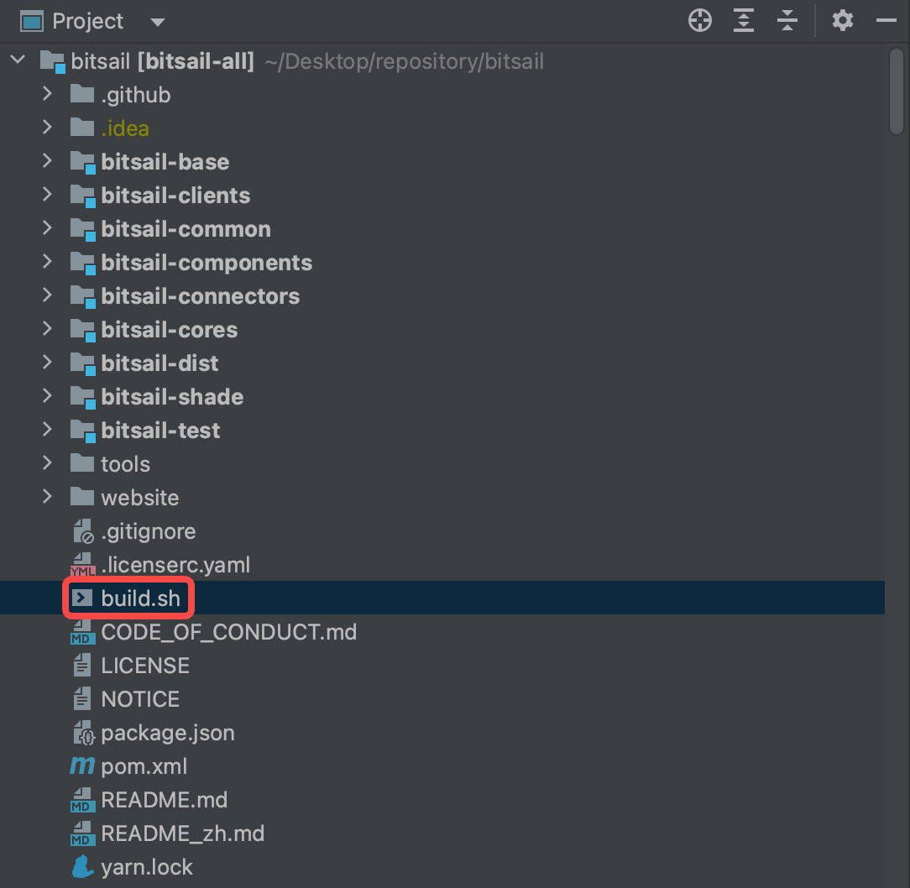
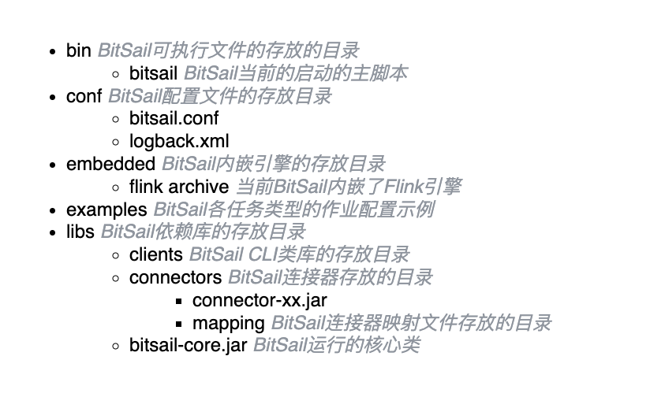
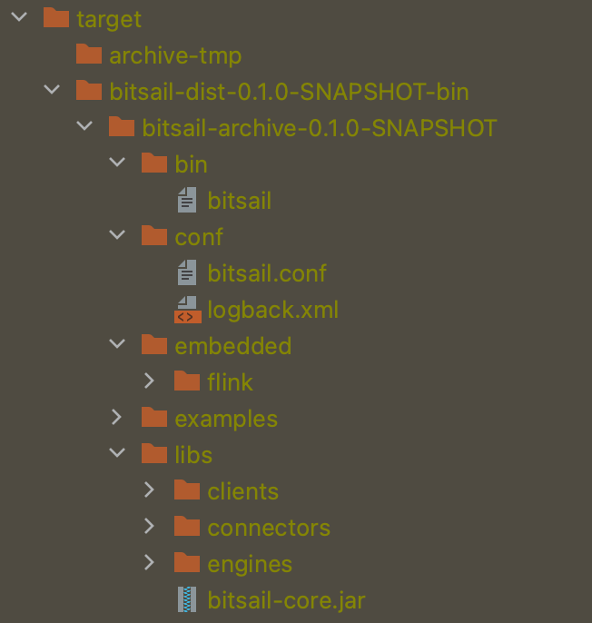

# BitSail实机演示

[English](../../../en/documents/start/quick_guide.md) | 简体中文

-----

## BitSail演示视频

[BitSail实机演示](https://zhuanlan.zhihu.com/p/595157599) 

## BitSail源码编译

BitSail在项目中内置了编译脚本build.sh，存放在项目根目录中。新下载的用户可以直接该脚本进行编译，编译成功后可以在目录：bitsail-dist/target/bitsail-dist-${rversion}-bin 中找到相应的产物。



## BitSail产物结构





## BitSail如何提交作业

### Flink Session Job

```Shell
第一步：启动Flink Session集群

session运行要求本地环境存在hadoop的依赖，同时需要HADOOP_CLASSPATH的环境变量存在。

bash ./embedded/flink/bin/start-cluster.sh

第二步：提交作业到Flink Session 集群

bash bin/bitsail run \
  --engine flink \
  --execution-mode run \
  --deployment-mode local \
  --conf examples/Fake_Print_Example.json \
  --jm-address <job-manager-address>
```

### Yarn Cluster Job

```Shell
第一步：设置HADOOP_HOME环境变量

export HADOOP_HOME=XXX

第二步：设置HADOOP_HOME，使提交客户端就找到yarn集群的配置路径，然后就可以提交作业到Yarn集群

bash ./bin/bitsail run --engine flink \
--conf ~/dts_example/examples/Hive_Print_Example.json \
--execution-mode run \
--deployment-mode yarn-per-job \
--queue default
```

## BitSail 实机演示

### Fake->MySQL

```Shell
// 创建mysql表
CREATE TABLE `bitsail_fake_source` (
  `id` bigint(20) NOT NULL AUTO_INCREMENT,
  `name` varchar(255) DEFAULT NULL,
  `price` double DEFAULT NULL,
  `image` blob,
  `start_time` datetime DEFAULT NULL,
  `end_time` datetime DEFAULT NULL,
  `order_id` bigint(20) DEFAULT NULL,
  `enabled` tinyint(4) DEFAULT NULL,
  `datetime` int(11) DEFAULT NULL,
  PRIMARY KEY (`id`)
) ENGINE=InnoDB DEFAULT CHARSET=utf8mb4;
```

### MySQL->Hive

```Shell
// 创建hive表
CREATE TABLE `bitsail`.`bitsail_mysql_hive`(
  `id` bigint ,
  `name` string ,
  `price` double ,
  `image` binary,
  `start_time` timestamp ,
  `end_time` timestamp,
  `order_id` bigint ,
  `enabled` int,
  `datetime` int
)PARTITIONED BY (`date` string)
ROW FORMAT SERDE
  'org.apache.hadoop.hive.ql.io.parquet.serde.ParquetHiveSerDe'
STORED AS INPUTFORMAT
  'org.apache.hadoop.hive.ql.io.parquet.MapredParquetInputFormat'
OUTPUTFORMAT
  'org.apache.hadoop.hive.ql.io.parquet.MapredParquetOutputFormat'
```